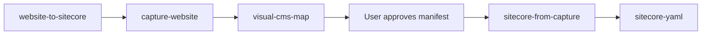

# Cursor agents — rules and skills

This repository configures the Cursor AI agent with **rules** (always-on or file-scoped constraints) and **skills** (on-demand workflows for website-to-Sitecore work). Together they keep codegen safe, consistent with XM Cloud patterns, and aligned with the industry-verticals monorepo.

| Mechanism | Location | When it applies |
|-----------|----------|-----------------|
| **Rules** | `.cursor/rules/*.mdc` | Injected into every agent turn (always) or when matching files are open/edited (globs) |
| **Skills** | `.cursor/skills/**/SKILL.md` | Loaded when the agent decides a task matches the skill `description`, or when you @-mention a skill |

Runtime scripts (Playwright, generators) live under `.cursor/skills/`; dependencies install in **`.cursor/node_modules/`** — see [RUNTIME-DEPENDENCIES.md](./RUNTIME-DEPENDENCIES.md).

---

## Rules (`.cursor/rules/`)

Rules are Markdown with YAML frontmatter. `alwaysApply: true` rules are included in every conversation. Others attach when you work on files matching their `globs`.

### Always applied

| Rule | Purpose |
|------|---------|
| **[safety.mdc](./rules/safety.mdc)** | Do not edit compiled artifacts (`node_modules`, `.next/`, lock files), secrets (`.env.local`, `.sitecore/user.json`), Docker/CI configs, or binary packages. Focus edits on source under `src/`, authoring YAML, and safe config. |
| **[project-context.mdc](./rules/project-context.mdc)** | Repo map: `industry-verticals/`, `authoring/`, `xmcloud.build.json`, available sites (healthcare, retail, bristan, travel, …), tech stack (Next.js 15+, Content SDK, Tailwind), local dev env vars, planned git flow. |
| **[general.mdc](./rules/general.mdc)** | DRY, SOLID, modular design, testing expectations, code review and CI norms. |
| **[code-style.mdc](./rules/code-style.mdc)** | TypeScript-first components, safe XM Cloud field destructuring, editing vs delivery rendering, Tailwind/Shadcn patterns, error handling, performance notes. |

### Applied when matching files

| Rule | Globs (summary) | Purpose |
|------|-----------------|--------|
| **[sitecore.mdc](./rules/sitecore.mdc)** | `src/components/**`, `sitecore.config.ts`, middleware | XM Cloud env vars, Content SDK component patterns, GraphQL/layout data, editing mode, placeholder conventions. |
| **[nextjs.mdc](./rules/nextjs.mdc)** | `src/app/**`, `src/pages/**`, `next.config.js`, layouts | App/Pages router patterns, i18n, ISR, image domains, middleware for XM Cloud. |
| **[javascript.mdc](./rules/javascript.mdc)** | `**/*.{ts,tsx,js,mjs}` | Naming (camelCase, `handle*`), imports, file layout, TS strictness. |
| **[linting-formatting.mdc](./rules/linting-formatting.mdc)** | `**/*.{ts,tsx,js,jsx}` | Run ESLint + Prettier after React/TS edits; fix before completing tasks. |
| **[testing.mdc](./rules/testing.mdc)** | `**/*.{test,spec}.{ts,tsx}`, jest/vitest config | Component tests with mocked XM Cloud APIs, field edge cases, integration guidance. |
| **[sitecore-authoring-shell.mdc](./rules/sitecore-authoring-shell.mdc)** | `authoring/items/**`, `generate-*.mjs`, `migrate-*.mjs`, `*.module.json` | Site shell folder templates (Dictionary, Media, Presentation, Settings); never JSS Data on all folders; Page Designs `$templates` / `$pageDesigns` tokens. |

**Rules vs skills:** Rules constrain *how* code is written everywhere in the repo. Skills describe *multi-step workflows* (capture a site, generate YAML, scaffold a host) that the agent runs only when relevant.

---

## Skills (`.cursor/skills/`)

Skills are procedural playbooks: inputs, outputs, scripts, references, and stop gates (e.g. user approval before TSX). Use the **compact** tier by default; open **detailed** skills for full bootstrap or edge cases. See [MIGRATION-MAP.md](./MIGRATION-MAP.md).

### Compact workflow (default)

End-to-end “mimic this website” on an **existing** rendering host:



| Skill | What it does |
|-------|----------------|
| **[website-to-sitecore](./skills/website-to-sitecore/SKILL.md)** | Orchestrator only. Defines outcome paths (`design-screenshots/`, `src/components/`, `authoring/items/`), review manifest shape, Bristan as reference implementation. Delegates to skills below; stops for approval before TSX/YAML. |
| **[capture-website](./skills/capture-website/SKILL.md)** | Playwright capture: desktop/tablet/mobile PNGs, clean shots (no sticky chrome), `page.html`, section crops, manifests, design tokens. No TSX/YAML here. |
| **[visual-cms-map](./skills/visual-cms-map/SKILL.md)** | Reads screenshots + `sections/manifest.json` → writes `component-review.json` (CMS names, fields, placeholders, reuse vs create). Visual-first, not one-div-per-component. |
| **[sitecore-from-capture](./skills/sitecore-from-capture/SKILL.md)** | After manifest approval: TSX components, variants, placeholders, `.sitecore/component-map`, page layout wiring, `npm run build` gate. |
| **[sitecore-yaml](./skills/sitecore-yaml/SKILL.md)** | Serialization dispatcher: collection/site/rendering generators under `generators/`, media via `sitecore-serialization-skills/sitecore-media-from-url-yaml`, `validate --fix`, optional push. |

### Full new-site bootstrap (detailed)

| Skill | What it does |
|-------|----------------|
| **[mimic-url](./skills/mimic-website-skills/mimic-url/SKILL.md)** | Full greenfield: scaffold host → collection + site YAML → url-screenshots → component manifest + user review → page/components + media → env local. Use when creating a **new** client site from URLs, not only mimicking on an existing host. |

### Capture and analysis (detailed)

| Skill | What it does |
|-------|----------------|
| **[url-screenshots](./skills/mimic-website-skills/url-screenshots/SKILL.md)** | Detailed Playwright capture (breakpoints, section-capture, domain merge, site-summary, color palette). Superset of compact `capture-website`. |
| **[url-page-html](./skills/mimic-website-skills/url-page-html/SKILL.md)** | HTML-only fetch (`fetch-html.mjs`) without PNGs. |
| **[visual-cms-component-detection](./skills/mimic-website-skills/visual-cms-component-detection/SKILL.md)** | Visual component taxonomy before DOM validation; used during section discovery. |

### Rendering host (detailed)

| Skill | What it does |
|-------|----------------|
| **[scaffold-rendering-host](./skills/sitecore-rendering-host-skills/scaffold-rendering-host/SKILL.md)** | New Content SDK app under `editing-hosts/` or `industry-verticals/`, `xmcloud.build.json` entry, Deploy-ready host. |
| **[sitecore-env-local](./skills/sitecore-rendering-host-skills/sitecore-env-local/SKILL.md)** | `.env.local` from Deploy portal (edge context, site name, editing secret). Always confirm values with user. |
| **[sitecore-page-from-design](./skills/sitecore-rendering-host-skills/sitecore-page-from-design/SKILL.md)** | Full-page decomposition: header, hero, sections, footer → placeholders and page assembly from screenshots/URLs. |
| **[sitecore-component-from-design](./skills/sitecore-rendering-host-skills/sitecore-component-from-design/SKILL.md)** | Single component from section PNGs + `section.html`; pixel-faithful TSX + YAML. |
| **[sitecore-section-decomposition](./skills/sitecore-rendering-host-skills/sitecore-section-decomposition/SKILL.md)** | Section crops → `component-blueprint.json` / `page-decomposition.json` before build. |
| **[sitecore-content-sdk-component](./skills/sitecore-rendering-host-skills/sitecore-content-sdk-component/SKILL.md)** | Generic Content SDK component + matching serialization (templates, renderings, variants). |
| **[header-navigation](./skills/sitecore-rendering-host-skills/header-navigation/SKILL.md)** | Header, nav, utility links, breadcrumb patterns (single placeholder mount, responsive CSS). Reference TSX vendored in skill. |
| **[sitecore-auth0-authentication](./skills/sitecore-rendering-host-skills/sitecore-auth0-authentication/SKILL.md)** | Auth0 login/register/profile, Management API, header auth UI. |
| **[sitecore-search-experience](./skills/sitecore-search-experience/SKILL.md)** | App Router search results: `useSearch`, next-intl, TSX + YAML. **App Router only.** |

Redirects: `search-experience/` and `sitecore-rendering-host-skills/search-experience/` → `sitecore-search-experience`.

### Serialization (detailed)

| Skill | What it does |
|-------|----------------|
| **[sitecore-new-collection-yaml](./skills/sitecore-serialization-skills/sitecore-new-collection-yaml/SKILL.md)** | New headless collection module (tenant, templates, branches, renderings). |
| **[sitecore-new-site-yaml](./skills/sitecore-serialization-skills/sitecore-new-site-yaml/SKILL.md)** | New site under existing collection (Home, Presentation, Settings). |
| **[headless-site-shell](./skills/sitecore-serialization-skills/headless-site-shell/SKILL.md)** | Correct site shell templates + Page Designs mapping; fix JSS Data misuse on Dictionary/Media/Presentation/Settings. |
| **[sitecore-new-rendering-yaml](./skills/sitecore-serialization-skills/sitecore-new-rendering-yaml/SKILL.md)** | New JSON rendering + datasource/parameters templates for one component. |
| **Datasource field values** | [datasource-field-values.md](./skills/sitecore-serialization-skills/sitecore-new-rendering-yaml/references/datasource-field-values.md) — General Link `id`, CH DAM images, Edge verify; prevents `[object Object]`. Human summary: [docs/SITECORE-DATASOURCE-FIELDS.md](../docs/SITECORE-DATASOURCE-FIELDS.md). |
| **[sitecore-media-from-url-yaml](./skills/sitecore-serialization-skills/sitecore-media-from-url-yaml/SKILL.md)** | Download URLs → media library YAML (base64 blobs, path dedup). |
| **[unique-serialization-ids](./skills/sitecore-serialization-skills/unique-serialization-ids/SKILL.md)** | Fix duplicate GUIDs across YAML before push. |
| **[sitecore-serializing-roles-json](./skills/sitecore-serialization-skills/sitecore-serializing-roles-json/SKILL.md)** | `*.module.json` role predicates only. |
| **[sitecore-serializing-users-json](./skills/sitecore-serialization-skills/sitecore-serializing-users-json/SKILL.md)** | `*.module.json` user predicates + GraphQL settings. |

### Cloud SDK

| Skill | What it does |
|-------|----------------|
| **[sitecore-cloudsdk-identity-events](./skills/sitecore-cloud-sdk-skills/sitecore-cloudsdk-identity-events/SKILL.md)** | Identity resolution events after login/subscribe (pairs with Auth0 skill). |
| **[sitecore-cloudsdk-custom-events](./skills/sitecore-cloud-sdk-skills/sitecore-cloudsdk-custom-events/SKILL.md)** | Custom analytics events — only when user specifies event names/actions. |

### Support index

| Skill | What it does |
|-------|----------------|
| **[sitecore-utilities](./skills/sitecore-utilities/SKILL.md)** | Table of links to scaffold, env, Auth0, header-nav, Cloud SDK skills. Use when a support task is explicit, not during normal capture flow. |

---

## How rules and skills interact

```txt
User request
    │
    ├─ Rules (always): safety, project context, code style, general principles
    │
    ├─ Rules (file-scoped): sitecore / nextjs / linting when editing matching paths
    │
    └─ Skills (on demand): agent picks workflow skill by description
           │
           ├─ website-to-sitecore → capture → visual-cms-map → [approve] → from-capture → yaml
           │
           └─ mimic-url → scaffold + serialization + url-screenshots + page-from-design …
```

**Example — Bristan site:** Human guide in `docs/BRISTAN.md`; agent orchestration entry point is `website-to-sitecore` (or `mimic-url` if bootstrapping from scratch). Rules ensure TSX uses safe field handling; `sitecore-from-capture` / rendering-host skills define component structure; `sitecore-yaml` / serialization skills manage `authoring/items/bristan/`.

---

## Related docs

| Doc | Contents |
|-----|----------|
| [README.md](./README.md) | Install layout, Playwright setup, compact workflow summary |
| [MIGRATION-MAP.md](./MIGRATION-MAP.md) | Compact ↔ detailed skill mapping |
| [RUNTIME-DEPENDENCIES.md](./RUNTIME-DEPENDENCIES.md) | Where Playwright lives |
| [TOKEN-REDUCTION-NOTES.md](./TOKEN-REDUCTION-NOTES.md) | Why compact skills exist |
| [docs/BRISTAN.md](../docs/BRISTAN.md) | Reference site built with this workflow |
| [docs/SITECORE-SITE-SHELL.md](../docs/SITECORE-SITE-SHELL.md) | Site shell templates, Page Designs query tokens, generator checklist |

## Suggested prompts

**Compact (existing host):**

```txt
Use website-to-sitecore. Capture https://example.com, build the CMS component manifest, wait for my approval, then generate TSX and YAML for approved components only.
```

**Full bootstrap:**

```txt
Use mimic-url to create a new Sitecore site from https://example.com — scaffold host, collection, site YAML, screenshots, and component review.
```

**Support only:**

```txt
Use sitecore-env-local to configure .env.local for industry-verticals/bristan against SitecoreSilverProd.
```
