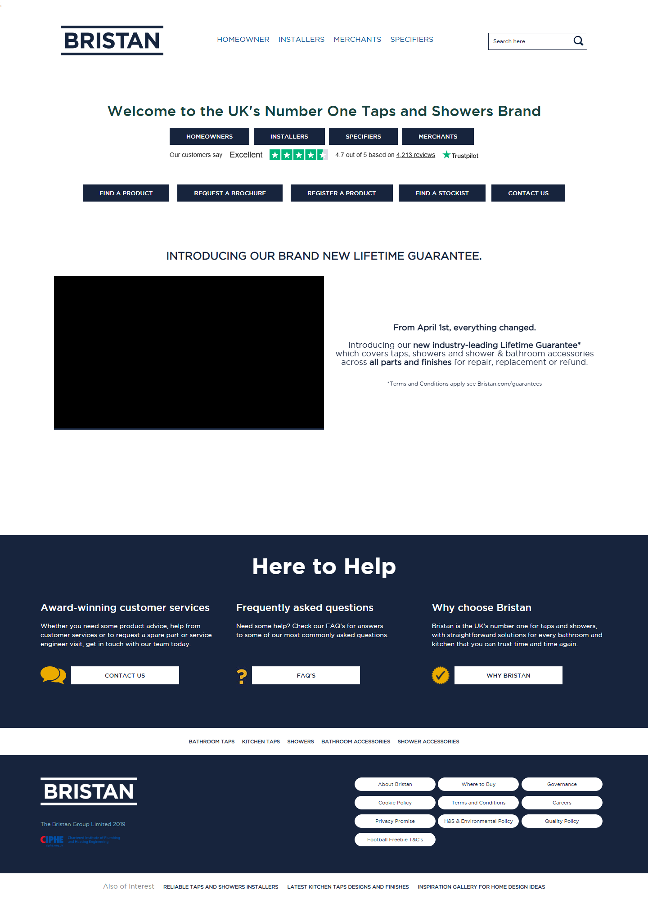
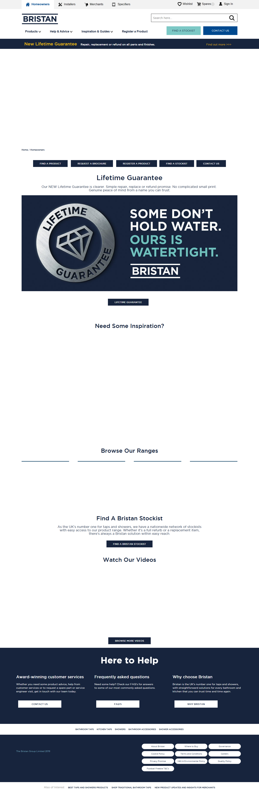
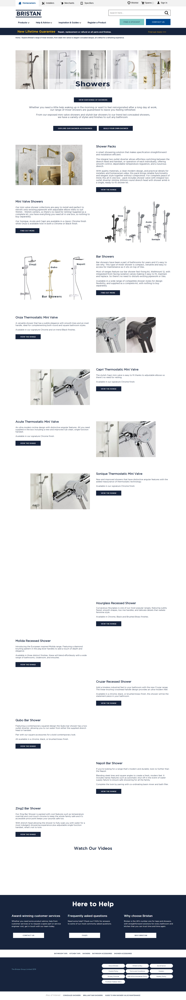
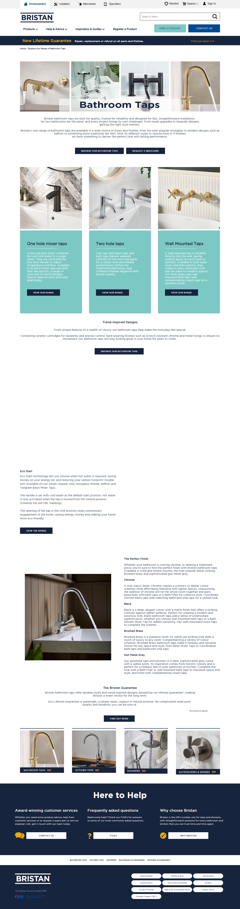
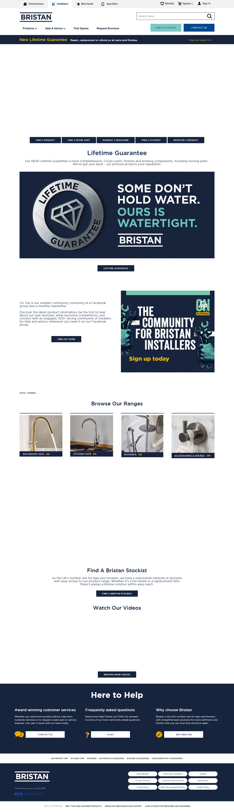
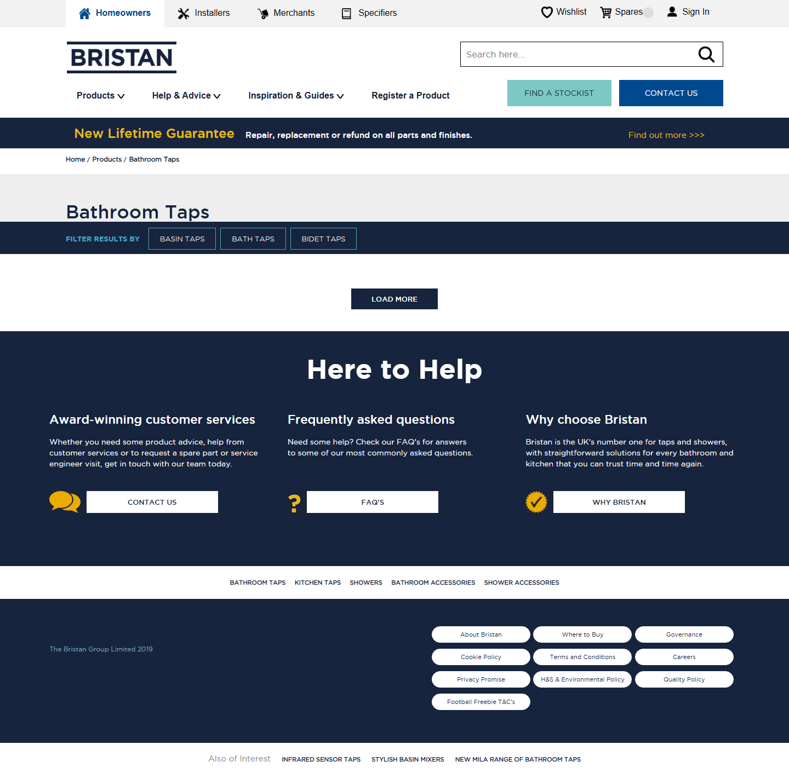
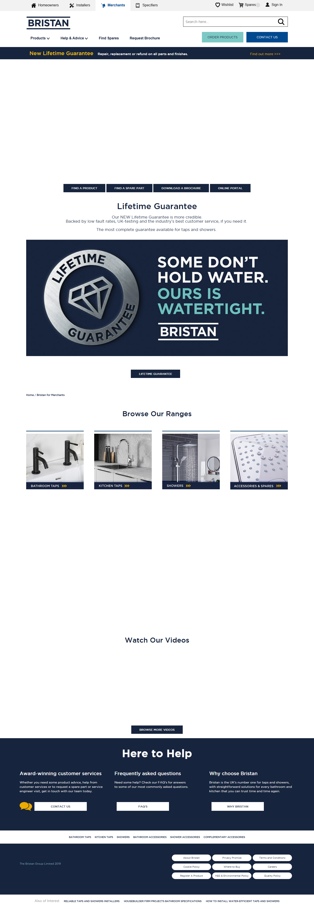
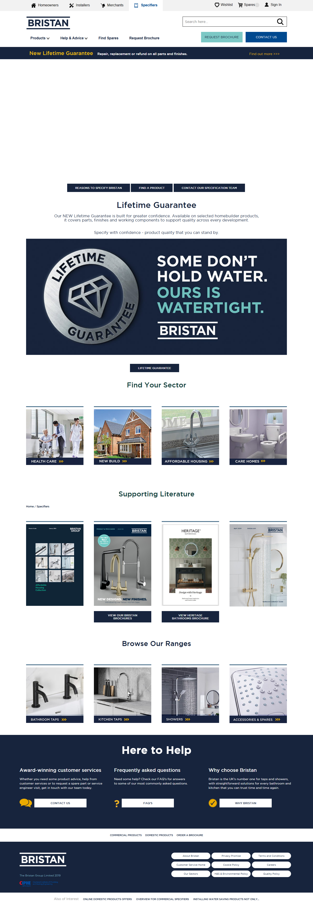
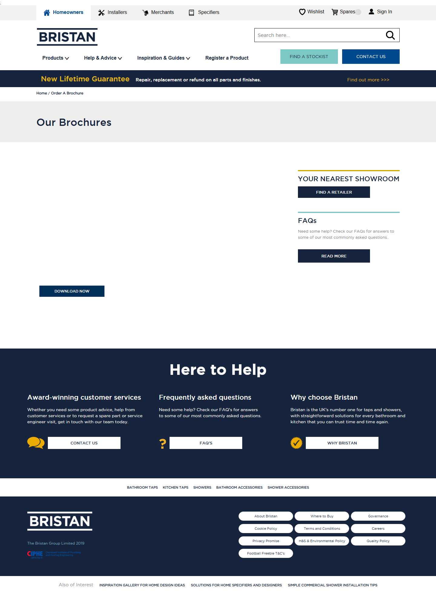

# Bristan demo site

UK taps and showers demo inspired by [bristan.com](https://www.bristan.com/). Uses **full site isolation**: own Sitecore collection, templates, renderings, and media — while reusing **industry-verticals** datasource templates and the same React component names as Forma Lux / retail.

|                        | Value                                                  |
| ---------------------- | ------------------------------------------------------ |
| **Reference site**     | [bristan.com](https://www.bristan.com/)                |
| **Rendering host**     | `bristan` → `industry-verticals/bristan`               |
| **Build key**          | `bristan` in `xmcloud.build.json`                      |
| **Site name**          | `bristan`                                              |
| **Collection path**    | `/sitecore/content/bristan`                            |
| **Site content path**  | `/sitecore/content/bristan/bristan`                    |
| **Module**             | `authoring/items/bristan/bristan.module.json`          |
| **Design captures**    | `design-screenshots/bristan-com/`                      |
| **Component manifest** | `design-screenshots/bristan-com/component-review.json` |

### Isolation layout

| Sitecore area        | Path                                                    |
| -------------------- | ------------------------------------------------------- |
| Collection           | `/sitecore/content/bristan`                             |
| Site                 | `/sitecore/content/bristan/bristan`                     |
| Templates            | `/sitecore/templates/Project/bristan`                   |
| Branches             | `/sitecore/templates/Branches/Project/bristan`          |
| Renderings           | `/sitecore/layout/Renderings/Project/bristan`           |
| Placeholder settings | `/sitecore/layout/Placeholder Settings/Project/bristan` |
| Project settings     | `/sitecore/system/Settings/Project/bristan`             |
| Media library        | `/sitecore/media library/Project/bristan`               |

Datasource templates still reference **Project/industry-verticals** (Hero, Promo, Footer, etc.). Renderings under **Project/bristan** use unique IDs (`b8030070-*`) but the same `componentName` values as the shared verticals set.

---

## Design reference (captured from bristan.com)

Desktop screenshots below were captured with Playwright (`url-screenshots` skill). Full set (desktop / tablet / mobile, clean + overlay) lives under `design-screenshots/bristan-com/`.

### Home



_Route: `/` — audience gateway, lifetime guarantee promo, hero carousel_

### Homeowners



_Route: `/homeowners-home` — inspiration carousel, lifetime guarantee, stockist CTA_

### Showers



_Route: `/showers` — shower packs, mini valve, bar showers, recessed ranges_

### Bathroom taps



_Route: `/bathroom-taps` — one-hole / two-hole / wall-mounted, finishes, Eco Start_

### Installers



_Route: `/installers-home` — On Tap community, lifetime guarantee, essentials range_

### Product listing



_Route: `/products/bathroom-taps` — filter sidebar + product grid_

### Merchants



_Route: `/merchants-home` — merchant portal, brochures, stockist network_

### Specifiers



_Route: `/specifiers-home` — sector tiles (healthcare, new build, affordable housing, care homes)_

### Brochures



_Route: `/order-a-brochure` — downloadable brochure list_

### Design tokens (from capture)

| Token                 | Value                           |
| --------------------- | ------------------------------- |
| Primary navy          | `#003058`                       |
| Secondary             | `#17243d`                       |
| Accent / gradient end | `#7aa7be`                       |
| Typography            | Gotham Book / Medium / Bold     |
| Neutrals              | `#ffffff`, `#898989`, `#000000` |

Re-capture:

```bash
node .cursor/skills/mimic-website-skills/url-screenshots/scripts/capture.mjs \
  --file design-screenshots/bristan-com/capture-urls.txt \
  --out design-screenshots/bristan-com --manifest
```

---

## Site connection

| Setting        | Value                                         |
| -------------- | --------------------------------------------- |
| Site name      | `bristan`                                     |
| Rendering host | `bristan` → `industry-verticals/bristan`      |
| Start item     | Home (`b8030000-0001-4000-8000-000000000002`) |

In **Settings → Site Grouping → bristan**, set **Predefined application editing host** to `bristan` (same pattern as [Forma Lux site grouping](../assets/sitecore-predefined-application-editing-host.png)).

## Pages (Sitecore routes)

| Route                     | Content item    | Reference screenshot                                                                      |
| ------------------------- | --------------- | ----------------------------------------------------------------------------------------- |
| `/`                       | Home            | [home-desktop.png](./images/bristan/home-desktop.png)                                     |
| `/homeowners-home`        | Homeowners      | [homeowners-home-desktop.png](./images/bristan/homeowners-home-desktop.png)               |
| `/showers`                | Showers         | [showers-desktop.png](./images/bristan/showers-desktop.png)                               |
| `/bathroom-taps`          | Bathroom Taps   | [bathroom-taps-desktop.png](./images/bristan/bathroom-taps-desktop.png)                   |
| `/installers-home`        | Installers      | [installers-home-desktop.png](./images/bristan/installers-home-desktop.png)               |
| `/merchants-home`         | Merchants       | [merchants-home-desktop.png](./images/bristan/merchants-home-desktop.png)                 |
| `/specifiers-home`        | Specifiers      | [specifiers-home-desktop.png](./images/bristan/specifiers-home-desktop.png)               |
| `/products/bathroom-taps` | Product listing | [products-bathroom-taps-desktop.png](./images/bristan/products-bathroom-taps-desktop.png) |
| `/order-a-brochure`       | Brochures       | [order-a-brochure-desktop.png](./images/bristan/order-a-brochure-desktop.png)             |

## Shared components used

Pages use **Project/bristan** renderings (unique IDs, same React `componentName` values as industry-verticals / Essential Living):

| Area           | Sitecore renderings                                            | React path                                                                                |
| -------------- | -------------------------------------------------------------- | ----------------------------------------------------------------------------------------- |
| Chrome         | Header, Navigation, Navigation Icons, Image, Footer, Link List | `src/components/header`, `navigation`, `navigation-icons`, `image`, `footer`, `link-list` |
| Home / landing | Hero Banner, Promo, Features, Rich Text                        | `hero-banner`, `promo`, `features`, `rich-text`                                           |
| Products       | Page Header, Product Listing, Product Details                  | `page-header`, `product-listing`, `product-details`                                       |
| Optional       | Breadcrumb, Search Results, Article Listing                    | `breadcrumb`, `search-results`, `article-listing`                                         |

See `design-screenshots/bristan-com/component-review.json` for the page-by-page mapping.

### React component map

Registered SXA components live in `.sitecore/component-map.ts` (generated baseline via CLI, with search widgets merged manually like retail).

```bash
cd industry-verticals/bristan
npm run sitecore-tools:generate-map
```

**Regenerate notes:**

- `sitecore.cli.config.ts` scans `src/components` but **excludes** `content-sdk`, `non-sitecore`, `demo`, and `cdp-profile-panel` folders.
- After generate, re-add **search widget** entries (`PreviewSearch`, `SearchResultsComponent`, etc.) if the CLI removed them — they are imported from `non-sitecore/search/*` but registered for Sitecore Search placeholders.
- **Do not** register app-shell modules in the map: `DemoAuthShell`, `DemoLoginModal`, `CdpProfileShell`, etc. Those are wired in `src/pages/_app.tsx` only.

**Hero Banner variants** (`src/components/hero-banner/HeroBanner.tsx`):

| Headless variant | React export | Use                                                 |
| ---------------- | ------------ | --------------------------------------------------- |
| Default          | `Default`    | Home welcome band + banner below (bristan.com home) |
| TopContent       | `TopContent` | Category pages — title over image                   |

Styling follows Essential Living / Forma Lux patterns (direct SDK `<Text>`, `<RichText>`, `<Link>` fields). Bristan-specific layout is in `src/assets/components/hero-banner.css`.

**Search widgets** (`src/constants/search.ts`): shared retail source rfkIds — `formalux_preview_search`, `formalux_search_results`, `formalux_search_home_highlight_articles`.

## Local development

```bash
cd industry-verticals/bristan
cp .env.remote.example .env.local
# Set SITECORE_EDGE_CONTEXT_ID, SITECORE_EDITING_SECRET from Deploy portal
npm install
npm run dev
```

### Search environment variables

Bristan uses the shared Forma Lux search source. Set the search variables listed in [Deployment Guide — Bristan](./DEPLOYMENT-GUIDE.md#bristan) on the **`bristan`** editing host in XM Cloud Deploy and in `.env.local` for local development. Copy **customer key**, **API key**, and **source id** from the [CEC portal](https://sitecore.atlassian.net/wiki/x/ZwAengE) or your team's Deploy portal configuration — do not commit those values to the repo.

To **list or update** deployed values via CLI, see [Deployment Guide — Check and update environment variables (Deploy CLI)](./DEPLOYMENT-GUIDE.md#7-check-and-update-environment-variables-deploy-cli). Resolve the editing host **environment id** from `dotnet sitecore cloud environment list` by matching the host name `bristan`.

## Authoring

Regenerate page content and presentation:

```bash
node authoring/items/bristan/scripts/generate-bristan-site.mjs
```

Deploy to CM (use your **environment nickname** for `-n`, module name for `-i`):

```bash
# One-time: connect CM (use the CM environment id from Deploy portal or `dotnet sitecore cloud environment list`)
dotnet sitecore cloud environment connect --environment-id <cm-environment-id> --allow-write true

# Push only the bristan module
dotnet sitecore serialization push -n SitecoreSilverProd -i bristan
```

`-n` is the nickname from `dotnet sitecore cloud environment connect` (stored in `.sitecore/user.json`), **not** `bristan`. The module namespace is `-i bristan`.

XM Cloud build deploys `Project.IndustryVerticals` and `bristan` together (`xmcloud.build.json`). The bristan module is fully isolated — no overlap with `/sitecore/content/industry-verticals/bristan`.

If the old industry-verticals path exists in CM from a prior deploy, remove or migrate it manually after pushing the new module.

---

## Page Designs and template-to-design mapping

The **Template to design mapping** field on **Presentation → Page Designs** is populated by a Sitecore field-source query (defined on the SXA **Page Designs** template). Forma Lux shows the expected rows (`Page` → `Default`, `ProductPage` → `ProductPage`, etc.). If Bristan shows unrelated system entries (Folder, PowerShell Rule, Script Library, …) or an empty list, the query tokens are not resolving in site context — usually because site shell items still have the wrong template in CM or **Settings** path fields are missing.

> **Canonical reference:** [SITECORE-SITE-SHELL.md](./SITECORE-SITE-SHELL.md) — template map, generator rules, and verification checklist for all isolated sites.

### Field source query

```
query:$templates||query:$pageDesigns//*[@@templatename='Page Design']
```

| Part                              | Meaning                                                                                                                     |
| --------------------------------- | --------------------------------------------------------------------------------------------------------------------------- |
| `query:`                          | Run a Sitecore query (not a fixed path)                                                                                     |
| `\|\|`                            | **OR** — merge both result sets into one picker list                                                                        |
| `$templates`                      | Resolves to the site **Settings → Templates** path (for Bristan: `/sitecore/templates/Project/bristan`)                     |
| `$pageDesigns`                    | Resolves to the site **Presentation → Page Designs** folder (`/sitecore/content/bristan/bristan/Presentation/Page Designs`) |
| `//`                              | All descendants                                                                                                             |
| `*[@@templatename='Page Design']` | Only items based on the **Page Design** template (Default, ProductPage, ProductCategoryPage, …)                             |

**Left side of `\|\|`** — page templates under the project templates folder (`Page`, `ProductPage`, `ProductCategoryPage`, …).

**Right side** — page design items under the site’s Page Designs folder.

The mapping UI uses the left column for templates and the right column for designs. Both sides depend on site tokens resolving correctly.

### How tokens resolve for Bristan

| Token          | Must point to                                                 | Serialized in repo                                                                                                                  |
| -------------- | ------------------------------------------------------------- | ----------------------------------------------------------------------------------------------------------------------------------- |
| `$templates`   | `/sitecore/templates/Project/bristan`                         | **Settings → Templates** on `/sitecore/content/bristan/bristan/Settings`                                                            |
| `$pageDesigns` | `/sitecore/content/bristan/bristan/Presentation/Page Designs` | **Presentation** folder uses SXA Presentation template; **Page Designs** child uses **Page Designs** branch template (not JSS Data) |

Compare with Forma Lux: **Settings** uses JSS App Settings, **Presentation** uses Presentation Folder, **Page Designs** uses `/sitecore/templates/Project/industry-verticals/Page Designs`.

### Why the dropdown shows the wrong items

Yes — this is directly related to the template inheritance issues on the Bristan site shell.

If **Settings** was still on **JSS Data** (`a29d272e…`) in CM:

- The **Templates**, **RenderingsPath**, **DictionaryPath**, etc. fields do not exist or are empty.
- `$templates` fails to resolve to `/sitecore/templates/Project/bristan` and the query falls back to a very broad templates tree — you see system templates (PowerShell, Folder, Alias, …) instead of **Page**, **ProductPage**, etc.

If **Presentation** or **Page Designs** were on **JSS Data**:

- `$pageDesigns` does not resolve.
- The **Designing** section may not appear correctly; stored mapping GUIDs show **Value not in the selection list**.

Other common causes:

- Serialization fixes not pushed to CM yet (`dotnet sitecore serialization push … -i bristan`).
- Editing the item outside Bristan site context (tokens resolve against the wrong site).
- **TemplatesMapping** value uses wrong template GUIDs or `%26` vs raw `&` encoding (see below).

### Expected mapping after fix

After a successful push, **Presentation → Page Designs → Designing** should allow:

| Page template       | Page design         |
| ------------------- | ------------------- |
| Page                | Default             |
| ProductPage         | ProductPage         |
| ProductCategoryPage | ProductCategoryPage |

Serialized value lives on the Page Designs folder item (`TemplatesMapping` field). Mappings use URL-encoded `{templateGuid}={designGuid}` pairs joined with `%26` (encoded `&`), matching the Forma Lux pattern.

### Verify in Content Editor

1. **Settings** (`/sitecore/content/bristan/bristan/Settings`)
   - Template: **JSS App** (not JSS Data)
   - **Templates** → `/sitecore/templates/Project/bristan`
   - **RenderingsPath** → `/sitecore/layout/Renderings/Project/bristan`
2. **Presentation** — template: **Presentation Folder** (not JSS Data)
3. **Page Designs** — template: **Page Designs** under Project/bristan (not JSS Data)
4. Open **Page Designs** → **Designing** → template dropdown should list **Page**, **ProductPage**, **ProductCategoryPage**; design dropdown should list **Default**, **ProductPage**, **ProductCategoryPage**.

If templates are still wrong in CM after push, confirm `bristan.module.json` allows `CreateUpdateAndDelete` on `/Presentation`, `/Settings`, `/Dictionary`, and `/Media`, then push again.

### Regenerate and push

```bash
node authoring/items/bristan/scripts/generate-bristan-site.mjs
dotnet sitecore serialization validate -i bristan
dotnet sitecore serialization push -n <cm-nickname> -i bristan
```

If push fails with duplicate item on disk, run `dotnet sitecore serialization validate -i bristan -f` (see hash-path note for `ProductCategoryContent` placeholder in the generator script).

---

## App README

[industry-verticals/bristan/README.md](../industry-verticals/bristan/README.md)
