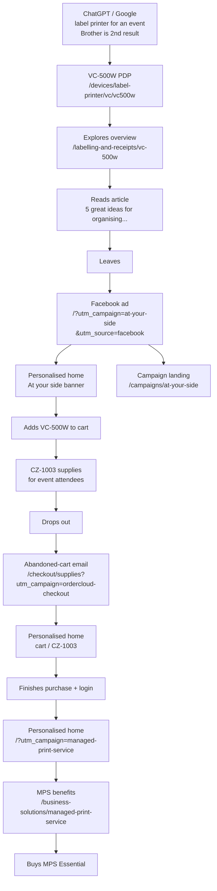

# Brother UK (labelling & printing vertical)

SitecoreAI demo host for **Brother UK** — [brother.co.uk](https://www.brother.co.uk/) labelling / VC-500W story. Collection and site system name: `brother`.

| | Value |
|--|--|
| **Reference design** | [brother.co.uk](https://www.brother.co.uk/) |
| **Rendering host** | `brother` → `industry-verticals/brother` |
| **Build key** | `brother` in `xmcloud.build.json` |
| **Site name** | `brother` |
| **Collection path** | `/sitecore/content/brother` |
| **Site content path** | `/sitecore/content/brother/brother` |
| **Module** | `authoring/items/brother/brother.module.json` (`brother-scs`) |
| **Design captures** | `design-screenshots/brother-co-uk/` |
| **Component review** | `design-screenshots/brother-co-uk/component-review.json` |
| **GUID prefix** | `b40e` (renderings / story pages) |

### Isolation layout

| Sitecore area | Path |
|---------------|------|
| Collection | `/sitecore/content/brother` |
| Site | `/sitecore/content/brother/brother` |
| Templates | `/sitecore/templates/Project/brother` |
| Renderings | `/sitecore/layout/Renderings/Project/brother` |
| Media | `/sitecore/media library/Project/brother` |

---

## Storyboard — event labelling journey

She needs a **label printer for an event**. ChatGPT and Google both surface Brother as the **2nd** result (visitor-badge guide → **VC-500W** → CZ-1003). She opens the PDP, explores the overview, reads the desk-organisation article, leaves, comes back via a Facebook ad, adds the printer plus CZ rolls for attendees, drops out, returns from an abandoned-cart email, finishes checkout, then sees an MPS-personalised home and buys Essential.



Use the floating **CDP panel** (bottom-right) for guest ID, affinities and journey. Use **Chat with Brother** (bottom-left) for the talk-track — chips follow the active intent. Auto-opens with `utm_source=chatgpt`.

| Beat | Open this |
|------|-----------|
| Home (default) | `/` |
| ChatGPT discovery | `/?utm_source=chatgpt&utm_campaign=label-printer` |
| Google SERP (Brother 2nd) | `/search?q=label+printer+for+an+event&utm_source=google` |
| VC-500W PDP | `/devices/label-printer/vc/vc500w` |
| VC-500W overview | `/labelling-and-receipts/vc-500w` |
| Desk organisation article | `/brother-for-home/blog/your-home-office/2024/5-great-ideas-for-organising-your-desk-and-home-office` |
| Facebook ad → personalised home | `/?utm_campaign=at-your-side&utm_source=facebook&persona=izzy` |
| Campaign landing | `/campaigns/at-your-side?utm_campaign=at-your-side&utm_source=facebook&persona=izzy` |
| CZ-1003 event supplies | `/supplies/label-printers/labels/cz/cz1003` |
| Abandoned-cart email | `/checkout/supplies?utm_campaign=ordercloud-checkout` |
| Cart-personalised home | `/?utm_campaign=ordercloud-checkout` |
| MPS-personalised home | `/?utm_campaign=managed-print-service` |
| MPS hub | `/business-solutions/managed-print-service` |
| MPS Essential | `/business-solutions/managed-print-service/mps-essential` |

### Intent query params (`HeroBanner` + home promo grid)

| Intent | Triggers | Home banner / promo |
|--------|----------|---------------------|
| `label-printer` | label-printer, vc-500w, labelling, izzy | VC-500W product shot |
| `at-your-side` | at-your-side, atyourside | At your side laptop hero + campaign promos |
| `supplies` / `return-visit` | ordercloud, checkout, cart, return | Abandoned-cart / CZ-1003 |
| `mps` | managed-print, mps | MPS generic banner + Essential / sustainability |
| `home-printer` | home-printer, jack, google+printer | Jack printers shortlist |

## Story & catalogue pages

| Route | Purpose |
|-------|---------|
| `/` | Home — hero + promo + featured product grid |
| `/campaigns/at-your-side` | Izzy multi-channel campaign landing |
| `/checkout/supplies` | OrderCloud cart / checkout demo |
| `/search` | Site search (demo index) |
| `/labelling-and-receipts` | Labelling hub — CategoryListing + products |
| `/labelling-and-receipts/office-labelling` | Office labelling subcategory |
| `/labelling-and-receipts/vc-500w` | VC-500W overview (+ promo / selected) |
| `/printers` · `/scanners` · `/devices` · `/supplies` | Category listings |
| `/supplies/toner/tn-243bk` · `/supplies/labels/dk-22205` · `/supplies/label-printers/labels/cz/cz1003` | Supplies SKUs |
| `/business-solutions` | Business hub |
| `/business-solutions/managed-print-service` · `.../mps-essential` | MPS solution pages |
| `/support` | Support hub |
| `/brother-for-home/blog/your-home-office/2024/5-great-ideas-for-organising-your-desk-and-home-office` | CMS-authored blog article (abstract, rich-text body, tags, related posts) |
| `/brother-for-home/blog/your-home-office/2025/...` | Three related posts linked from the article above |
| Product PDPs under `/devices/...` | Catalogue below (incl. `ql-800`, `vc500w`, `vc500wcr`) |

### Product catalogue (search + listings)

| Model | Path | Category |
|-------|------|----------|
| VC-500W | `/devices/label-printer/vc/vc500w` | Labelling |
| QL-800 | `/devices/label-printer/ql/ql-800` | Labelling |
| QL-820NWB | `/devices/label-printer/ql/ql-820nwb` | Labelling |
| PT-P750W | `/devices/label-printer/pt/pt-p750w` | Labelling |
| TD-4550DNWB | `/devices/label-printer/td/td-4550dnwb` | Labelling |
| DCP-L3520CDW | `/devices/printers/dcp/dcp-l3520cdw` | Printers |
| MFC-L8390CDW | `/devices/printers/mfc/mfc-l8390cdw` | Printers |
| HL-L2460DN | `/devices/printers/hl/hl-l2460dn` | Printers |
| HL-L2460DW | `/devices/printers/hl/hl-l2460dw` | Printers |
| ADS-1800W | `/devices/scanners/ads/ads-1800w` | Scanners |
| ADS-4900W | `/devices/scanners/ads/ads-4900w` | Scanners |
| TN-243BK | `/supplies/toner/tn-243bk` | Supplies |
| TN-243C | `/supplies/toner/tn-243c` | Supplies |
| DK-22205 | `/supplies/labels/dk-22205` | Supplies |

Products include demo SKU, GBP price, and related slugs. Source: `industry-verticals/brother/src/lib/products-catalog.ts`.

### Article catalogue (blog + ArticleBody fallbacks)

| Heading | Path |
|---------|------|
| 5 great ideas for organising your desk… | `/brother-for-home/blog/.../5-great-ideas-...` |
| Full-colour labels without ink | `/brother-for-home/blog/labelling/.../colour-labels-without-ink` |
| Hybrid desk setup | `/brother-for-home/blog/.../hybrid-desk-setup` |
| One brief. Web, email, paid social. | `/brother-for-home/blog/campaigns/.../at-your-side-one-brief` |
| Toner reorder without friction | `/brother-for-home/blog/supplies/.../toner-reorder-without-friction` |
| Warehouse labels that scan first time | `/brother-for-home/blog/labelling/.../warehouse-labels-that-scan-first-time` |

Each article has heading, description, lead, body HTML, author, date, category, tags, read time, CTAs, and related product/article slugs. Source: `articles-catalog.ts` (feeds `search-index.ts` + `ArticleBody`).

### CMS-authored blog articles

`/brother-for-home/blog/your-home-office/2024/5-great-ideas-for-organising-your-desk-and-home-office` is authored end-to-end in Sitecore on the **ArticlePage** template (Breadcrumb → ArticleBody → RelatedProducts), mirroring the live Brother article. ArticlePage `/Content` fields:

| Field | Type | Purpose |
|-------|------|---------|
| `Title` · `Eyebrow` | Single-Line Text | Headline and kicker |
| `PublishedDate` | Date | Rendered as `13 February 2024` |
| `ReadTimeMinutes` | Integer | Rendered as `3 minute read` |
| `Author` · `Category` | Single-Line Text | Byline and blog category |
| `Lead` | Multi-Line Text | Article abstract above the body |
| `Body` | Rich Text | Article body HTML (headings + bullet lists) |
| `Tags` | Single-Line Text | Comma-separated, rendered as tag chips |
| `RelatedArticles` | Treelist | **Related posts** cards under the body (title, date, read time, abstract, hero image) |
| `HeroImage` · `CtaLink` | Image / General Link | Hero and in-article CTA |

Three sibling posts under `.../your-home-office/2025/` (`balancing-business-toddlers-and-the-school-run`, `transforming-and-empowering-small-businesses-with-printing`, `hobby-to-home-business-manchester-honey-company`) supply the related-posts grid and cross-link back. `ArticleBody` falls back to `articles-catalog.ts` when the page has no CMS values.

### Demo search (Sitecore Search stand-in)

Until `NEXT_PUBLIC_SITECORE_SEARCH_INDEX_ID` is wired to `@sitecore-content-sdk/nextjs/search`, `/search` and the header typeahead use a **local demo index**.

Try: `label printer`, `VC-500W`, `scanner`, `laser`, `toner`, `desk`, `ZINK`, `OrderCloud`.

---

## Local setup

```bash
cd industry-verticals/brother
cp .env.remote.example .env.local   # if present; else create from Deploy portal
# SITECORE_EDGE_CONTEXT_ID, SITECORE_EDITING_SECRET, NEXT_PUBLIC_DEFAULT_SITE_NAME=brother
npm install
npm run dev
```

### Authoring / media

```bash
node authoring/items/brother/scripts/generate-brother-site.mjs
powershell -File authoring/items/brother/scripts/Download-BrotherMedia.ps1
dotnet sitecore serialization validate --fix -i brother-scs
dotnet sitecore cloud login
dotnet sitecore serialization push -n sitecoreSilverProd -i brother-scs
```

### Hosting

Vercel project settings (root directory `industry-verticals/brother`, files outside root included, Node 24.x) and the full
environment-variable list live in [`VERCEL-DEPLOYMENT.md`](./VERCEL-DEPLOYMENT.md#brother-uk-project-settings).

**Media (mandatory):** story images are downloaded from Brother Content Hub into `media-library` YAML and copied to `public/images/` for live fallbacks. Do not hotlink brother.co.uk CDNs in datasources. Mimic is not complete until `media-library` is **pushed**.

After push/publish, the same catalogue URLs are what Sitecore Search would crawl; until a Search index ID is set, the FE uses the local demo index on `/search`.

Note: Playwright captures against brother.co.uk may be WAF-blocked (“request is blocked”). Use browser User-Agent HTML under `design-screenshots/brother-co-uk/fetched-html/` plus `Download-BrotherMedia.ps1`.

---

## Page Designs (Forma Lux pattern)

| Page Design | Partial Designs | Template mapping |
|-------------|-----------------|------------------|
| **Default** | Header + Footer | `Page` |
| **ProductCategoryPage** | Header + ProductCategoryContent + Footer | `ProductCategoryPage` (listings) |
| **ProductPage** | Header + ProductContent + Footer | `ProductPage` (PDPs) |

Partial Designs live under `Presentation/Partial Designs/` (`Signature` = `header` / `footer` / `productcontent` / `productcategorycontent`). **ProductContent** is Breadcrumb + ProductDetail only. `CtaBanner` and `RelatedProducts` are on the ProductPage item (`headless-main`) so they can be personalized per PDP. Listing hubs (`/printers`, `/devices`, …) and device PDPs assign the matching **Page Design**; chrome comes from partials, not Layout fallbacks (Layout still falls back if placeholders are empty).

## Components

CMS-editable via Project/brother templates. Datasource folders live under `Data/Headers`, `Hero Banners`, `Feature Grids`, `Promo Grids`, `Product Listings`, `Articles`, `Promo Strips`, `Product Details`, `Related Products`, `Product Promos`, `Cta Banners`, `Campaign Landings`. PDPs use **ProductPage** fields (images, features, related Treelist); articles use **ArticlePage** + `ArticleBody` datasource. **ProductListing** datasources include a **Products** Treelist of ProductPages — card images/titles come from those pages (DAM Image fields); edit Title/Intro on the listing datasource, and Image/Title/Subtitle/SKU on each ProductPage. **VC-500W** (`/labelling-and-receipts/vc-500w`) uses Default page design: Breadcrumb → Compact HeroBanner → Promo ImageLeft / ImageRight → LinkList → SelectedProducts → Promo ImageLeft (**VC-500W Related Article**, CTA to the desk-organisation blog post).

**Managed Print Service** (`/business-solutions/managed-print-service`) mirrors the live MPS page: Breadcrumb → Compact HeroBanner (`Hero Banners/MPS Banner`) → Promo ImageRight “Why choose our managed print service?” (`Product Promos/MPS Why Choose`, rich-text benefit list) → FeatureGrid MPS Essential / Professional / Enterprise (`Feature Grids/MPS Plans`) → PromoGrid **TwoColumn** benefits + calculator signposts (`Promo Grids/MPS Resources`) → Promo ImageRight reseller (`Product Promos/MPS Reseller`) → Promo ImageRight free ink & toner returns (`Product Promos/MPS Free Returns`) → LinkList → SelectedProducts. The Promo `Description` field is **Rich Text** so promos can render bulleted benefit lists.

**SelectedProducts datasources:** `Data/Selected Products/` holds three curated strips on the RelatedProducts template
(`Title`, `ProductsList` Treelist of ProductPages, `ProductsLink`): **Labelling Selected Products** (labelling hub +
office labelling), **VC-500W Selected Products** (VC-500W overview, excludes the VC-500W itself) and **MPS Selected
Products** (MPS + MPS Essential). Card images come from each ProductPage's DAM `Image` field; price and SKU are matched
from the local catalogue by page URL. Without a datasource the component falls back to route-aware catalogue cards that
use `public/images/` files, which is why unwired renderings showed broken thumbnails.

**Related products — one component, one datasource:** `RelatedProducts` is the only related-products strip on the site.
PDPs get it from the **page layout** (ProductPage `__Standard Values` and each store PDP `__Renderings`) with the single
shared datasource `Data/Related Products/PDP Related Products` (QL-800, VC-500W, PT-P750W, HL-L2460DN). It sits **after**
`CtaBanner`, not inside the ProductContent partial, so the discount bar can sit between product chrome and related cards.
The blog article uses `Blog Related Products`. `ProductDetail` no longer renders its own strip. Card images come from each
ProductPage's DAM `Image` field (catalogue image only as a last resort), titles/subtitles fall back to the catalogue, the
current page is filtered out of its own list, and a rendering with no datasource falls back to the page's own
`RelatedProducts` Treelist.

**PromoGrid personalization:** seed four datasources — `Home Promo Grid` (default register / business / sustainability), plus **Jack**, **Izzy**, and **Rick** variants. In Pages, add personalization rules on the Home `PromoGrid` rendering to swap datasource. Locally, UTM/persona query params also swap FE fallbacks (`?persona=jack` / `at-your-side` / `ordercloud`).

**CtaBanner personalization (PDP return / abandoned-cart email):** `CtaBanner` is on the **product page** (`headless-main` sibling of Partial design content), not on ProductContent. Shared default: `Data/Cta Banners/PDP Return Discount` — **Title**, **DiscountCode** (`EVENT15`), **CtaLink** (Find out more → `/checkout/supplies?utm_campaign=ordercloud-checkout`). In Pages, personalize that page-level rendering (hide default / swap datasource for return / email UTMs). Do **not** add CtaBanner to the ProductContent partial — partial rules apply to every PDP and Pages will not let you personalize them per page.

**Placeholder Allowed Controls:** the same Brother page-component list (CtaBanner, Promo, PromoStrip, RelatedProducts, SelectedProducts, FeatureGrid, RichText, ContentBlock, … — not Header/Footer) is on `headless-main`, `headless-main-{*}`, `main`, `productcontent`, `headless-productcontent`, and `sxa-productcontent`. ProductContent is Breadcrumb + ProductDetail only. CtaBanner and RelatedProducts are page-level on `headless-main`.

### Demo cart (Add to cart)

Local `localStorage` cart for the OrderCloud commerce beat — not a live OrderCloud API.

| Piece | Path |
|-------|------|
| Store | `src/lib/demo-cart.ts` (`brother-demo-cart`) |
| Button | `src/lib/AddToCartButton.tsx` |
| Product cards | `src/lib/ProductCard.tsx` — listing / selected / related |
| Header count | `src/lib/CartLink.tsx` → `/checkout/supplies?utm_campaign=ordercloud-checkout` |
| Checkout | `OrderCloudCheckout` — cart lines if any, else TN-243BK + DK-22205 demo lines |

**PDP:** `ProductDetail` shows **Add to cart** first (SKU/price from the catalogue). Authored `PrimaryCta` / `SecondaryCta` stay as outline actions.

**Cards:** always use `ProductCard` (link + **Add to cart**). Do not wrap a whole card in `<a className="brother-card">`. SKU/price come from `products-catalog.ts` via page URL.

**Helpers stay in `src/lib/`** — `sitecore-tools` registers every folder under `src/components/` as a Sitecore component.

Agent skill: [`.cursor/skills/brother-commerce/SKILL.md`](../.cursor/skills/brother-commerce/SKILL.md).

| Component | Role |
|-----------|------|
| `Header` / `HeaderSearch` | Partial Design `Header` + typeahead; **Logo** Image media field on `Data/Headers/Site Header`; **Cart** count from the demo cart |
| `CdpProfileShell` | Floating CDP panel — affinities, journey, identify Jack |
| `AiChatbot` | App-shell pull-up chat (bottom-left); Brother Q&A + search index |
| `Footer` | Partial Design `Footer` |
| `HeroBanner` | Home banner + UTM intents; **Compact** / **Split** for hubs |
| `Breadcrumb` | Path-based trail on category / PDP / solution pages |
| `PageHeader` / `PageContent` / `RichText` / `ContentBlock` | Generic content blocks |
| `CategoryListing` | Category discovery (WithFilters) — catalogue fallback |
| `LinkList` | Hub / MPS navigation lists |
| `SelectedProducts` | Curated product strip (Add to cart on each card) |
| `Promo` | Generic image+copy+CTA — variants **ImageLeft** / **ImageRight**; datasources under `Data/Product Promos` |
| `CampaignLanding` | `/campaigns/at-your-side` multi-channel pack (CMS fields) |
| `OrderCloudCheckout` | `/checkout/supplies` commerce demo — shows items added via **Add to cart**, or the default toner/DK lines |
| `PromoGrid` | 3-up home promos (image / heading / description / CTA) — personalizable datasources under `Data/Promo Grids` |
| `PromoStrip` | Labelling CTA band (CMS) |
| `CtaBanner` | Magenta full-width bar (Title, DiscountCode, CtaLink) — personalize on PDPs for return / abandoned-cart email. Datasource: `Data/Cta Banners/PDP Return Discount` (`EVENT15`) |
| `ProductListing` | Title / Category / Intro / Image + **Products** Treelist (ProductPages with DAM images); catalogue fallback if empty; **Add to cart** on cards |
| `ProductDetail` | ProductPage fields + gallery / features / **specifications** / **Add to cart** |
| `RelatedProducts` | Treelist of ProductPages — `ProductCard` with **Add to cart** |
| `SiteSearch` | Full search UI on `/search` |
| `FeatureGrid` | Three CMS cards + CTA |
| `ArticleBody` | Blog/article body (also reads ArticlePage route fields) |
| `PartialDesignDynamicPlaceholder` | Resolves page-design partials |

Regenerate component templates: `node authoring/items/brother/scripts/generate-brother-component-templates.mjs` then `dotnet sitecore serialization validate --fix -i brother-scs` and push.

Layout falls back to Header/Footer when page-design chrome placeholders are empty.

---

## Content Hub media (DAM) and PCM products

Brother demo content in the sandbox Content Hub tenant has **three related layers**:

| Layer | Definition | Role for the demo |
|-------|------------|-------------------|
| **DAM assets** | `M.Asset` + public links | Sitecore Image fields (`src` + `dam-id`) on pages/datasources |
| **PCM products** | `M.PCM.Product` | Product catalog in [ch-products](https://starter-verticals-2.sitecoresandbox.cloud/en-us/ch-products) (Name, Number/SKU, slogan, long description, brand, family, master assets) |
| **XM Cloud CMS** | Sitecore serialization (`brother-scs`) | Pages, templates, renderings; Image fields point at DAM; PDPs are not auto-bound to PCM entities unless a connector is added later |

**AI skill (images / mimic):** [`.cursor/skills/sitecore-serialization-skills/sitecore-content-hub-images/SKILL.md`](../.cursor/skills/sitecore-serialization-skills/sitecore-content-hub-images/SKILL.md)

Full runbook (no secrets): [`authoring/items/brother/scripts/media-maps/README.md`](../authoring/items/brother/scripts/media-maps/README.md).

### Integration picture

```text
Brother page / PDP (XM Cloud)
  └─ Image fields ──dam-id──► Content Hub public asset URLs (DAM)

Content Hub PCM product (ch-products)
  ├─ Brand → Brother
  ├─ Family → Brother Labelling | Printers | Scanners | Supplies
  └─ Master assets → same M.Asset entities used by CMS Image fields
```

CMS and PCM share assets; they are **not** the same item. Re-run product script safely — it **dedupes by `ProductNumber` (SKU)** and only refreshes relations.

### What we sync (assets)

| Source | Examples |
|--------|----------|
| Deck / content-ready pack | `product-*`, personas, promos |
| Live Brother marketing + store pages | `web-*` from office-labelling, VC-500W, VC-500WCR, QL-800, CZ-1003, MPS, MPS Essential |
| Brother public Content Hub (`bie-p-001`) banners / feature modules | `web-banner-mps-generic.webp` (home MPS personalisation + MPS page hero), `web-home-sustainability.jpg` (home promo tile), `web-feature-why-choose-mps.webp` |
| Home story DAM | Logo `41f98f6ac7ae…`, At your side hero `e3ef5869a8d1…`, sustainability `e7f1794bcb25…`, MPS banner `442f69d5d9d2…` — see `media-maps/brother-sitecore-image-field-map.csv` |

### Metadata on every uploaded asset

| Field | Value |
|-------|-------|
| Brand | Brother |
| Asset type | Social Media Asset |
| Tag | Used in CMS |

### PCM products (demo SKUs)

Created via `New-BrotherContentHubProducts.ps1` (OAuth `client_credentials`):

| Family | Example SKUs |
|--------|----------------|
| Brother Labelling | VC500WZU1, QL800ZU1, QL820NWBZU1, PTP750WZU1, TD4550DNWBZU1 |
| Brother Printers | DCPL3520CDWZU1, MFCL8390CDWZU1, HLL2460DNZU1 |
| Brother Scanners | ADS1800WZU1, ADS4900WZU1 |
| Brother Supplies | CZ1003ZU1 |

Portal: [ch-products](https://starter-verticals-2.sitecoresandbox.cloud/en-us/ch-products). Inventory: `media-maps/content-hub-product-registry.csv`.

### Scripts (credentials via local env only)

| Script | Purpose |
|--------|---------|
| `Import-BrotherWebProductImages.ps1` | Download curated images from brother.co.uk / store.brother.co.uk |
| `Upload-BrotherContentHub.ps1` | Upload new files, public links, CMS field CSV (skips existing LocalFiles) |
| `Set-BrotherContentHubMetadata.ps1` | Apply brand / type / Used in CMS on assets |
| `New-BrotherContentHubProducts.ps1` | Create/update PCM products + families; attach master assets; write product inventory (dedupe by SKU) |
| `Sync-BrotherContentHubMedia.ps1` | Asset registry + Sitecore image map; `-ApplyPatch` / `-DownloadLocal` |
| `Update-BrotherCmsImageInventory.ps1` | Rebuild CMS image map from YAML + registry |

Copy `set-ch-env.example.ps1` to a **non-git** path, fill values locally, and dot-source before running. Never commit client secrets, passwords, or API tokens.

### Maps

Under `authoring/items/brother/scripts/media-maps/`:

- `content-hub-asset-registry.csv` — unique LocalFile → asset id / dam-id / public URL
- `content-hub-product-registry.csv` — SKU → PCM product id, family, Sitecore path, master asset ids, portal URL
- `content-hub-product-family-registry.csv` — Brother product families in CH
- `sitecore-cms-image-map.csv` — CMS path + field → DAM ids + sync status
- `content-hub-asset-metadata.csv` — metadata apply results
- `device-image-field-plan.csv` — device tree + Product Listing Image wiring

---

## Legal / demo note

SitecoreAI industry demo patterned after public Brother UK marketing pages. Brand assets are for local/demo authoring only.
