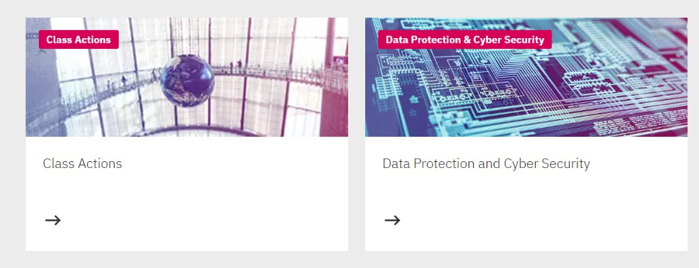

# Sitecore XM Cloud Industry Verticals - Component Reference

This document provides a comprehensive list of all components available across the industry verticals in this Sitecore Headless JSS project.

---

## Project Overview

| Vertical          | Site Name        | Rendering Host  | Path                                 |
| ----------------- | ---------------- | --------------- | ------------------------------------ |
| **Healthcare**    | Nova Medical     | `healthcare`    | `./industry-verticals/healthcare`    |
| **Luxury Retail** | Essential Living | `luxury-retail` | `./industry-verticals/luxury-retail` |
| **Marley** | Marley | `marley` | `./industry-verticals/marley` |
| **Retail**        | Forma Lux        | `nextjsstarter` | `./industry-verticals/retail`        |
| **Travel**        | Visit London     | `visitlondon`   | `./industry-verticals/visitlondon`   |
| **Energy**        | GridWell         | `energy`        | `./industry-verticals/energy`        |
| **Legal**         | Legal            | `legal`         | `./industry-verticals/legal`         |

---

## Component Inventory by Vertical

### 🏥 Healthcare (Nova Medical)

**Path:** `industry-verticals/healthcare/src/components/`

| Component                         | Description                                |
| --------------------------------- | ------------------------------------------ |
| `ColumnSplitter`                  | Layout component for multi-column content  |
| `Container`                       | Wrapper component for content sections     |
| `ContentBlock`                    | Rich content display block                 |
| `ContentSection`                  | Structured content section with styling    |
| `DoctorDetails`                   | Doctor profile and information display     |
| `DoctorsListing`                  | Grid/list of doctors                       |
| `Features`                        | Feature highlights component               |
| `Footer`                          | Site footer                                |
| `HeaderExtended`                  | Extended header with additional navigation |
| `HeroBanner`                      | Hero section with banner imagery           |
| `Image`                           | Image display component                    |
| `LinkList`                        | List of navigational links                 |
| `Navigation`                      | Main navigation menu                       |
| `PageContent`                     | Page content wrapper                       |
| `PartialDesignDynamicPlaceholder` | Dynamic placeholder for partial designs    |
| `Promo`                           | Promotional content block                  |
| `Reviews`                         | Customer/patient reviews                   |
| `RichText`                        | Rich text content display                  |
| `RowSplitter`                     | Layout component for row-based content     |
| `SocialFollow`                    | Social media follow links                  |
| `ThemeSwitcher`                   | Theme toggle functionality                 |
| `Title`                           | Title/heading component                    |

**Non-Sitecore Components:**

- `BlobAccent` - Decorative blob shapes
- `CurvedClip` - Curved clipping mask
- `HamburgerIcon` - Mobile menu icon
- `HeroClip` - Hero section clipping mask

---

### 🛋️ Luxury Retail (Essential Living)

**Path:** `industry-verticals/luxury-retail/src/components/`

| Component                         | Description                               |
| --------------------------------- | ----------------------------------------- |
| `ColumnSplitter`                  | Layout component for multi-column content |
| `Container`                       | Wrapper component for content sections    |
| `ContentBlock`                    | Rich content display block                |
| `Features`                        | Feature highlights component              |
| `Footer`                          | Site footer                               |
| `Header`                          | Site header                               |
| `HeroBanner`                      | Hero section with banner imagery          |
| `Image`                           | Image display component                   |
| `LanguageSwitcher`                | Language selection component              |
| `LinkList`                        | List of navigational links                |
| `Navigation`                      | Main navigation menu                      |
| `NavigationIcons`                 | Icon-based navigation elements            |
| `Offers`                          | Special offers display                    |
| `PageContent`                     | Page content wrapper                      |
| `PageHeader`                      | Page-level header component               |
| `PartialDesignDynamicPlaceholder` | Dynamic placeholder for partial designs   |
| `ProductDetails`                  | Product detail page component             |
| `ProductListing`                  | Product grid/list display                 |
| `Promo`                           | Promotional content block                 |
| `RichText`                        | Rich text content display                 |
| `RowSplitter`                     | Layout component for row-based content    |
| `SectionWrapper`                  | Section wrapper with styling              |
| `SelectedProducts`                | Curated product selection display         |
| `SocialFeed`                      | Social media feed integration             |
| `SocialFollow`                    | Social media follow links                 |
| `Title`                           | Title/heading component                   |

**Non-Sitecore Components:**

- `AddToCartButton` - E-commerce add to cart
- `HamburgerIcon` - Mobile menu icon
- `MiniCart` - Cart preview widget
- `ParentPathLink` - Breadcrumb-style parent link
- `ProductCard` - Product card display
- `ProductColorControl` - Color variant selector
- `ProductGallery` - Product image gallery
- `ProductMetaDetails` - Product metadata display
- `ProductReviews` - Product review section
- `ProductSizeControl` - Size variant selector
- `QuantityControl` - Quantity input control
- `StarRating` - Star rating display

---

### 🏠 Marley (marley.co.uk)

**Path:** `industry-verticals/marley/src/components/`  
**Setup guide:** [MARLEY.md](./MARLEY.md)

Marley is a **dedicated rendering host** cloned from luxury-retail with article components from retail. Most renderings are **reused** (not Marley-prefixed); theme tokens live in `src/assets/marley/marley.css`.

| Component                         | Description                               |
| --------------------------------- | ----------------------------------------- |
| `ArticleDetails`                  | Blog article detail (from retail)         |
| `ArticleListing`                  | Blog listing grid (from retail)           |
| `ColumnSplitter`                  | Layout component for multi-column content |
| `Container`                       | Wrapper component for content sections    |
| `ContentBlock`                    | Rich content display block                |
| `Features`                        | Feature highlights (e.g. roof system USPs)|
| `Footer`                          | Site footer                               |
| `Header`                          | Site header with utility areas            |
| `HeroBanner`                      | Homepage and article heroes               |
| `Image`                           | Image display component                   |
| `LanguageSwitcher`                | Language selection component              |
| `LinkList`                        | Footer link columns                       |
| `Navigation`                      | Primary nav (products, help, technical)   |
| `NavigationIcons`                 | Search, stockist, samples utilities       |
| `Offers`                          | Promotional callouts                      |
| `PageContent`                     | Page content wrapper                      |
| `PageHeader`                      | In-page title bands                       |
| `PartialDesignDynamicPlaceholder` | Dynamic placeholder for partial designs   |
| `ProductDetails`                  | PDP (e.g. Acme Single Camber Plain Tile)  |
| `ProductListing`                  | Product category grids                    |
| `Promo`                           | Category / campaign promo tiles           |
| `RichText`                        | Long-form copy                            |
| `RowSplitter`                     | Layout component for row-based content    |
| `SectionWrapper`                  | Section wrapper with styling              |
| `SelectedProducts`                | Curated product picks                     |
| `SocialFeed`                      | Social content feed                       |
| `SocialFollow`                    | Social follow links                       |
| `Title`                           | Title/heading component                   |

**Non-Sitecore UI:** `ProductCard`, `ProductGallery`, `Pagination`, `SocialShare`, `MiniCart`, etc. under `non-sitecore/`.

---

### 🛒 Retail (Forma Lux)

**Path:** `industry-verticals/retail/src/components/`

| Component                         | Description                               |
| --------------------------------- | ----------------------------------------- |
| `AllProductsCarousel`             | Carousel of all products                  |
| `ArticleCarousel`                 | Article/blog carousel                     |
| `ArticleDetails`                  | Article detail page component             |
| `ArticleListing`                  | Article grid/list display                 |
| `Breadcrumb`                      | Navigation breadcrumb                     |
| `ColumnSplitter`                  | Layout component for multi-column content |
| `ContactForm`                     | Contact/inquiry form                      |
| `Container`                       | Wrapper component for content sections    |
| `ContentBlock`                    | Rich content display block                |
| `Features`                        | Feature highlights component              |
| `Footer`                          | Site footer                               |
| `Header`                          | Site header                               |
| `HeroBanner`                      | Hero section with banner imagery          |
| `Image`                           | Image display component                   |
| `LanguageSwitcher`                | Language selection component              |
| `LinkList`                        | List of navigational links                |
| `Navigation`                      | Main navigation menu                      |
| `NavigationIcons`                 | Icon-based navigation elements            |
| `Offers`                          | Special offers display                    |
| `PageContent`                     | Page content wrapper                      |
| `PartialDesignDynamicPlaceholder` | Dynamic placeholder for partial designs   |
| `ProductDetails`                  | Product detail page component             |
| `ProductListing`                  | Product grid/list display                 |
| `Promo`                           | Promotional content block                 |
| `Reviews`                         | Customer reviews section                  |
| `RichText`                        | Rich text content display                 |
| `RowSplitter`                     | Layout component for row-based content    |
| `SectionWrapper`                  | Section wrapper with styling              |
| `SelectedProducts`                | Curated product selection display         |
| `SocialFeed`                      | Social media feed integration             |
| `SocialFollow`                    | Social media follow links                 |
| `Subscribe`                       | Newsletter subscription component         |
| `Title`                           | Title/heading component                   |

**Non-Sitecore Components:**

- `AddToCartButton` - E-commerce add to cart
- `CarouselButton` - Carousel navigation button
- `HamburgerIcon` - Mobile menu icon
- `MiniCart` - Cart preview widget
- `Pagination` - Pagination controls
- `ProductCard` - Product card display
- `ProductCarousel` - Product carousel component
- `ProductColorControl` - Color variant selector
- `ProductDescription` - Product description display
- `ProductGallery` - Product image gallery
- `ProductMetaDetails` - Product metadata display
- `ProductReviews` - Product review section
- `ProductSizeControl` - Size variant selector
- `ProductTabs` - Tabbed product information
- `QuantityControl` - Quantity input control
- `ReviewCard` - Individual review card
- `SocialShare` - Social sharing buttons
- `StarRating` - Star rating display

---

### 🗺️ Travel (Visit London)

**Path:** `industry-verticals/visitlondon/src/components/`

| Component                         | Description                               |
| --------------------------------- | ----------------------------------------- |
| `AllProductsCarousel`             | Carousel of all products                  |
| `ArticleDetails`                  | Article detail page component             |
| `ArticleListing`                  | Article grid/list display                 |
| `BestSelling`                     | Bestselling mosaic list (Visit London-style, hardcoded price) |
| `Breadcrumb`                      | Navigation breadcrumb                     |
| `ColumnSplitter`                  | Layout component for multi-column content |
| `ContactForm`                     | Contact/inquiry form                      |
| `Container`                       | Wrapper component for content sections    |
| `ContentBlock`                    | Rich content display block                |
| `Features`                        | Feature highlights component              |
| `Footer`                          | Site footer                               |
| `Header`                          | Site header                               |
| `HeroBanner`                      | Hero section with banner imagery          |
| `Image`                           | Image display component                   |
| `LanguageSwitcher`                | Language selection component              |
| `LinkList`                        | List of navigational links                |
| `Navigation`                      | Main navigation menu                      |
| `NavigationIcons`                 | Icon-based navigation elements            |
| `Offers`                          | Special offers display                    |
| `PageContent`                     | Page content wrapper                      |
| `PartialDesignDynamicPlaceholder` | Dynamic placeholder for partial designs   |
| `ProductDetails`                  | Product detail page component             |
| `ProductListing`                  | Product grid/list display                 |
| `Promo`                           | Promotional content block                 |
| `Reviews`                         | Customer reviews section                  |
| `RichText`                        | Rich text content display                 |
| `RowSplitter`                     | Layout component for row-based content    |
| `SearchResults`                   | Search results with filters               |
| `SectionWrapper`                  | Section wrapper with styling              |
| `SelectedArticles`                | Curated article selection display         |
| `SelectedProducts`                | Curated product selection display         |
| `SocialFeed`                      | Social media feed integration             |
| `SocialFollow`                    | Social media follow links                 |
| `Subscribe`                       | Newsletter subscription component         |
| `ThemeEditor`                     | Theme editing component                   |
| `Title`                           | Title/heading component                   |

**Non-Sitecore Components:**

- `AddToCartButton` - E-commerce add to cart
- `CarouselButton` - Carousel navigation button
- `HamburgerIcon` - Mobile menu icon
- `MiniCart` - Cart preview widget
- `Pagination` - Pagination controls
- `ProductCard` - Product card display
- `ProductCarousel` - Product carousel component
- `ProductColorControl` - Color variant selector
- `ProductDescription` - Product description display
- `ProductGallery` - Product image gallery
- `ProductMetaDetails` - Product metadata display
- `ProductReviews` - Product review section
- `ProductSizeControl` - Size variant selector
- `ProductTabs` - Tabbed product information
- `QuantityControl` - Quantity input control
- `ReviewCard` - Individual review card
- `SocialShare` - Social sharing buttons
- `StarRating` - Star rating display
- `VisitLondonHeroSearch` - Visit London hero search component
- `VisitLondonLanguageCurrency` - Language and currency switcher
- `VisitLondonLogo` - Visit London logo component
- `search/ArticleCard` - Article card for search results
- `search/ArticleHorizontalCard` - Horizontal article card layout
- `search/CardViewSwitcher` - Toggle between card views
- `search/HomeHighlighted` - Highlighted search results
- `search/PreviewSearch` - Search preview component
- `search/QueryResultsSummary` - Search results summary
- `search/QuestionsAnswers` - Q&A search results
- `search/ResultsPerPage` - Results per page selector
- `search/SearchFacets` - Search filtering facets
- `search/SearchPagination` - Search pagination controls
- `search/SearchResultsComponent` - Main search results component
- `search/SortOrder` - Search sort order selector
- `search/Spinner` - Loading spinner
- `search/SuggestionBlock` - Search suggestions display

---

### ⚖️ Legal

**Path:** `industry-verticals/legal/src/components/`

| Component                         | Description                               |
| --------------------------------- | ----------------------------------------- |
| `ArticleDetails`                  | Article detail page component             |
| `ArticleListing`                  | Article grid/list display                 |
| `Breadcrumb`                      | Hierarchical navigation (ancestors + current page) |
| `ColumnSplitter`                  | Layout component for multi-column content |
| `Container`                       | Wrapper component for content sections    |
| `ContentBlock`                    | Rich content display block                |
| `Features`                        | Feature highlights component              |
| `Footer`                          | Site footer                               |
| `GridConditions`                  | Grid conditions visualization             |
| `GridDemand`                      | Grid demand/chart component               |
| `GridStatusGauge`                 | Grid status gauge indicator               |
| `Header`                          | Site header                               |
| `HeroBanner`                      | Hero section with banner imagery          |
| `Image`                           | Image display component                   |
| `LinkList`                        | List of navigational links                |
| `Navigation`                      | Main navigation menu                      |
| `PageContent`                     | Page content wrapper                      |
| `PartialDesignDynamicPlaceholder` | Dynamic placeholder for partial designs   |
| `Promo`                           | Promotional content block                 |
| `RichText`                        | Rich text content display                 |
| `RowSplitter`                     | Layout component for row-based content    |
| `SectionWrapper`                  | Section wrapper with styling              |
| `SelectedArticles`                | Curated article selection display         |
| `SocialFollow`                    | Social media follow links                 |
| `ThemeEditor`                     | Theme editing component                   |
| `Title`                           | Title/heading component                   |
| `SearchResults`                   | Search results with filters               |
| `Subscribe`                      | Newsletter signup                        |
| `SitecoreStyles`                  | Sitecore styling integration              |
| `CdpPageView`                     | CDP (Customer Data Platform) page tracking |
| `FEAASScripts`                    | FEAAS (Front-End as a Service) scripts    |

**Non-Sitecore Components:**

- `HamburgerIcon` - Mobile menu icon
- `Chart` - Reusable chart component
- `ParentPathLink` - Breadcrumb-style parent link
- `ArticleCard` - Article card for listings
- `SocialShare` - Social sharing buttons
- `search/ArticleCard` - Article card for search results
- `search/ArticleHorizontalCard` - Horizontal article card layout
- `search/CardViewSwitcher` - Toggle between card views
- `search/HomeHighlighted` - Highlighted search results
- `search/PreviewSearch` - Search preview component
- `search/QueryResultsSummary` - Search results summary
- `search/QuestionsAnswers` - Q&A search results
- `search/ResultsPerPage` - Results per page selector
- `search/SearchFacets` - Search filtering facets
- `search/SearchPagination` - Search pagination controls
- `search/SearchResultsComponent` - Main search results component
- `search/SortOrder` - Search sort order selector
- `search/Spinner` - Loading spinner
- `search/SuggestionBlock` - Search suggestions display

**Legal – Promo variants:** Aligned with the **retail (FormaLux)** Promo implementation: **Default** (two-column grid, optional multiple images, accent line, `arrow-btn` CTA), **WithFullImage** (wide image from `PromoImageTwo` + split title/description), **WithQuote** (decorative quote mark + `PromoImageOne`), and **Stacked** (DWF-style banner strip on the image + title/CTA). See `industry-verticals/legal/README.md` and [Control Risks brand tokens](../industry-verticals/legal/docs/CONTROL-RISKS-BRAND.md) for styling.

---

## Shared/Common Components

These components appear across multiple verticals:

| Component                         | Healthcare | Luxury Retail | Retail | Visit London |
| --------------------------------- | :--------: | :-----------: | :----: | :----------: |
| `ColumnSplitter`                  |     ✅     |      ✅       |   ✅   |      ✅      |
| `Container`                       |     ✅     |      ✅       |   ✅   |      ✅      |
| `ContentBlock`                    |     ✅     |      ✅       |   ✅   |      ✅      |
| `Features`                        |     ✅     |      ✅       |   ✅   |      ✅      |
| `Footer`                          |     ✅     |      ✅       |   ✅   |      ✅      |
| `HeroBanner`                      |     ✅     |      ✅       |   ✅   |      ✅      |
| `Image`                           |     ✅     |      ✅       |   ✅   |      ✅      |
| `LinkList`                        |     ✅     |      ✅       |   ✅   |      ✅      |
| `Navigation`                      |     ✅     |      ✅       |   ✅   |      ✅      |
| `PageContent`                     |     ✅     |      ✅       |   ✅   |      ✅      |
| `PartialDesignDynamicPlaceholder` |     ✅     |      ✅       |   ✅   |      ✅      |
| `Promo`                           |     ✅     |      ✅       |   ✅   |      ✅      |
| `RichText`                        |     ✅     |      ✅       |   ✅   |      ✅      |
| `RowSplitter`                     |     ✅     |      ✅       |   ✅   |      ✅      |
| `SocialFollow`                    |     ✅     |      ✅       |   ✅   |      ✅      |
| `Title`                           |     ✅     |      ✅       |   ✅   |      ✅      |

---

## Visit London - Required styling + icon setup (implementation notes)

Visit London uses a **CSS background SVG icon** approach (data-URIs) for logos and UI icons.

- **Icons CSS**: `industry-verticals/visitlondon/src/assets/icons/icons.data.svg.css` (imported by `industry-verticals/visitlondon/src/assets/main.css`)
- **Base icon class**: `.svg` hides text via `text-indent` and shows background SVG (sprite-style)
- **Footer border graphic**: uses CDN URL (not local asset) to avoid Next/CSS-loader resolution errors:
  - `https://cdn.londonandpartners.com/webui/visit/images/footer-border-graphic.svg`

Visit London `Header`/`Navigation` use a hydration-safe pattern for the Sitecore `Link` `editable` prop (enable editing only after mount) to avoid SSR/client markup mismatches.

## Content SDK Components

Each vertical includes these core Sitecore Content SDK components:

| Component        | Purpose                                    |
| ---------------- | ------------------------------------------ |
| `CdpPageView`    | CDP (Customer Data Platform) page tracking |
| `FEAASScripts`   | FEAAS (Front-End as a Service) scripts     |
| `SitecoreStyles` | Sitecore styling integration               |

---

---

## Brother UK Enhancements

The Brother site extends existing components with new variants:

### Header Component

| Variant   | Description                                             |
| --------- | ------------------------------------------------------- |
| `Default` | Standard header layout                                  |
| `Brother` | Brother-style with EcoPro banner, mega menu, search bar |
| `Compact` | Minimal header for focused pages                        |

### Footer Component

**Rendering ID:** `02654ba0-74ae-42a4-b384-bca9b96adf4b`  
**Datasource Template:** `7e3a2360-40fa-456d-8061-307338dd39e0`

| Variant   | Description                               |
| --------- | ----------------------------------------- |
| `Default` | Standard footer with logo and links       |
| `Brother` | Dark theme, 5-column layout, social icons |
| `Minimal` | Simple footer with logo and copyright     |

**Datasource Fields:**
| Field | Type | Description |
|-------|------|-------------|
| `Logo` | Image | Footer logo (light theme) |
| `LogoDark` | Image | Footer logo (dark theme) |
| `Description` | Rich Text | Footer description text |
| `CopyrightText` | Single-Line Text | Copyright notice |
| `TitleOne` - `TitleFive` | Single-Line Text | Column titles |
| `PolicyText` | General Link | Privacy policy link |
| `TermsText` | General Link | Terms of use link |

### HeroBanner Component

**Rendering ID:** `b49cf2d7-7cb2-4918-8f38-2607d956d995`  
**Datasource Template:** `ac18eef2-f134-4985-8b74-6ad16cca6577`

| Variant      | Description                                  |
| ------------ | -------------------------------------------- |
| `Default`    | Standard hero with side content              |
| `TopContent` | Centered content at top                      |
| `Brother`    | "More time for life" style with dark overlay |
| `Compact`    | Smaller hero for category pages              |
| `Split`      | Two-column layout (content + image)          |

**Datasource Fields:**
| Field | Type | Description |
|-------|------|-------------|
| `Title` | Single-Line Text | Hero headline |
| `Description` | Rich Text | Hero body text |
| `Image` | Image | Hero background image |
| `Video` | File | Optional video background |
| `CtaLink` | General Link | Call-to-action button |

### RichText Component

**Rendering ID:** `9c6d53e3-fe57-4638-af7b-6d68304c7a94`  
**Datasource Template:** `0a7aa373-5ed1-4e9b-9678-22d3c5faf6df`

**Datasource Fields:**
| Field | Type | Description |
|-------|------|-------------|
| `Text` | Rich Text | HTML content |

### New Components (Brother Only)

| Component         | Description                                      |
| ----------------- | ------------------------------------------------ |
| `CategoryListing` | Product category grid with filter pills          |
| `SearchBar`       | Search with recent/trending suggestions          |
| `SearchResults`   | Results with grid/list view, filters, pagination |

---

## Page Templates

### ProductPage

**Template ID:** `f6e44a9e-074a-4865-987e-0c2dc00b7af5`

| Field                 | Type             | Description                   |
| --------------------- | ---------------- | ----------------------------- |
| `Title`               | single-line text | Product name                  |
| `SKU`                 | single-line text | Product SKU code              |
| `Price`               | number           | Product price (e.g., 299.99)  |
| `ShortDescription`    | multi-line text  | Brief product summary         |
| `LongDescription`     | rich text        | Full HTML product description |
| `Image1` - `Image5`   | image            | Product gallery images        |
| `Category`            | droplink         | Reference to category item    |
| `Color`               | treelist         | Available colours             |
| `Size`                | treelist         | Available sizes               |
| `Tags`                | treelist         | Product tags                  |
| `metadataTitle`       | single-line text | SEO page title                |
| `metadataDescription` | multi-line text  | SEO meta description          |
| `NavigationTitle`     | single-line text | Menu display name             |

### ProductCategoryPage

**Template ID:** `4d2b49e6-1130-444a-b22c-5c7e25d01b56`

| Field                 | Type             | Description                  |
| --------------------- | ---------------- | ---------------------------- |
| `Title`               | single-line text | Page title                   |
| `CategoryName`        | single-line text | Category name                |
| `Content`             | rich text        | Category description content |
| `metadataTitle`       | single-line text | SEO page title               |
| `metadataDescription` | multi-line text  | SEO meta description         |
| `NavigationTitle`     | single-line text | Menu display name            |

### ArticlePage

**Template ID:** `412bf445-b1a6-4aff-8054-0b21a1febc47`

| Field              | Type             | Description         |
| ------------------ | ---------------- | ------------------- |
| `Title`            | single-line text | Article title       |
| `ShortDescription` | multi-line text  | Article summary     |
| `Content`          | rich text        | Article body (HTML) |
| `Image`            | image            | Featured image      |
| `Author`           | droplink         | Reference to author |
| `Category`         | droplink         | Article category    |
| `PublishedDate`    | date             | Publication date    |
| `Tags`             | treelist         | Article tags        |

---

## Out-of-the-box Components in Sitecore AI Pages

There are several categories of components that can be used in multiple contexts or configurations across **XM Cloud Pages**. The out-of-the-box (OOTB) components included in Sitecore AI Pages are grouped into **Media**, **Navigation**, **Page Content**, and **Page Structure** categories.

Components can include elements such as:

- Text
- Images
- Forms
- Navigation menus
- Videos and more

These OOTB components map to the shared industry-verticals React implementations in this repo (for example `LinkList`, `Navigation`, `RichText`). Custom site components (such as SitecoreSilver’s `SitecoreSilver*` set) are added separately via serialization and the component map.

### OOTB component inventory

| Category | # | SitecoreAI component | Repo component | Description |
| -------- | - | -------------------- | -------------- | ----------- |
| **Media** | 1 | Image Component | `Image` | Add images from the media library to a page. |
| **Navigation** | 2 | List Link Component | `LinkList` | Add a list of items that display a title, link, and text. |
| **Navigation** | 3 | Navigation Component | `Navigation` | Creates a navigation menu for your site. |
| **Page Content** | 4 | Page Content Component | `PageContent` | Displays specific fields from a selected data source item on the page. |
| **Page Content** | 5 | Promo Component | `Promo` | Consists of an image, text, and link field, all manually populated on the same content item assigned to the component. |
| **Page Content** | 6 | Rich Text Component | `RichText` | Add formatted text to the page using HTML tags. |
| **Page Content** | 7 | Title Component | `Title` | Displays the title or subtitle of the current page. |
| **Page Structure** | 8 | Column Splitter Component | `ColumnSplitter` | Divides the page into a number of specified columns. |
| **Page Structure** | 9 | Container Component | `Container` | Adds extra CSS styling to other components using a wrapper. |
| **Page Structure** | 10 | Row Splitter Component | `RowSplitter` | Divides the page into a number of specified rows. |

### Adding built-in components in Sitecore XM Cloud Pages

To add a component in XM Cloud, use the **Sitecore Pages** visual editor and its drag-and-drop functionality. Components are the building blocks for page layouts and hold content that authors can edit visually.

The exact placement of a component depends on the layout configuration of the page in Sitecore Pages, but it can be inserted:

- Inside a blank placeholder
- Before or after existing components on the page

**Typical workflow:**

1. Open the page in **Pages** (visual editor).
2. Select a placeholder (for example `headless-main`, `headless-header`, or `headless-footer`).
3. Drag a component from the toolbox into the placeholder, or use **Insert before/after** on an existing component.
4. Assign or create a **datasource** item when prompted (for content-driven components such as Promo or Rich Text).
5. Publish the page so changes appear on the live site.

For a full walkthrough of creating pages and adding components, see the [Junior Developer Guide — Placeholders](./JUNIOR-DEVELOPER-GUIDE.md#4-placeholders) and your site’s authoring checklist (for example [Copenhagen Silver — Authoring checklist](./COPENHAGEN-SILVER-SITE.md#authoring-checklist)).

---

## Extended component categories (industry verticals)

In addition to the OOTB Pages components above, this repo’s vertical sites include custom and demo components registered in each rendering host:

| Category            | Components                                          | Purpose                 |
| ------------------- | --------------------------------------------------- | ----------------------- |
| **Page Content**    | Hero Banner, Rich Text, Title, Promo, Features      | Main content components |
| **Navigation**      | Navigation, Breadcrumb, Link List, Social Follow    | Site navigation         |
| **Page Structure**  | Container, Column Splitter, Row Splitter            | Layout components       |
| **Global Elements** | Header, Footer, Header Extended                     | Site-wide elements      |
| **Products**        | Product Details, Product Listing, Selected Products | E-commerce components   |
| **Articles**        | Article Details, Article Listing, Article Carousel  | Blog/news components    |
| **Forms**           | Contact Form, Subscribe                             | User input components   |
| **Search**          | Search Box, Search Results, Filters                 | Search functionality    |
| **Media**           | Image, Video, Gallery                               | Media display           |
| **Composites**      | Accordion, Tabs, Carousel                           | Complex UI patterns     |

---

## Technology Stack

- **Framework:** Next.js
- **Styling:** Tailwind CSS + Shadcn UI
- **Node Version:** 22.11.0
- **Type:** SXA (Sitecore Experience Accelerator)

---

## For Junior Developers

See the [Junior Developer Guide](./JUNIOR-DEVELOPER-GUIDE.md) for:

- Detailed explanations of Sitecore concepts
- How to create and modify components
- Template and field type reference
- Common tasks and troubleshooting
