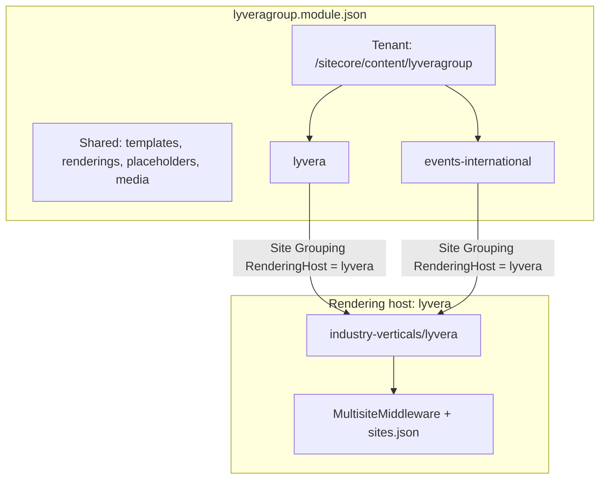

# Lyvera Group — multi-site setup and components

**Lyvera Group** is a PepsiCo-style **multi-site collection** under one tenant and one rendering host. The corporate site ([lyveragroup.com](https://www.lyveragroup.com/)) and brand sites (e.g. [Events International](https://eventsinternational.co.uk/)) share project templates/renderings but have separate Sitecore site roots, Presentation, and Home content.

| | Value |
|---|--------|
| **Rendering host** | `industry-verticals/lyvera` (single host for all sites) |
| **Module** | `authoring/items/lyveragroup.module.json` |
| **Build key** | `lyvera` in `xmcloud.build.json` |
| **Tenant** | `/sitecore/content/lyveragroup` |
| **Pattern reference** | PepsiCo (`examples/pepsico`, `pepsico.module.json.disabled`) |

---

## Multi-site architecture



| Concept | Lyvera Group |
|---------|----------------|
| **Site collection** | Tenant folder `/sitecore/content/lyveragroup` |
| **Site** | Sibling folder + Site Grouping item (`lyvera`, `events-international`, …) |
| **Shared project** | `/sitecore/templates/Project/lyveragroup`, renderings, placeholders |
| **Rendering host** | One Next.js app — `RenderingHost = lyvera` on every site |
| **Serialization folder** | `authoring/items/lyveragroup/{siteName}/` (PepsiCo-style) |

### Enabled sites

| Site name | Path | Role | Status |
|-----------|------|------|--------|
| `lyvera` | `/sitecore/content/lyveragroup/lyvera` | Corporate overview | Generated |
| `events-international` | `/sitecore/content/lyveragroup/events-international` | Hospitality brand | Generated |

### Planned brand sites

Enable in `lyveragroup-brands.mjs` (`enabled: true`) and add a module include when ready:

| Site name | Website |
|-----------|---------|
| `gullivers-sports-travel` | gulliverssportstravel.co.uk |
| `keithprowse` | keithprowse.co.uk |
| `theexperiencegolf` | theexperiencegolf.com |
| `thevenuescollection` | thevenuescollection.co.uk |
| `limevenueportfolio` | limevenueportfolio.com |
| `iluka-collective` | ilukacollective.com |

---

## Brand portfolio

| Brand | Website | What they do | Primary customer | Primary goal |
|-------|---------|--------------|------------------|--------------|
| **Lyvera** (corporate) | lyveragroup.com | Umbrella brand for the portfolio | Corporate / agency buyers | Explore group and brands |
| **Events International** | eventsinternational.co.uk | Official hospitality for major events | Corporate buyers, agencies, VIP guests | Book premium hospitality |
| **Gullivers Sports Travel** | gulliverssportstravel.co.uk | Sports travel packages | Fans, supporter groups, corporates | Book sports travel |
| **Keith Prowse** | keithprowse.co.uk | Premium hospitality (Wimbledon, Twickenham, Lord's) | Corporate hospitality, affluent consumers | Purchase VIP hospitality |
| **The Experience Golf** | theexperiencegolf.com | Luxury golf travel worldwide | Golf societies, affluent travellers | Book premium golf trips |
| **The Venues Collection** | thevenuescollection.co.uk | UK conference venues and hotels | Event planners, procurement | Find and book venues |
| **Lime Venue Portfolio** | limevenueportfolio.com | Unique UK venue sourcing | Agencies, corporate planners | Match clients to venues |
| **The iLUKA Collective** | ilukacollective.com | Experiential marketing and activations | Global brands, sponsors | Deliver brand experiences |

---

## Personas

| Brand | Persona | Job title | Main objective |
|-------|---------|-----------|------------------|
| Events International | Emma Wilson | Corporate Events Manager | Impress clients through premium hospitality |
| Gullivers Sports Travel | David Harris | Rugby Fan & Traveller | Book hassle-free sports travel |
| Keith Prowse | Sarah Bennett | Head of Client Entertainment | Secure premium hospitality for key customers |
| The Experience Golf | James Thornton | Golf Society Captain | Organise a luxury golf trip |
| The Venues Collection | Rachel Cooper | Conference Manager | Find the right venue |
| Lime Venue Portfolio | Michael Jones | Event Planner | Source venues quickly |
| The iLUKA Collective | Sophie Adams | Brand Partnerships Director | Deliver memorable experiential campaigns |

---

## Customer journeys (Discover → Expand)

| Stage | Events International | Gullivers | Keith Prowse | Experience Golf | Venues Collection |
|-------|---------------------|-----------|--------------|-----------------|-------------------|
| Discover | Search event hospitality | Search Six Nations travel | Search Wimbledon hospitality | Search golf holidays | Search conference venues |
| Explore | Compare packages | Review itineraries | Compare options | Browse destinations | Browse venues |
| Consider | Download brochure | Check availability | Review pricing | Request itinerary | Shortlist venues |
| Convert | Book hospitality | Book package | Purchase hospitality | Submit enquiry | Request proposal |
| Retain | Future event offers | Future tournaments | Future events | New experiences | Repeat bookings |
| Expand | Cross-sell events | Cross-sell hospitality | Cross-sell travel | Cross-sell tournaments | Cross-sell services |

---

## Serialization generators

```bash
# Regenerate shared project + all enabled sites
node authoring/items/lyveragroup/scripts/generate-lyvera-site.mjs

cd authoring
dotnet sitecore serialization validate --fix -i lyveragroup
dotnet sitecore serialization push -n {YourEnv} -i lyveragroup
```

| Script | Purpose |
|--------|---------|
| `generate-lyvera-site.mjs` | Project templates/renderings + all enabled sites |
| `lyveragroup-brands.mjs` | Brand registry, personas, journeys, `enabled` flags |
| `lyveragroup-site-configs.mjs` | Per-site IDs, datasources, Home layout |
| `lyveragroup-site-factory.mjs` | Writes YAML for one sibling site |

### Adding a new brand site

1. Set `enabled: true` in `lyveragroup-brands.mjs`
2. Add `create{Brand}Config()` in `lyveragroup-site-configs.mjs` and register in `allSiteConfigs()`
3. Add module include in `lyveragroup.module.json` (copy `events-international` rules block)
4. Regenerate and push
5. Optional: site-specific UI via `src/lib/lyvera-sites.ts` (`isEventsInternationalSite`, etc.)

---

## Frontend multi-site helpers

```typescript
import { isLyveraCorporateSite, isEventsInternationalSite } from '@/lib/lyvera-sites';

// Branch layout/copy by siteName or content path (PepsiCo isLaysSite pattern)
```

Local dev: set `NEXT_PUBLIC_DEFAULT_SITE_NAME` to `lyvera` or `events-international`.

---

## Component inventory and sharing

This section answers: **what components exist**, **what authors can use**, **what is shared between sites**, and **what overlaps or is redundant**.

### Sharing model (PepsiCo pattern)

| Layer | Shared across all sites? | Sitecore path | Repo path |
|-------|--------------------------|---------------|-----------|
| **Templates** | Yes | `/sitecore/templates/Project/lyveragroup/Lyvera/*` | `lyveragrouptemplatesProject/` |
| **Renderings (Json)** | Yes | `/sitecore/layout/Renderings/Project/lyveragroup/Lyvera/*` | `lyveragroupprojectRenderings/` |
| **Placeholder settings** | Yes | `/sitecore/layout/Placeholder Settings/Project/lyveragroup/*` | `lyveragroupprojectPlaceholderSettings/` |
| **React components** | Yes | One rendering host (`lyvera`) | `industry-verticals/lyvera/src/components/` |
| **Headless Variants** | No — per site | `…/{site}/Presentation/Headless Variants/*` | `{site}/{site}/Presentation/…` |
| **Presentation Styles** | No — per site | `…/{site}/Presentation/Styles/*` | `{site}/{site}/Presentation/Styles/…` |
| **Datasources** | No — per site | `…/{site}/Data/*` | `{site}/{site}/Data/…` |
| **Home / page layout** | No — per site | `…/{site}/Home` | `{site}/{site}/Home.yml` |
| **Partial designs** | No — per site (same structure) | `…/{site}/Presentation/Partial Designs/*` | header/footer per site |
| **Available Renderings list** | No — per site (same list today) | `…/{site}/Presentation/Available Renderings/Lyvera` | same 9 renderings per site |

**Rule:** One **component implementation** in React + one **rendering item** in Sitecore; each **site** gets its own variant items, styles folder, datasources, and page wiring.


### Registered components (authoring palette)

These are the **only** components in each site’s **Available Renderings → Lyvera** list. Map key = Sitecore `componentName` = TSX filename.

| # | Map key | Role | Variants (Headless) | Parent / child | Typical use |
|---|---------|------|---------------------|----------------|-------------|
| 1 | `LyveraHeader` | Utility bar + nav (desktop + mobile) | `Default` | Partial design (`headless-header`) | All sites |
| 2 | `LyveraFooter` | Footer, social, links, legal | `Default` | Partial design (`headless-footer`) | All sites |
| 3 | `LyveraTextBand` | Centred eyebrow + rich text band | `Default` | Main | Simple intro copy (optional) |
| 4 | `LyveraBanner` | Full-bleed hero / banner | `Default`, `BackgroundText` | Main | Hero, “why we do it” |
| 5 | `LyveraPromo` | Split / stacked promo blocks | `Default`, `ImageLeftColor`, `ImageRightColor`, `Stacked`, `StackedColor` | Main | Story sections |
| 6 | `LyveraOurBrands` | Brand logo strip or grid | `Default`, `Grid` | Main | **Corporate (`lyvera`) mainly** |
| 7 | `LyveraBrandLogo` | Single brand logo slide | `Default` | Child of `LyveraOurBrands` | Portfolio bar |
| 8 | `LyveraMultiPromoImageSlider` | Gallery + promo copy | `Default`, `Stacked` | Main | Portfolio / events gallery |
| 9 | `LyveraMultiPromoSlide` | Single gallery image | `Default` | Child of slider | Slider slides |

**Child placeholders (project-level, shared keys):**

| Parent | Placeholder key | Allowed child |
|--------|-----------------|---------------|
| `LyveraOurBrands` | `lyvera-brand-logos-{DynamicPlaceholderId}` | `LyveraBrandLogo` |
| `LyveraMultiPromoImageSlider` | `lyvera-multi-promo-slides-{DynamicPlaceholderId}` | `LyveraMultiPromoSlide` |

**Presentation styles (per site, same class names):**

| Style class | Applies to | Effect |
|-------------|------------|--------|
| `lyvera-bg-teal` | `LyveraPromo` | Teal background |
| `lyvera-bg-coral` | `LyveraPromo` | Coral background |
| `lyvera-bg-mint` | `LyveraPromo` | Mint background |
| `lyvera-banner-tricolor` | `LyveraBanner` | Purple / blue / coral top bar |

---

### Frontend components not in the authoring palette

The app is based on the **Content SDK starter**. These exist in `src/components/` and are in **component-map**, but are **not** serialized under lyveragroup (authors cannot add them from the Lyvera rendering set):

| Map key | Source | In Sitecore lyveragroup? | Notes |
|---------|--------|--------------------------|-------|
| `Container` | Starter kit | No | Layout wrapper |
| `ColumnSplitter` | Starter kit | No | Layout |
| `RowSplitter` | Starter kit | No | Layout |
| `ContentBlock` | Starter kit | No | Generic text |
| `PageContent` | Starter kit | No | Page body helper |
| `Image` | Starter kit | No | Generic image |
| `Title` | Starter kit | No | Generic title |
| `RichText` | Starter kit | No | Generic rich text |
| `Navigation` | Starter kit | No | **Overlaps `LyveraHeader` nav** |
| `LinkList` | Starter kit | No | Generic links |
| `Promo` | Starter kit | No | **Overlaps `LyveraPromo`** — different fields/CSS |
| `PartialDesignDynamicPlaceholder` | Starter kit | No | Framework placeholder |

**Excluded from component-map** (not authorable renderings):

| Path | Purpose |
|------|---------|
| `content-sdk/*` | CDP, styles injection, FEaaS |
| `non-sitecore/*` | Dev-only helpers |

To expose starter components on a site, add kit renderings to **Available Renderings** and serialize templates under the lyveragroup project (not done today).

---

### Redundancies and recommendations

| Item | Overlaps with | Verdict |
|------|---------------|---------|
| **`Promo` (starter) vs `LyveraPromo`** | Same conceptual job (image + text + CTA) | **Use `LyveraPromo` only** for Lyvera Group sites. Starter `Promo` is dead weight unless you register it in Sitecore. |
| **`LyveraTextBand` vs `LyveraPromo` (`Default` / `Stacked`)** | Intro / body copy | **TextBand** = simple centred eyebrow + paragraph. **Promo** = split layout + image + variants. Prefer Promo for homepage sections; keep TextBand for lightweight bands or legal/intro pages. |
| **`Navigation` / `LinkList` vs `LyveraHeader` / `LyveraFooter`** | Site navigation | **Use Lyvera header/footer** on all group sites. Kit navigation is redundant for standard pages. |
| **`LyveraOurBrands` on brand sites** | N/A — shows sister brands | **Corporate only** on Home today. Brand sites (e.g. events-international) omit it from Home; variant items still exist per site but need not be used. |
| **`LyveraBrandLogo` without CMS children** | Fallback logos in TSX | Not redundant — parent uses **fallback** brand list from `lyvera-defaults.ts` when no slides are authored. Add child items in Page Editor for full CMS control. |
| **Duplicate Headless Variant trees** | Same variant names on every site | **Not redundant** — required by Sitecore (each site has its own Presentation). Same export names (`Default`, etc.), different item GUIDs. |
| **Duplicate style items per site** | Same CSS classes | **Not redundant** — styles are scoped per site in SXA. Classes are intentionally identical for consistent branding. |

**Safe to ignore (for now):** starter `Container`, `Image`, `Title`, `RichText` unless you build inner pages with the kit pattern.

**Consider removing later:** starter `Promo.tsx` from the lyvera app if you never plan to register it — reduces map noise (optional cleanup).

---

### Per-site Home component usage (generated)

**Corporate `lyvera`:**

1. `LyveraBanner` — Default  
2. `LyveraPromo` — ImageRightColor  
3. `LyveraOurBrands` — Default  
4. `LyveraMultiPromoImageSlider` — Default  
5. `LyveraPromo` — ImageLeftColor  
6. `LyveraPromo` — Default  
7. `LyveraBanner` — BackgroundText (+ `lyvera-banner-tricolor`)  
8. `LyveraPromo` — StackedColor  

Plus partial designs: `LyveraHeader`, `LyveraFooter`.

**Brand `events-international`:**

1. `LyveraBanner` — Default  
2. `LyveraPromo` — ImageRightColor  
3. `LyveraMultiPromoImageSlider` — Default  
4. `LyveraPromo` — Default  
5. `LyveraBanner` — BackgroundText (+ tricolor)  

No `LyveraOurBrands` on Home (brand site, not portfolio overview).

---

### Setup: sharing components on a new site

1. **Enable brand** in `lyveragroup-brands.mjs` (`enabled: true`).
2. **Add site config** in `lyveragroup-site-configs.mjs` (`create…Config()`, register in `allSiteConfigs()`).
   - Reuses shared renderings — **no new TSX** unless the brand needs unique UI.
   - Define **site-specific** `homeSections`, `dsItems`, and IDs via `buildSiteIds('NN')`.
3. **Add module include** in `lyveragroup.module.json` (copy `events-international` rules).
4. **Regenerate and push:**
   ```bash
   node authoring/items/lyveragroup/scripts/generate-lyvera-site.mjs
   dotnet sitecore serialization validate --fix -i lyveragroup
   dotnet sitecore serialization push -n {YourEnv} -i lyveragroup
   ```
5. **CM:** Site Grouping → `RenderingHost` = `lyvera`; verify Home renders.
6. **Optional FE branching:** extend `src/lib/lyvera-sites.ts` (e.g. `isKeithProwseSite()`).
7. **Regenerate component-map** after any new TSX:
   ```bash
   cd industry-verticals/lyvera && npm run sitecore-tools:generate-map
   ```

**Adding a new shared component (all sites):**

1. Create `src/components/lyvera/LyveraNewThing.tsx` with named exports.
2. Add template + rendering in `generate-lyvera-site.mjs` (`COMPONENT_TEMPLATES`, `R.*`, `writeRendering`).
3. Extend `lyveragroup-site-factory.mjs` variant folders/items (or generator variant maps).
4. Add rendering GUID to Available Renderings list in factory.
5. Regenerate **all** sites so each gets Headless Variant + Styles entries.
6. Push + regenerate component-map.

---

## Component map contract

| Rule | Detail |
|------|--------|
| Map key | TSX filename without extension (`LyveraBanner.tsx` → `LyveraBanner`) |
| Sitecore `componentName` | Must match map key exactly |
| Variants | Named exports (`Default`, `BackgroundText`, …) |
| Headless Variants | Item name under `Presentation/Headless Variants/{Component}/` must match export name |
| Styles | `params.styles` — space-separated CSS classes from **Presentation → Styles** |

Regenerate after component changes:

```bash
cd industry-verticals/lyvera
npm run sitecore-tools:generate-map
npm run lint
```

---

## Components and variants

### LyveraBanner (HomePageBanner)

Full-bleed hero / banner sections.

| Headless variant | Export | Layout |
|------------------|--------|--------|
| Default | `Default` | Video/image hero, centred title, coral CTA |
| BackgroundText | `BackgroundText` | Image + teal overlay, centred title and body, tricolor top bar, no CTA |

**Fields:** `Title`, `Description`, `BackgroundImage`, `BackgroundVideo`, `CtaLink`

**Styles:** `lyvera-banner-tricolor` — purple / blue / coral bar on BackgroundText variant

### LyveraPromo

Split and stacked promo blocks.

| Headless variant | Export | Layout |
|------------------|--------|--------|
| Default | `Default` | Text left, image right, white background |
| ImageLeftColor | `ImageLeftColor` | Image left, text right, coral background + accent brackets |
| ImageRightColor | `ImageRightColor` | Text left, image right, teal background |
| Stacked | `Stacked` | Text above full-width image |
| StackedColor | `StackedColor` | Teal quote block with portrait below |

**Fields:** `Title`, `Description`, `Image`, `CtaLink`

**Styles (optional overrides):** `lyvera-bg-teal`, `lyvera-bg-coral`, `lyvera-bg-mint`

### LyveraHeader / LyveraFooter

Chrome components — wired via **Partial Designs** on `DefaultPage`, not placed on Home directly.

| Component | Fields | Notes |
|-----------|--------|-------|
| `LyveraHeader` | `ContactEmail` | Brands dropdown + Blog/Contact; fallbacks in `lyvera-defaults.ts` |
| `LyveraFooter` | `Tagline`, `ContactEmail` | Social, brand links, legal; per-site datasource |

### LyveraTextBand

Simple centred intro (eyebrow + rich text). **Not on generated Home** for corporate or EI — available in palette for inner pages.

**Fields:** `Eyebrow`, `Body`

### LyveraOurBrands

Brand logo bar inspired by the live site carousel strip.

| Headless variant | Export | Layout |
|------------------|--------|--------|
| Default | `Default` | Horizontal scrolling logo strip on dark teal |
| Grid | `Grid` | Static responsive grid |

**Fields:** `SectionTitle` (optional, screen-reader on Default)

**Child placeholder:** `lyvera-brand-logos-{DynamicPlaceholderId}` → **LyveraBrandLogo**

### LyveraBrandLogo

Child slide for Our Brands.

**Fields:** `Title`, `LogoImage`, `BrandLink`

Mark slide root with `data-lyvera-brand-slide` (handled in component).

### LyveraMultiPromoImageSlider

Portfolio section with image gallery + promo copy (desktop side-by-side, mobile stacked).

| Headless variant | Export | Layout |
|------------------|--------|--------|
| Default | `Default` | Gallery left, copy right (desktop) |
| Stacked | `Stacked` | Copy above gallery (mobile-first emphasis) |

**Fields:** `Title`, `Description`, `CtaLink`

**Child placeholder:** `lyvera-multi-promo-slides-{DynamicPlaceholderId}` → **LyveraMultiPromoSlide**

### LyveraMultiPromoSlide

**Fields:** `Image`, `AltText`

---

## Homepage wiring (generated)

`Home.yml` includes (in order):

1. LyveraBanner — Default (hero)
2. LyveraPromo — ImageRightColor (Who we are)
3. LyveraOurBrands — Default
4. LyveraMultiPromoImageSlider — Default
5. LyveraPromo — ImageLeftColor (What we do)
6. LyveraPromo — Default (How we do it)
7. LyveraBanner — BackgroundText (Why we do it)
8. LyveraPromo — StackedColor (CEO quote)

Header/footer remain on **Partial Designs** (`DefaultPage`). See [Component inventory and sharing](#component-inventory-and-sharing) for per-site differences.

---

## Local development

```bash
cd industry-verticals/lyvera
cp .env.remote.example .env.local
npm install
npm run dev
```

| Variable | Value |
|----------|--------|
| `NEXT_PUBLIC_DEFAULT_SITE_NAME` | `lyvera` or `events-international` |
| `SITECORE_EDGE_CONTEXT_ID` | From Deploy portal |

---

## Related docs

| Doc | Contents |
|-----|----------|
| [`industry-verticals/lyvera/README.md`](../industry-verticals/lyvera/README.md) | App quick start, deploy |
| [`lyveragroup-brands.mjs`](../authoring/items/lyveragroup/scripts/lyveragroup-brands.mjs) | Brand registry source of truth |
| PepsiCo reference (SE9) | `examples/pepsico`, `pepsico.module.json.disabled` |
