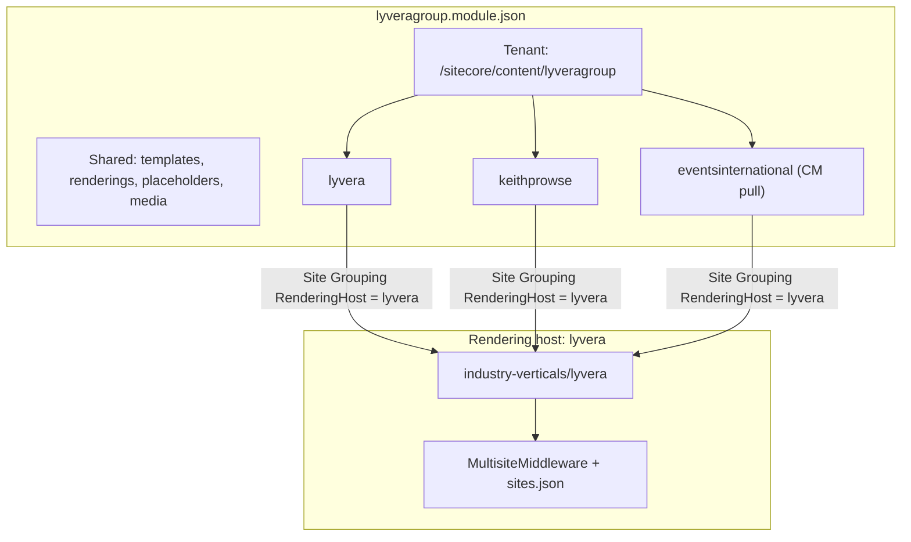
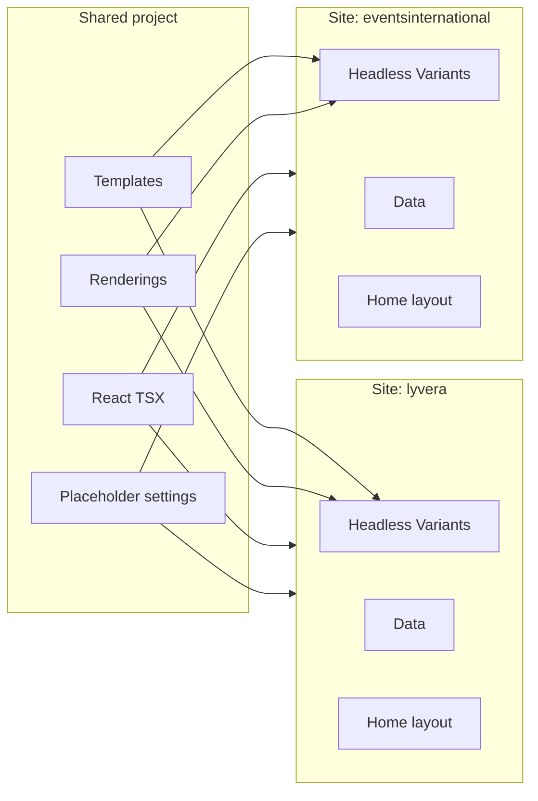

# Lyvera Group — multi-site setup and components

**Lyvera Group** is a PepsiCo-style **multi-site collection** under one tenant and one rendering host. The corporate site ([lyveragroup.com](https://www.lyveragroup.com/)), brand sites (e.g. [Keith Prowse](https://www.keithprowse.co.uk/)), and future siblings share project templates/renderings but have separate Sitecore site roots, Presentation, and Home content.

| | Value |
|---|--------|
| **Rendering host** | `industry-verticals/lyvera` (single host for all sites) |
| **Module** | `authoring/items/lyveragroup.module.json` |
| **Build key** | `lyvera` in `xmcloud.build.json` |
| **Tenant** | `/sitecore/content/lyveragroup` |
| **Pattern reference** | PepsiCo (`examples/pepsico`, `pepsico.module.json.disabled`) |

---

## Multi-site architecture



| Concept | Lyvera Group |
|---------|----------------|
| **Site collection** | Tenant folder `/sitecore/content/lyveragroup` |
| **Site** | Sibling folder + Site Grouping item (`lyvera`, `eventsinternational`, …) |
| **Shared project** | `/sitecore/templates/Project/lyveragroup`, renderings, placeholders |
| **Rendering host** | One Next.js app — `RenderingHost = lyvera` on every site |
| **Serialization folder** | `authoring/items/lyveragroup/{siteName}/` (PepsiCo-style) |

### Enabled sites

| Site name | Path | Item ID (site root) | Role | Serialization |
|-----------|------|---------------------|------|---------------|
| `lyvera` | `/sitecore/content/lyveragroup/lyvera` | `3E2CA30A-C965-44AB-8CD0-F37BDF7555E1` | Corporate overview | CM site root + generated content (`preserveDataSources`) |
| `keithprowse` | `/sitecore/content/lyveragroup/keithprowse` | `b7010421-0001-4000-8000-000000000001` | Premium hospitality brand ([keithprowse.co.uk](https://www.keithprowse.co.uk/)) | Fully generated (`authoring/items/lyveragroup/keithprowse/`) |
| `eventsinternational` | `/sitecore/content/lyveragroup/eventsinternational` | `F55CB525-C4DB-4804-B775-58A3DF4BABC1` | Hospitality brand | Pulled from CM (not in `allSiteConfigs()` today) |

**Generator:** `allSiteConfigs()` in `lyveragroup-site-configs.mjs` currently regenerates **`lyvera`** and **`keithprowse`** only. Other brand folders may remain in the repo from earlier CM pulls until their configs are re-enabled.

**Keith Prowse vs corporate brand page:** The corporate site has a marketing page at `Home/brands/keith-prowse` (`/brands/keith-prowse`). The **`keithprowse` site** is a separate Sitecore site with its own Home, header/footer, and homepage aligned to the live Keith Prowse website.

**Tenant:** `/sitecore/content/lyveragroup` — `D8C675B7-E44D-4115-9FE0-D6BA229BC0F6` (Headless Tenant template from lyveragroup project branch). Do not regenerate the tenant or site roots from the script; they are created in CM.

### CM vs generated content

| Item / area | Managed in CM | Generated by script |
|-------------|---------------|---------------------|
| Tenant + site root | Yes | No (`skipInfrastructure: true` for `lyvera`) |
| Site Grouping / Settings | Yes | No |
| Presentation folder tree (SXA defaults) | Yes (pull) | No |
| **Page design** | **Yes — create manually** | **No** |
| Partial designs (header/footer) | Serialized | Yes |
| Home layout (`__Renderings`) | Serialized | Yes |
| **Data datasources (corporate `lyvera`)** | **Yes — pull from CM after author changes** | **No** (`preserveDataSources: true`) |
| Data datasources (new brand sites) | Serialized | Yes |
| Headless Variants + Lyvera styles | Serialized | Yes |
| Shared templates / renderings | Serialized | Yes |

**Page designs (important):** Do **not** serialize a generated `DefaultPage` under `Presentation/Page Designs`. A scripted page design (`b7010051-…`) was removed because it broke the Pages tool. Create the page design in **Content Editor → Presentation → Page Designs**, attach **header** and **footer** partial designs, then map the headless page template to that design. Pull when done so the item is captured in source control.

```text
/sitecore/content/lyveragroup/lyvera/Presentation/
  Partial Designs/          ← generated header.yml + footer.yml (keep)
  Placeholder Settings/
    Partial Design/         ← header.yml (sxa-header) + footer.yml (sxa-footer) — required for page design preview
  Page Designs/             ← CM folder only; add your page design manually
  Headless Variants/        ← generated Lyvera* variants
  Styles/                   ← generated Lyvera Promo / Banner styles
```

CM folder IDs for `lyvera` live in `authoring/items/lyveragroup/scripts/lyveragroup-cm-ids.mjs` (`dataRoot`, `headlessVariants`, `pageDesigns`, `home`, etc.).

### Corporate site pages (generated content tree)

The generator adds pages under `Home/` for the corporate site. Public URLs map from item paths via `getPublicItemPath()` in `src/lib/lyvera-sites.ts`.

| Public URL | Sitecore path | Main components |
|------------|---------------|-----------------|
| `/` | `Home` | Homepage sections (banner, promos, brands bar, …) |
| `/brands/keith-prowse` (×7 brands) | `Home/brands/{slug}` | `LyveraBanner/BrandHero`, `LyveraBrandPageBody` |
| `/news-and-blog` | `Home/news-and-blog` | `LyveraBanner/BrandHero`, `LyveraBlogListing` |
| `/news-and-blog/lyvera/2026/{slug}` | `Home/news-and-blog/lyvera/2026/{slug}` | `LyveraArticleDetails` |

Static fallbacks in `lyvera-brand-pages.ts` / `lyvera-blog-content.ts` only fill **empty datasource fields** — they do not create routes. Pages must exist in Sitecore with components on `__Renderings`.

The rendering host uses the standard Content SDK catch-all (`src/pages/[[...path]].tsx`): `client.getPage(path)` loads layout and placeholders from the **Sitecore page item**. Authors add or reorder components in Pages; Next.js does not build synthetic pages in code.

### CM datasource preservation (important)

Corporate `lyvera` uses **`preserveDataSources: true`** in `lyveragroup-site-configs.mjs`. Running `generate-lyvera-site.mjs` will **not** delete or rewrite files under `lyvera/lyvera/Data/`.

**Why:** CM-pulled datasources include fields the generator does not emit, for example:

- `LogoImage` on **Default Header** / **Default Footer**
- `PromoImageOne` on promos (often in **`SharedFields`**, not language fields)
- Richer `PromoDescription` text and CM metadata (`__Revision`, `__Lock`, …)

After authors change images or copy in CM, **pull** datasources — do not rely on the generator to refresh them:

```bash
dotnet sitecore serialization pull -n {YourEnv} -i lyveragroup
```

New brand sites (e.g. `eventsinternational`) still get generated `Data/` items from `dsItems` in site config.

### Serialization hash folders

Sitecore CLI stores some items under **hash-named folders** instead of the logical tree path. Do not duplicate these with the generator.

| Item | Canonical file path |
|------|---------------------|
| `LyveraArticleDetails` field `ShortDescription` | `lyveragrouptemplatesProject/64FCA6B44F4D3CEE/ShortDescription.yml` |
| Blog articles (`…,-q-,` slugs) | `lyvera/98A996FF3808E9C2/{slug}.yml` |

The generator writes article pages to the hash folder above (not under `Home/news-and-blog/lyvera/2026/` in the file tree). If `validate` reports `NON-UNIQUE ITEM PATH`, delete the nested-path duplicate and run `validate --fix` to move to the hash folder.

### Planned brand sites

Enable in `lyveragroup-brands.mjs` (`enabled: true`) and add a module include when ready:

| Site name | Website | Status |
|-----------|---------|--------|
| `keithprowse` | keithprowse.co.uk | **Enabled** — see [Keith Prowse site](#keith-prowse-site-keithprowse) |
| `gullivers-sports-travel` | gulliverssportstravel.co.uk | Planned |
| `theexperiencegolf` | theexperiencegolf.com | Planned |
| `thevenuescollection` | thevenuescollection.co.uk | Planned |
| `limevenueportfolio` | limevenueportfolio.com | Planned |
| `iluka-collective` | ilukacollective.com | Planned |

---

## Brand portfolio

| Brand | Website | What they do | Primary customer | Primary goal |
|-------|---------|--------------|------------------|--------------|
| **Lyvera** (corporate) | lyveragroup.com | Umbrella brand for the portfolio | Corporate / agency buyers | Explore group and brands |
| **Events International** | eventsinternational.co.uk | Official hospitality for major events | Corporate buyers, agencies, VIP guests | Book premium hospitality |
| **Gullivers Sports Travel** | gulliverssportstravel.co.uk | Sports travel packages | Fans, supporter groups, corporates | Book sports travel |
| **Keith Prowse** | keithprowse.co.uk | Premium hospitality (Wimbledon, Twickenham, Lord's) | Corporate hospitality, affluent consumers | Purchase VIP hospitality |
| **The Experience Golf** | theexperiencegolf.com | Luxury golf travel worldwide | Golf societies, affluent travellers | Book premium golf trips |
| **The Venues Collection** | thevenuescollection.co.uk | UK conference venues and hotels | Event planners, procurement | Find and book venues |
| **Lime Venue Portfolio** | limevenueportfolio.com | Unique UK venue sourcing | Agencies, corporate planners | Match clients to venues |
| **The iLUKA Collective** | ilukacollective.com | Experiential marketing and activations | Global brands, sponsors | Deliver brand experiences |

---

## Personas

| Brand | Persona | Job title | Main objective |
|-------|---------|-----------|------------------|
| Events International | Emma Wilson | Corporate Events Manager | Impress clients through premium hospitality |
| Gullivers Sports Travel | David Harris | Rugby Fan & Traveller | Book hassle-free sports travel |
| Keith Prowse | Sarah Bennett | Head of Client Entertainment | Secure premium hospitality for key customers |
| The Experience Golf | James Thornton | Golf Society Captain | Organise a luxury golf trip |
| The Venues Collection | Rachel Cooper | Conference Manager | Find the right venue |
| Lime Venue Portfolio | Michael Jones | Event Planner | Source venues quickly |
| The iLUKA Collective | Sophie Adams | Brand Partnerships Director | Deliver memorable experiential campaigns |

---

## Customer journeys (Discover → Expand)

| Stage | Events International | Gullivers | Keith Prowse | Experience Golf | Venues Collection |
|-------|---------------------|-----------|--------------|-----------------|-------------------|
| Discover | Search event hospitality | Search Six Nations travel | Search Wimbledon hospitality | Search golf holidays | Search conference venues |
| Explore | Compare packages | Review itineraries | Compare options | Browse destinations | Browse venues |
| Consider | Download brochure | Check availability | Review pricing | Request itinerary | Shortlist venues |
| Convert | Book hospitality | Book package | Purchase hospitality | Submit enquiry | Request proposal |
| Retain | Future event offers | Future tournaments | Future events | New experiences | Repeat bookings |
| Expand | Cross-sell events | Cross-sell hospitality | Cross-sell travel | Cross-sell tournaments | Cross-sell services |

---

## Serialization generators

```bash
# Regenerate shared project + all enabled sites
node authoring/items/lyveragroup/scripts/generate-lyvera-site.mjs

cd authoring
dotnet sitecore serialization validate --fix -i lyveragroup
dotnet sitecore serialization push -n {YourEnv} -i lyveragroup
```

| Script | Purpose |
|--------|---------|
| `generate-lyvera-site.mjs` | Project templates/renderings + enabled site content (not CM site roots) |
| `lyveragroup-cm-ids.mjs` | Canonical CM item IDs for tenant and site folders |
| `lyveragroup-brands.mjs` | Brand registry, personas, journeys, `enabled` flags |
| `lyveragroup-site-configs.mjs` | Per-site IDs, datasources, Home layout, **`contentPages`** (`buildLyveraCmSiteIds` for corporate) |
| `lyveragroup-site-factory.mjs` | Writes YAML for one sibling site (`skipInfrastructure`, **`preserveDataSources`**) |
| `lyveragroup-brand-pages.mjs` | Brand page metadata for generator (`contentPages` under `Home/brands/`) |
| `lyveragroup-keith-prowse-home-page.mjs` | Keith Prowse Home sections, datasources, featured events, category grid (reference: [keithprowse.co.uk](https://www.keithprowse.co.uk/)) |

### Adding a new brand site

1. Set `enabled: true` in `lyveragroup-brands.mjs`
2. Add `create{Brand}Config()` in `lyveragroup-site-configs.mjs` and register in `allSiteConfigs()`
3. Add module include in `lyveragroup.module.json` (copy `eventsinternational` rules block)
4. **Create the site in CM** (or pull after branch) and add its folder IDs to `lyveragroup-cm-ids.mjs`
5. Regenerate and push
6. **Create page design manually** in CM (partial designs + template mapping); pull to serialize
7. Optional: site-specific UI via `src/lib/lyvera-sites.ts` (`isEventsInternationalSite`, etc.)

---

## Frontend multi-site helpers

Site detection and themes live in **`src/lib/lyveragroup-site.ts`** and **`src/lib/lyveragroup-themes.ts`** (re-exported from `lyvera-sites.ts` for back-compat).

```typescript
import {
  isLyveraCorporateSite,
  isKeithProwseSite,
  isEventsInternationalSite,
  lyveraGroupSiteClass,
} from '@/lib/lyveragroup-site';
import { sharedComponentModifier } from '@/lib/lyveragroup-themes';

// Branch layout/copy by siteName or content path (PepsiCo isLaysSite pattern)
// Layout.tsx applies lg-site--{site} + lg-theme--{site} on .lyvera-page
```

| Site | Detection | Theme modifier | Accent |
|------|-----------|----------------|--------|
| `lyvera` | `isLyveraCorporateSite()` | `lg-theme--lyvera` | Coral / teal corporate |
| `keithprowse` | `isKeithProwseSite()` | `lg-theme--keithprowse` | `#7dcec4` on charcoal `#232323` |

**Shared components with site branching:** `LyveraHeader` (corporate vs Keith Prowse chrome), `LyveraFooter`, `LyveraBanner`, `LyveraBlogListing`. Keith Prowse fallbacks: `keith-prowse-defaults.ts`, `keith-prowse-blog-content.ts`.

Local dev: set `NEXT_PUBLIC_DEFAULT_SITE_NAME` to `lyvera`, `keithprowse`, or `eventsinternational`.

---

## Component inventory and sharing

This section answers: **what components exist**, **what authors can use**, **what is shared between sites**, and **what overlaps or is redundant**.

### Sharing model (PepsiCo pattern)

| Layer | Shared across all sites? | Sitecore path | Repo path |
|-------|--------------------------|---------------|-----------|
| **Templates** | Yes | `/sitecore/templates/Project/lyveragroup/Lyvera/*` | `lyveragrouptemplatesProject/` |
| **Renderings (Json)** | Yes | `/sitecore/layout/Renderings/Project/lyveragroup/Lyvera/*` | `lyveragroupprojectRenderings/` |
| **Placeholder settings** | Yes | `/sitecore/layout/Placeholder Settings/Project/lyveragroup/*` | `lyveragroupprojectPlaceholderSettings/` |
| **React components** | Yes | One rendering host (`lyvera`) | `industry-verticals/lyvera/src/components/` |
| **Headless Variants** | No — per site | `…/{site}/Presentation/Headless Variants/*` | `{site}/{site}/Presentation/…` |
| **Presentation Styles** | No — per site | `…/{site}/Presentation/Styles/*` | `{site}/{site}/Presentation/Styles/…` |
| **Datasources** | No — per site | `…/{site}/Data/*` | `{site}/{site}/Data/…` |
| **Home / page layout** | No — per site | `…/{site}/Home` | `{site}/{site}/Home.yml` |
| **Partial designs** | No — per site (same structure) | `…/{site}/Presentation/Partial Designs/*` | header/footer YAML (generated) |
| **Page designs** | No — per site (**manual in CM**) | `…/{site}/Presentation/Page Designs/*` | Not generated — create in CM, then pull |
| **Available Renderings list** | No — per site (same list today) | `…/{site}/Presentation/Available Renderings/Lyvera` | 19 Lyvera renderings + kit **Promo** per site |

**Rule:** One **component implementation** in React + one **rendering item** in Sitecore; each **site** gets its own variant items, styles folder, datasources, and page wiring. **Site-specific UI** is handled via `isKeithProwseSite()` (etc.) inside shared TSX — not separate apps.



### Registered components (authoring palette)

These are the **Lyvera** renderings in each site’s **Available Renderings → Lyvera** list, plus kit **Promo** from **Page Content**. Map key = Sitecore `componentName` = TSX filename.

| # | Map key | Role | Variants (Headless) | Parent / child | Typical use |
|---|---------|------|---------------------|----------------|-------------|
| 1 | `LyveraHeader` | Site chrome | `Default`, **`KeithProwse`** | Partial design (`headless-header`) | All sites; **`Default` export branches** to KP chrome when `isKeithProwseSite()` |
| 2 | `LyveraFooter` | Site chrome | `Default` | Partial design (`headless-footer`) | All sites; **KP footer** when on `keithprowse` site |
| 3 | `LyveraTextBand` | Centred eyebrow + rich text | `Default` | Main | Simple intro copy |
| 4 | `LyveraBanner` | Full-bleed hero / banner | `Default`, `BackgroundText`, **`BrandHero`** | Main | Hero, about band, brand/blog pages; **KP hero/about** styling |
| 5 | `Promo` | Split / stacked promo blocks | `Default`, `WithColumns` | Main; child of **`LyveraPromoCardGrid`** | Story sections; **KP featured event cards** with `promo-kp-card` |
| 6 | `LyveraOurBrands` | Logo strip or grid | `Default`, `Grid` | Main | Corporate portfolio; **KP official appointments** |
| 7 | `LyveraBrandLogo` | Single brand / partner logo | `Default` | Child of `LyveraOurBrands` | Portfolio bar; KP partner logos |
| 8 | `LyveraMultiPromoImageSlider` | Gallery + promo copy | `Default`, `Stacked` | Main | Portfolio / events gallery |
| 9 | `LyveraMultiPromoSlide` | Single gallery image | `Default` | Child of slider | Slider slides |
| 10 | `LyveraBrandPageBody` | Brand page sections | `Default` | Main | Corporate `/brands/*` pages |
| 11 | `LyveraBlogListing` | Blog card grid | `Default` | Main | Blog listing; **KP “News and Blog”** variant |
| 12 | `LyveraArticleDetails` | Article layout | `Default` | Main | Blog articles |
| 13 | `LyveraFAQ` | FAQ accordion container | `Default` | Main | FAQ pages |
| 14 | `LyveraFAQItem` | Single FAQ Q&A | `Default` | Child of `LyveraFAQ` | FAQ items |
| 15 | `LyveraPageSectionNav` | In-page anchor nav | `Default` | Main | BrandHero subnav |
| 16 | `LyveraTrustBar` | Four-icon trust strip | `Default` | Main | Optional KP trust messaging (not on generated KP Home) |
| 17 | `LyveraExperienceFinder` | “What matters most?” filter card | `Default` | Main | **Keith Prowse Home** |
| 18 | `LyveraPromoCardGrid` | Featured events grid wrapper | `Default` | Main | **Keith Prowse Home** — hosts **Promo** children |
| 19 | `LyveraTabCategoryGrid` | Sport / culture tab + grid | `Default` | Main | **Keith Prowse Home** — hosts **LyveraCategoryGridItem** children |
| 20 | `LyveraCategoryGridItem` | Category tile with image | `Default` | Child of `LyveraTabCategoryGrid` | Sport / music-arts tiles |

**Child placeholders (project-level, shared keys):**

| Parent | Placeholder key | Allowed child |
|--------|-----------------|---------------|
| `LyveraOurBrands` | `lyvera-brand-logos-{DynamicPlaceholderId}` | `LyveraBrandLogo` |
| `LyveraMultiPromoImageSlider` | `lyvera-multi-promo-slides-{DynamicPlaceholderId}` | `LyveraMultiPromoSlide` |
| `LyveraFAQ` | `lyvera-faq-items-{DynamicPlaceholderId}` | `LyveraFAQItem` |
| `LyveraPromoCardGrid` | `lyvera-promo-cards-{DynamicPlaceholderId}` | `Promo` (Page Content) |
| `LyveraTabCategoryGrid` | `lyvera-category-grid-items-{DynamicPlaceholderId}` | `LyveraCategoryGridItem` |

**Presentation styles (per site, same class names):**

| Style class | Applies to | Effect |
|-------------|------------|--------|
| `promo-bg-teal` | `Promo` | Dark teal text column background |
| `promo-bg-coral` | `Promo` | Coral text column background |
| `promo-reversed` | `Promo` | Image left, text right |
| `promo-hero` | `Promo` | Stacked text above full-width image |
| `promo-overlay` | `Promo` | Image overlay treatment |
| `accent-coral` | `Promo` | Coral L-bracket accents on image |
| `promo-kp-card` | `Promo` | Keith Prowse featured-event card (image + pill CTA) |
| `lyvera-banner-tricolor` | `LyveraBanner` | Purple / blue / coral top bar |

---

### Frontend components not in the authoring palette

The app is based on the **Content SDK starter**. These exist in `src/components/` and are in **component-map**, but are **not** serialized under lyveragroup (authors cannot add them from the Lyvera rendering set):

| Map key | Source | In Sitecore lyveragroup? | Notes |
|---------|--------|--------------------------|-------|
| `Container` | Starter kit | No | Layout wrapper |
| `ColumnSplitter` | Starter kit | No | Layout |
| `RowSplitter` | Starter kit | No | Layout |
| `ContentBlock` | Starter kit | No | Generic text |
| `PageContent` | Starter kit | No | Page body helper |
| `Image` | Starter kit | No | Generic image |
| `Title` | Starter kit | No | Generic title |
| `RichText` | Starter kit | No | Generic rich text |
| `Navigation` | Starter kit | No | **Overlaps `LyveraHeader` nav** |
| `LinkList` | Starter kit | No | Generic links |
| `Promo` | Starter kit (Page Content) | Yes | **Primary promo** for Lyvera Group — versele-inspired variants and Lyvera-themed styles |
| `PartialDesignDynamicPlaceholder` | Starter kit | No | Framework placeholder |

**Excluded from component-map** (not authorable renderings):

| Path | Purpose |
|------|---------|
| `content-sdk/*` | CDP, styles injection, FEaaS |
| `non-sitecore/*` | Dev-only helpers |

To expose starter components on a site, add kit renderings to **Available Renderings** and serialize templates under the lyveragroup project (not done today).

---

### Redundancies and recommendations

| Item | Overlaps with | Verdict |
|------|---------------|---------|
| **`LyveraTextBand` vs `Promo`** | Intro / body copy | **TextBand** = simple centred eyebrow + paragraph. **Promo** = split layout + image + SXA styles. Prefer Promo for homepage sections; keep TextBand for lightweight bands or legal/intro pages. |
| **`Navigation` / `LinkList` vs `LyveraHeader` / `LyveraFooter`** | Site navigation | **Use Lyvera header/footer** on all group sites. Kit navigation is redundant for standard pages. |
| **`LyveraOurBrands` on brand sites** | N/A — shows sister brands | **Corporate only** on Home today. Brand sites (e.g. `eventsinternational`) omit it from Home; variant items still exist per site but need not be used. |
| **`LyveraBrandLogo` without CMS children** | Fallback logos in TSX | Not redundant — parent uses **fallback** brand list from `lyvera-defaults.ts` when no slides are authored. Add child items in Page Editor for full CMS control. |
| **Duplicate Headless Variant trees** | Same variant names on every site | **Not redundant** — required by Sitecore (each site has its own Presentation). Same export names (`Default`, etc.), different item GUIDs. |
| **Duplicate style items per site** | Same CSS classes | **Not redundant** — styles are scoped per site in SXA. Classes are intentionally identical for consistent branding. |

**Safe to ignore (for now):** starter `Container`, `Image`, `Title`, `RichText` unless you build inner pages with the kit pattern.

**Consider removing later:** unused starter components (`Container`, `Image`, `Title`, `RichText`) if you never plan to register them — reduces map noise (optional cleanup).

---

### Per-site Home component usage (generated)

**Corporate `lyvera`:**

1. `LyveraBanner` — Default  
2. `Promo` — Default + `promo-bg-teal` (Who we are)  
3. `LyveraOurBrands` — Default  
4. `LyveraMultiPromoImageSlider` — Default  
5. `Promo` — Default + `promo-reversed`, `promo-bg-coral`, `accent-coral` (What we do)  
6. `Promo` — Default + `promo-hero` (How we do it)  
7. `LyveraBanner` — BackgroundText (+ `lyvera-banner-tricolor`)  
8. `Promo` — Default + `promo-bg-teal` (CEO quote)  

Plus partial designs: `LyveraHeader`, `LyveraFooter`.

**Corporate inner pages** (generated under `Home/`):

| Page type | Path example | Layout |
|-----------|--------------|--------|
| Brand | `Home/brands/keith-prowse` | `BrandHero` banner → `LyveraBrandPageBody` |
| Blog listing | `Home/news-and-blog` | `BrandHero` banner → `LyveraBlogListing` |
| Blog article | `Home/news-and-blog/lyvera/2026/{slug}` | `LyveraArticleDetails` |

**Brand `eventsinternational`:**

1. `LyveraBanner` — Default  
2. `Promo` — Default + `promo-bg-teal`  
3. `LyveraMultiPromoImageSlider` — Default  
4. `Promo` — Default + `promo-hero`  
5. `LyveraBanner` — BackgroundText (+ tricolor)  

No `LyveraOurBrands` on Home (brand site, not portfolio overview).

**Brand `keithprowse`** (reference layout: [keithprowse.co.uk](https://www.keithprowse.co.uk/)):

Partial designs: `LyveraHeader` (**KeithProwse** variant on KP site), `LyveraFooter` (KP legal + Trustpilot).

Main placeholder (`headless-main`), in order:

| # | Component | Variant | Styles / children | Section |
|---|-----------|---------|-------------------|---------|
| 1 | `LyveraBanner` | `Default` | — | Hero — “Welcome to Keith Prowse / The Home of Hospitality” |
| 2 | `LyveraExperienceFinder` | `Default` | — | “Quickly find your perfect experience” |
| 3 | `LyveraPromoCardGrid` | `Default` | 6 × **`Promo`** children (`promo-kp-card`) | **FEATURED EVENTS** |
| 4 | `LyveraTabCategoryGrid` | `Default` | 16 × **`LyveraCategoryGridItem`** (13 sport + 3 culture) | Sport / Music Arts and Culture tabs |
| 5 | `LyveraBanner` | `BackgroundText` | KP about band (centred, pill **About Us** CTA) | About copy |
| 6 | `LyveraOurBrands` | `Grid` | 5 × **`LyveraBrandLogo`** | Official Appointments |
| 7 | `LyveraBlogListing` | `Default` | — | News and Blog (3 articles from `keith-prowse-blog-content.ts`) |

Datasource definitions: `buildKeithProwseHomeDsItems()` in `lyveragroup-keith-prowse-home-page.mjs`. Static fallbacks when CMS fields are empty: `keith-prowse-defaults.ts`, `keith-prowse-blog-content.ts`.

**Keith Prowse site pages (today):**

| Public URL | Sitecore path | Main components |
|------------|---------------|-----------------|
| `/` | `keithprowse/Home` | Homepage sections above |
| *(future)* | `keithprowse/Home/...` | Add via CM / generator `contentPages` |

Corporate marketing page (different site):

| Public URL | Sitecore path | Main components |
|------------|---------------|-----------------|
| `/brands/keith-prowse` | `lyvera/Home/brands/keith-prowse` | `LyveraBanner/BrandHero` → `LyveraBrandPageBody` |

---

### Setup: sharing components on a new site

1. **Enable brand** in `lyveragroup-brands.mjs` (`enabled: true`).
2. **Add site config** in `lyveragroup-site-configs.mjs` (`create…Config()`, register in `allSiteConfigs()`).
   - Reuses shared renderings — **no new TSX** unless the brand needs unique UI.
   - Define **site-specific** `homeSections`, `dsItems`, and IDs via `buildSiteIds('NN')`.
3. **Add module include** in `lyveragroup.module.json` (copy `eventsinternational` rules).
4. **Regenerate and push:**
   ```bash
   node authoring/items/lyveragroup/scripts/generate-lyvera-site.mjs
   dotnet sitecore serialization validate --fix -i lyveragroup
   dotnet sitecore serialization push -n {YourEnv} -i lyveragroup
   ```
5. **CM:** Site Grouping → `RenderingHost` = `lyvera`; create **page design** manually (header/footer partials + template mapping); verify Home renders.
6. **Optional FE branching:** extend `src/lib/lyveragroup-site.ts` (e.g. `isKeithProwseSite()`) and `lyveragroup-themes.ts` — see [Per-site Home → Keith Prowse](#per-site-home-component-usage-generated).
7. **Regenerate component-map** after any new TSX:
   ```bash
   cd industry-verticals/lyvera && npm run sitecore-tools:generate-map
   ```

**Adding a new shared component (all sites):**

1. Create `src/components/lyvera/LyveraNewThing.tsx` with named exports.
2. Add template + rendering in `generate-lyvera-site.mjs` (`COMPONENT_TEMPLATES`, `R.*`, `writeRendering`).
3. Extend `lyveragroup-site-factory.mjs` variant folders/items (or generator variant maps).
4. Add rendering GUID to Available Renderings list in factory.
5. Regenerate **all** sites so each gets Headless Variant + Styles entries.
6. Push + regenerate component-map.

---

## Component map contract

| Rule | Detail |
|------|--------|
| Map key | TSX filename without extension (`LyveraBanner.tsx` → `LyveraBanner`) |
| Sitecore `componentName` | Must match map key exactly |
| Variants | Named exports (`Default`, `BackgroundText`, …) |
| Headless Variants | Item name under `Presentation/Headless Variants/{Component}/` must match export name |
| Styles | `params.styles` — space-separated CSS classes from **Presentation → Styles** |

Regenerate after component changes:

```bash
cd industry-verticals/lyvera
npm run sitecore-tools:generate-map
npm run lint
```

---

## Components and variants

### LyveraBanner (HomePageBanner)

Full-bleed hero / banner sections.

| Headless variant | Export | Layout |
|------------------|--------|--------|
| Default | `Default` | Video/image hero, centred title, coral CTA |
| BackgroundText | `BackgroundText` | Image + teal overlay, centred title and body, tricolor top bar, no CTA |
| BrandHero | `BrandHero` | Full-bleed background, title, **Share** button, optional anchor nav (brand/blog pages) |

**Fields:** `Title`, `Description`, `BackgroundImage`, `BackgroundVideo`, `CtaLink`

**BrandHero fallbacks:** `findBrandPageByPath()` and blog listing metadata from `lyvera-brand-pages.ts` / `lyvera-blog-content.ts` when datasource fields are empty.

**Styles:** `lyvera-banner-tricolor` — purple / blue / coral bar on BackgroundText variant

### Promo (Page Content)

Split and stacked promo blocks. Implementation follows the **versele** example (`Promo.tsx` + `promo.css`) with Lyvera brand tokens (teal, coral, serif headings).

| Headless variant | Export | Layout |
|------------------|--------|--------|
| Default | `Default` | Text left, image right (50/50 split); combine with SXA styles |
| WithColumns | `WithColumns` | Multi-column promo with optional icons |

**Datasource template:** industry-verticals **Promo** (`08213afb-9cb4-4c1f-a5da-865b9a095601`)

**Fields:** `PromoTitle`, `PromoDescription`, `PromoImageOne`, `PromoMoreInfo` (optional CTA)

**Rendering:** Page Content **Promo** (`2492BAC4-DA07-4C86-87F0-9873D40E2276`) — add from **Available Renderings → Page Content**, not the Lyvera custom set.

**Styles (combine in Pages editor):**

| Class | Effect |
|-------|--------|
| `promo-bg-teal` | Dark teal text column |
| `promo-bg-coral` | Coral text column |
| `promo-reversed` | Flip image/text columns |
| `promo-hero` | Stacked text above full-width image |
| `promo-overlay` | Overlay treatment on image |
| `accent-coral` | Coral L-bracket accents around image |

**Homepage mapping (corporate):**

| Section | Variant | Styles |
|---------|---------|--------|
| Who we are | Default | `promo-bg-teal` |
| What we do | Default | `promo-reversed`, `promo-bg-coral`, `accent-coral` |
| How we do it | Default | `promo-hero` |
| CEO quote | Default | `promo-bg-teal` |

Authors should set **PromoImageOne** on each promo datasource in Content Editor.

### LyveraHeader / LyveraFooter

Chrome components — wired via **Partial Designs** (header/footer). Attach those partials to your **page design** in CM (not generated by the script).

| Component | Variants | Fields | Notes |
|-----------|----------|--------|-------|
| `LyveraHeader` | `Default`, **`KeithProwse`** | `LogoImage`, `ContactEmail`, **`PhoneNumber`** | **`Default` export** renders corporate or Keith Prowse header via `isKeithProwseSite()`. KP: utility bar (call, contact, VAT toggle, account, basket), main nav from `KP_MAIN_NAV`. |
| `LyveraFooter` | `Default` | `LogoImage`, `Tagline`, `ContactEmail` | Corporate: brand links + legal. **KP:** centred legal links + Trustpilot (`KP_FOOTER_LINKS`). |

### LyveraExperienceFinder

Keith Prowse “Quickly find your perfect experience” card with three filter links.

| Headless variant | Export |
|------------------|--------|
| Default | `Default` |

**Fields:** `Title`, `Description`, `Label`, `OptionOne`, `OptionTwo`, `OptionThree` (General Link fields)

**Fallbacks:** `KP_EXPERIENCE_FINDER` in `keith-prowse-defaults.ts`.

### LyveraPromoCardGrid

Wrapper for featured event **Promo** cards (Keith Prowse homepage).

| Headless variant | Export |
|------------------|--------|
| Default | `Default` |

**Fields:** `SectionTitle` (default “FEATURED EVENTS”)

**Child placeholder:** `lyvera-promo-cards-{DynamicPlaceholderId}` → **Promo** (apply style **`promo-kp-card`**)

**Fallbacks:** Renders `KP_FEATURED_EVENTS` when no Promo children are placed.

### LyveraTabCategoryGrid

Tabbed Sport / Music Arts and Culture category grid (Keith Prowse homepage).

| Headless variant | Export |
|------------------|--------|
| Default | `Default` |

**Fields:** `TabOneLabel`, `TabTwoLabel`

**Child placeholder:** `lyvera-category-grid-items-{DynamicPlaceholderId}` → **LyveraCategoryGridItem**

**Fallbacks:** `KP_CATEGORY_TABS` in `keith-prowse-defaults.ts` when no children are placed.

### LyveraCategoryGridItem

Single category tile (image, label, link). Child items carry **`CategoryTab`** (`sport` | `culture`) for tab filtering.

**Fields:** `Title`, `Image`, `Link`, `CategoryTab`

### LyveraTrustBar

Four-column trust strip with icons (award, ticket, hospitality, star). Available in the palette; **not wired on generated Keith Prowse Home** (live site does not show this block above the hero).

**Fields:** `ItemOneText` … `ItemFourText`

**Fallbacks:** `KP_TRUST_ITEMS` in `keith-prowse-defaults.ts`.

### LyveraFAQ / LyveraFAQItem / LyveraPageSectionNav

FAQ accordion (`LyveraFAQ` + child **`LyveraFAQItem`** placeholder `lyvera-faq-items-*`) and in-page section nav for **BrandHero** pages. Used on corporate inner pages where configured; not on generated Keith Prowse Home.

### LyveraTextBand

Simple centred intro (eyebrow + rich text). **Not on generated Home** for corporate or EI — available in palette for inner pages.

**Fields:** `Eyebrow`, `Body`

### LyveraOurBrands

Brand logo bar inspired by the live site carousel strip.

| Headless variant | Export | Layout |
|------------------|--------|--------|
| Default | `Default` | Horizontal scrolling logo strip on dark teal |
| Grid | `Grid` | Static responsive grid |

**Fields:** `SectionTitle` (optional, screen-reader on Default)

**Child placeholder:** `lyvera-brand-logos-{DynamicPlaceholderId}` → **LyveraBrandLogo**

### LyveraBrandLogo

Child slide for Our Brands.

**Fields:** `Title`, `LogoImage`, `BrandLink`

Mark slide root with `data-lyvera-brand-slide` (handled in component).

### LyveraMultiPromoImageSlider

Portfolio section with image gallery + promo copy (desktop side-by-side, mobile stacked).

| Headless variant | Export | Layout |
|------------------|--------|--------|
| Default | `Default` | Gallery left, copy right (desktop) |
| Stacked | `Stacked` | Copy above gallery (mobile-first emphasis) |

**Fields:** `Title`, `Description`, `CtaLink`

**Child placeholder:** `lyvera-multi-promo-slides-{DynamicPlaceholderId}` → **LyveraMultiPromoSlide**

### LyveraMultiPromoSlide

**Fields:** `Image`, `AltText`

### LyveraBrandPageBody

Renders brand-page sections (intro promo, image gallery, two copy blocks) from **`lyvera-brand-pages.ts`** when not in editing mode. Used on all `/brands/*` pages.

| Headless variant | Export |
|------------------|--------|
| Default | `Default` |

**Datasource:** optional `SectionTitle` (live site uses path-based fallbacks).

### LyveraBlogListing

Blog card grid. On **`keithprowse`**, uses KP copy (“News and Blog”, “READ ARTICLE”, “VIEW ALL”) and `KP_BLOG_ARTICLES` from `keith-prowse-blog-content.ts`. On corporate **`lyvera`**, uses `LYVERA_BLOG_ARTICLES` from `lyvera-blog-content.ts`.

| Headless variant | Export |
|------------------|--------|
| Default | `Default` |

**Fields:** `SectionTitle` (optional on corporate; KP uses fallbacks)

### LyveraArticleDetails

Article detail layout: hero image, title, metadata, rich-text body, share button, related articles.

| Headless variant | Export |
|------------------|--------|
| Default | `Default` |

**Fields:** `Title`, `ShortDescription`, `Content`, `Image`, `PublishedDate`, `ReadTime`, `Category`, `Author`

**Fallbacks:** `findBlogArticleByPath()` merges static article content when CM fields are empty.

---

## Homepage wiring (generated)

`Home.yml` includes (in order):

1. LyveraBanner — Default (hero)
2. Promo — Default + `promo-bg-teal` (Who we are)
3. LyveraOurBrands — Default
4. LyveraMultiPromoImageSlider — Default
5. Promo — Default + `promo-reversed`, `promo-bg-coral`, `accent-coral` (What we do)
6. Promo — Default + `promo-hero` (How we do it)
7. LyveraBanner — BackgroundText (Why we do it)
8. Promo — Default + `promo-bg-teal` (CEO quote)

Header/footer renderings live on **partial designs**; the page design links partials to the headless page template. Home only carries **main** placeholder components (`headless-main`).

See [Component inventory and sharing](#component-inventory-and-sharing) for per-site differences.

---

## Local development

```bash
cd industry-verticals/lyvera
cp .env.remote.example .env.local
npm install
npm run dev
```

| Variable | Value |
|----------|--------|
| `NEXT_PUBLIC_DEFAULT_SITE_NAME` | `lyvera`, **`keithprowse`**, or `eventsinternational` |
| `SITECORE_EDGE_CONTEXT_ID` | From Deploy portal |

---

## Troubleshooting: Pages editor error on Home

If Pages shows *"An error occurred on this page that prevents editing"* with empty/grey **Layers**, check these in order:

### 1. Wrong editing host (most common)

The Pages toolbar must show **`lyvera`**, not **Default editing host**.

1. Content Editor → `/sitecore/content/lyveragroup/lyvera/Settings/Site Grouping/lyvera`
2. Set **Predefined application editing host** / **RenderingHost** = **`lyvera`**
3. XM Cloud Deploy → **Editing hosts** → ensure **`lyvera`** exists, build succeeded, and points at this repo/branch (`xmcloud.build.json` has `"lyvera": { "enabled": true }`)
4. Reopen Home in Pages and confirm the toolbar shows **`lyvera`**

### 2. Invalid rendering UIDs on Home / partial designs

Each component in the layout XML needs a **valid GUID** `uid` (e.g. `{B70100C0-0001-4000-8000-000000000001}`). Values like `{LYV-HOME-001}` break the Layers tree.

Regenerate and push if needed (safe for corporate `Data/` — datasources are preserved):

```bash
node authoring/items/lyveragroup/scripts/generate-lyvera-site.mjs
dotnet sitecore serialization push -n {YourEnv} -i lyveragroup
```

**Note:** The generator refreshes Home layout, inner pages (`Home/brands/*`, `Home/news-and-blog/*`), variants, and renderings. It does **not** overwrite `lyvera/lyvera/Data/*.yml` when `preserveDataSources: true`.

### 3. Page design not wired

Home uses template `70a225e0-4e98-4268-ad42-6da54e923870`. Under **Presentation → Page Designs**:

- Create a page design (e.g. `DefaultPage`)
- Attach **header** and **footer** partial designs
- Map the headless page template to that design on the **Page Designs** folder

Your manual setup should reference partials `b7010050-…0001` (header) and `b7010050-…0002` (footer).

### 4. Page design preview is blank (header/footer selected but white canvas)

Two things are required for the **Page design** editor to render chrome:

1. **Editing host** — same as §1: toolbar must show **`lyvera`**, not **Default editing host**.
2. **Partial design placeholder slots** — under `Presentation/Placeholder Settings/Partial Design/` you need child items that map partial design signatures to SXA composition keys:
   - `header` → Placeholder Key **`sxa-header`**
   - `footer` → Placeholder Key **`sxa-footer`**

These are **not** the same as `headless-header` / `headless-footer` (those are layout placeholders in `Layout.tsx`). Without `sxa-header` / `sxa-footer`, the page design preview stays empty even when header/footer partials are attached.

Push the serialized slot items if missing:

```bash
dotnet sitecore serialization push -n {YourEnv} -i lyveragroup
```

---

## Related docs

| Doc | Contents |
|-----|----------|
| [`industry-verticals/lyvera/README.md`](../industry-verticals/lyvera/README.md) | App quick start, deploy |
| [`lyveragroup-cm-ids.mjs`](../authoring/items/lyveragroup/scripts/lyveragroup-cm-ids.mjs) | CM tenant/site folder IDs |
| PepsiCo reference (SE9) | `examples/pepsico`, `pepsico.module.json.disabled` |
