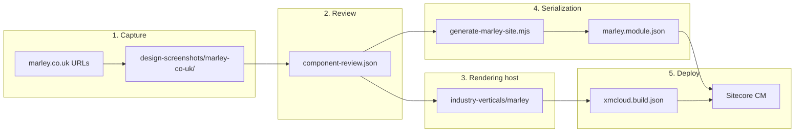

# Marley — website-to-sitecore setup and guide

**Marley** is a single-site vertical that mimics [marley.co.uk](https://www.marley.co.uk/) — pitched roof systems, roof tiles, solar, accessories, and blog content. It was built with the **website-to-sitecore** workflow: capture reference URLs → component review manifest → dedicated rendering host → standalone serialization module.

| | Value |
|---|--------|
| **Reference site** | [marley.co.uk](https://www.marley.co.uk/) |
| **Rendering host** | `industry-verticals/marley` |
| **Build key** | `marley` in `xmcloud.build.json` (`enabled: true`) |
| **Editing host** (Deploy portal) | `marley` (must match build key) |
| **XM Cloud project** | **SitecoreSilver** (Deploy portal) |
| **Authoring environment** | **SitecoreSilverProd** (Production) |
| **Editing host ID** | `4hpZwGNI9QyMAQGNhdwCoi` |
| **Module** | `authoring/items/marley/marley.module.json` |
| **Deploy module** | `marley` in `xmcloud.build.json` → `deployItems.modules` |
| **Content root** | `/sitecore/content/marley/marley` |
| **Site name** | `marley` (`NEXT_PUBLIC_DEFAULT_SITE_NAME`) |
| **GUID prefix** | `b703` (Marley item IDs — do not reuse Lyvera `b701` IDs) |

**Agent workflow:** `.cursor/website-to-sitecore/SKILL.md`  
**Component manifest:** `design-screenshots/marley-co-uk/component-review.json`  
**App README:** [industry-verticals/marley/README.md](../industry-verticals/marley/README.md)

---

## Architecture



Marley uses a **dedicated rendering host** (not `luxury-retail`). The host was cloned from `luxury-retail` and extended with article components from `retail` (`ArticleListing`, `ArticleDetails`, `Pagination`, `SocialShare`).

**Essential Living** (`luxury-retail`) remains the generic high-end retail starter. See [industry-verticals/luxury-retail/README.md](../industry-verticals/luxury-retail/README.md).

---

## How the site is created (current workflow)

### Phase 1 — Capture reference pages

Use the `capture-website` skill (Playwright) to capture each target URL:

| URL | Capture folder |
|-----|----------------|
| `/` | `design-screenshots/marley-co-uk/marley-co-uk--home/` |
| `/products` | `.../marley-co-uk--products/` |
| `/roof-tiles` | `.../marley-co-uk--roof-tiles/` |
| `/roof-tiles/clay-roof-tiles/acme-single-camber-plain-tile` | `.../marley-co-uk--roof-tiles-clay-roof-tiles-acme-single-camber-plain-tile/` |
| `/blog` | `.../marley-co-uk--blog/` |
| `/blog/warm-homes-plan-government-funding-for-homeowners` | `.../marley-co-uk--blog-warm-homes-plan-.../` |

Each folder contains desktop/tablet/mobile screenshots, HTML, CSS tokens, and section crops.

Setup (once per machine):

```powershell
npm --prefix .cursor run setup:playwright
```

### Phase 2 — Component review manifest

Analyze captures and write `design-screenshots/marley-co-uk/component-review.json`. For Marley, almost all sections were marked **`reuse`** (existing industry-verticals components) rather than new TSX:

- **Site chrome:** Header, Navigation, NavigationIcons, Footer, LinkList
- **Marketing:** HeroBanner, Promo, Features, PageHeader
- **Catalogue:** ProductListing, ProductDetails
- **Content:** RichText, PageContent, ArticleListing, ArticleDetails

Design tokens captured: Marley red `#c83232`, charcoal `#4d4d4c`, neutrals `#fafafa` / `#f4f4f4`, Geometr706 fonts.

### Phase 3 — Dedicated rendering host

```powershell
# Scaffold (already done — pattern for future sites)
# Clone luxury-retail → industry-verticals/marley
# Copy article components from retail
# Theme: src/assets/base/variables.css + src/assets/marley/marley.css
# Register in xmcloud.build.json + scripts/setup-editing-hosts.js
```

After TSX changes:

```powershell
cd industry-verticals/marley
npm install
npm run sitecore-tools:generate-map
npx tsc --noEmit
npm run dev
```

### Phase 4 — Serialization module

| Path | Purpose |
|------|---------|
| `authoring/items/marley/marley.module.json` | Module namespace `marley`, push rules |
| `authoring/items/marley/serialized-content/` | Templates, renderings, site YAML |
| `authoring/items/marley/scripts/generate-marley-site.mjs` | Regenerates Home tree, partial designs, datasources |

**Regenerate content YAML** after changing page layout or datasources:

```powershell
node authoring/items/marley/scripts/generate-marley-site.mjs
dotnet sitecore serialization validate --fix -i marley
```

The generator wires:

- Partial designs (Header / Footer)
- Default page design
- Home + 5 child pages with `__Renderings`
- Data folder items (hero banners, promos, features, link lists, texts)

**Site Grouping** (`Settings/Site Grouping/marley.yml`):

```yaml
- Hint: RenderingHost
  Value: marley
```

### Phase 5 — Register in XM Cloud build

`xmcloud.build.json`:

```json
"marley": {
  "path": "./industry-verticals/marley",
  "enabled": true,
  ...
},
"deployItems": {
  "modules": ["Project.IndustryVerticals", "lyveragroup", "marley"]
}
```

---

## Page map

| Public URL | Sitecore path | Main components |
|------------|---------------|-----------------|
| `/` | `Home` | HeroBanner, Promo, Features |
| `/products` | `Home/Products` | PageHeader, ProductListing |
| `/roof-tiles` | `Home/Roof-Tiles` | PageHeader, Promo, ProductListing |
| `/roof-tiles/clay-roof-tiles/acme-single-camber-plain-tile` | `Home/Roof-Tiles/Clay-Roof-Tiles/Acme-Single-Camber-Plain-Tile` | ProductDetails, RichText |
| `/blog` | `Home/Blog` | PageHeader, ArticleListing |
| `/blog/warm-homes-plan-government-funding-for-homeowners` | `Home/Blog/Warm-Homes-Plan-Government-Funding-For-Homeowners` | HeroBanner, ArticleDetails, RichText |

Routes are standard Content SDK catch-all (`src/pages/[[...path]].tsx`) — no synthetic Next.js routes.

After push, the Content Editor tree under **Home** should match:


---

## New site setup checklist

Use this when deploying Marley to a fresh XM Cloud environment.

### Step 1 — Confirm repo configuration

- [ ] `xmcloud.build.json` contains `"marley": { "enabled": true, ... }`
- [ ] `deployItems.modules` includes `"marley"`
- [ ] Changes are committed and pushed to the branch the editing host builds from
- [x] Editing host **`marley`** added in XM Cloud Deploy → **SitecoreSilver** → **SitecoreSilverProd** (see screenshot in Step 2)
- [ ] First **Build and deploy** for `marley` completed successfully
- [x] Serialization pushed — content tree visible at `/sitecore/content/marley/marley` (see screenshot in Step 3)

### Step 2 — Create editing host in XM Cloud Deploy

1. Open [Sitecore Cloud Portal](https://portal.sitecorecloud.io) → **Projects** → **SitecoreSilver**.
2. Open the **Editing hosts** tab.
3. Click **Add editing host** (or confirm **`marley`** already exists).
4. Set the name to **`marley`** — must match the `xmcloud.build.json` key **exactly** (case-sensitive).
5. Link it to the authoring environment **SitecoreSilverProd** (Production).
6. Connect the correct **GitHub account** and repository for this repo.
7. Set branch to **`main`** and enable **auto deploy based on commits**.
8. Run **Build and deploy** (Options → Build and deploy on the host) and wait until status is **successful**.

**Current status:** The **`marley`** editing host is registered on **SitecoreSilverProd** (host ID `4hpZwGNI9QyMAQGNhdwCoi`, branch `main`, auto deploy enabled):


> If split deployment is disabled, editing hosts may also be created automatically when `enabled: true` in `xmcloud.build.json` — verify in the portal either way. `xmcloud.build.json` alone does **not** create the portal entry; you must add the host or confirm it exists, then deploy.

> **Note:** Marley shares the **SitecoreSilver** XM Cloud project with the SitecoreSilver celebration site. Each site uses its own editing host name (`marley` vs `sitecoresilver`) and its own Site Grouping **RenderingHost** value.

### Step 3 — Push serialization

From repo root (after `cloud login` and environment connect):

```powershell
dotnet sitecore serialization validate --fix -i marley
dotnet sitecore serialization push -n <YourEnvironmentName> -i marley
```

Replace `<YourEnvironmentName>` with the nickname from `dotnet sitecore cloud environment connect` (see `.sitecore/user.json`). For this environment use **`SitecoreSilverProd`**.

**Expected result after push** — Content Editor → `/sitecore/content/marley`:


The site root at **`/sitecore/content/marley/marley`** should contain:

| Folder / item | Purpose |
|---------------|---------|
| **Home** | Page tree (Home, Products, Roof-Tiles, Blog, …) |
| **Media** | Site media library folder |
| **Data** | Shared datasources (hero banners, promos, link lists, …) |
| **Dictionary** | Site dictionary phrases |
| **Presentation** | Partial designs, page designs, available renderings, styles |
| **Settings** | Site configuration |
| **Settings → Site Grouping → marley** | Site definition — set **RenderingHost** = `marley` here |

The outer **`marley`** folder is the **site collection** (tenant); the inner **`marley`** folder (star icon) is the **site** root.

Expand **Home** to confirm the six demo pages were pushed:


| Sitecore path under `Home/` | Public URL |
|-----------------------------|------------|
| _(Home item)_ | `/` |
| `Products` | `/products` |
| `Roof-Tiles` → `Clay-Roof-Tiles` → `Acme-Single-Camber-Plain-Tile` | `/roof-tiles/clay-roof-tiles/acme-single-camber-plain-tile` |
| `Blog` → `Warm-Homes-Plan-Government-Funding-For-Homeowners` | `/blog/warm-homes-plan-government-funding-for-homeowners` |

**Settings → Site Grouping → marley** (globe icon) is the site definition item — configure **RenderingHost** here in Step 4.

### Step 4 — Verify Site Grouping

Content Editor → `/sitecore/content/marley/marley/Settings/Site Grouping/marley`:

| Field | Value |
|-------|--------|
| **Predefined application editing host** | `marley` |
| **SiteName** | `marley` |

If the dropdown only shows `Default` / `demosite`, the editing host deploy has not finished — wait and refresh.

### Step 5 — Verify in Pages

Open **Pages** → site **marley** → **Home**. Toolbar editing-host dropdown should show **`marley`**, not Default. Components should render (no orange “missing React implementation” blocks).

### Step 6 — Local development

```powershell
cd industry-verticals/marley
cp .env.remote.example .env.local
# SITECORE_EDGE_CONTEXT_ID, NEXT_PUBLIC_DEFAULT_SITE_NAME=marley, SITECORE_EDITING_SECRET
npm install
npm run dev
```

---

## Push / pull workflow

**Push** (YAML → CM):

```powershell
dotnet sitecore cloud login
dotnet sitecore cloud environment connect --environment-id <id> --allow-write
dotnet sitecore serialization validate --fix -i marley
dotnet sitecore serialization push -n <env> -i marley
```

After push, verify the content tree in Content Editor matches [02-content-tree-after-push.png](./images/marley/02-content-tree-after-push.png).

**Pull** (CM → YAML, after author changes):

```powershell
dotnet sitecore serialization pull -n <env> -i marley
dotnet sitecore serialization validate --fix -i marley
```

**CLI plugin mismatch** (common after CLI upgrade):

```powershell
cd authoring
dotnet sitecore plugin init --overwrite
```

---

## Troubleshooting

| Symptom | Fix |
|---------|-----|
| `Editing host 'marley' not found in xmcloud.build.json` | Push latest commit; confirm editing host repo/branch in Deploy portal |
| Pages shows Default editing host | Set Site Grouping **RenderingHost** = `marley`; redeploy editing host |
| Orange “missing React implementation” | Wrong editing host serving page — fix Site Grouping + Pages dropdown |
| Duplicate GUID on push | Marley uses **`b703`** prefix; never copy IDs from Lyvera (`b701`) or other modules |
| `serialization validate` parent path errors | Re-run `generate-marley-site.mjs`; check parent IDs in generator |
| Local `npm run build` SSG failures | Connected Edge may not have Marley content yet — push module first; or expect missing datasource errors until CM is populated |
| Search on ProductListing / ArticleListing | Optional — configure Sitecore Search env vars (see Forma Lux pattern in [DEPLOYMENT-GUIDE.md](./DEPLOYMENT-GUIDE.md)) |

---

## Theme and styling

| File | Purpose |
|------|---------|
| `src/assets/base/variables.css` | CSS custom properties (Marley palette) |
| `src/assets/marley/marley.css` | Marley-specific overrides |
| `src/Layout.tsx` | Root `marley-site` class |

Fonts: Geometr706 (from capture) — add webfont assets under `public/` when polishing visual parity.

---

## Related documentation

| Document | Description |
|----------|-------------|
| [JUNIOR-DEVELOPER-GUIDE.md](./JUNIOR-DEVELOPER-GUIDE.md) | Sitecore concepts for new developers |
| [DEPLOYMENT-GUIDE.md](./DEPLOYMENT-GUIDE.md) | XM Cloud deployment and editing hosts |
| [SITECORESILVER.md](./SITECORESILVER.md) | Another standalone-module site pattern |
| [LYVERA.md](./LYVERA.md) | Multi-site collection pattern (contrast) |
| [COMPONENTS.md](./COMPONENTS.md) | Component inventory including Marley |

---

## TODO / next polish

- [ ] Upload Marley media (hero images, product shots, logos) to `/sitecore/media library/Project/marley`
- [ ] Wire Sitecore Search for ProductListing and ArticleListing (optional)
- [ ] Add Geometr706 font files and `@font-face` rules
- [ ] Mega-menu styling for Navigation (Products / Help / Technical Services)
- [ ] Cookie banner component (captured in `design-screenshots/.../sections/cookie-banner/`)
- [ ] Visual QA each page against capture screenshots
- [ ] Author remaining body copy in CM after first push
