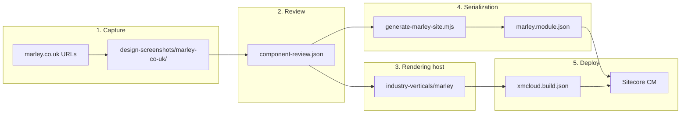

# Marley — website-to-sitecore setup and guide

**Marley** is a single-site vertical that mimics [marley.co.uk](https://www.marley.co.uk/) — pitched roof systems, roof tiles, solar, accessories, and blog content. It was built with the **website-to-sitecore** workflow: capture reference URLs → component review manifest → dedicated rendering host → standalone serialization module.

| | Value |
|---|--------|
| **Reference site** | [marley.co.uk](https://www.marley.co.uk/) |
| **Rendering host** | `industry-verticals/marley` |
| **Build key** | `marley` in `xmcloud.build.json` (`enabled: true`) |
| **Editing host** (Deploy portal) | `marley` (must match build key) |
| **XM Cloud project** | **SitecoreSilver** (Deploy portal) |
| **Authoring environment** | **SitecoreSilverProd** (Production) |
| **Editing host ID** | `4hpZwGNI9QyMAQGNhdwCoi` |
| **Module** | `authoring/items/marley/marley.module.json` |
| **Deploy module** | `marley` in `xmcloud.build.json` → `deployItems.modules` |
| **Content root** | `/sitecore/content/marley/marley` |
| **Site name** | `marley` (`NEXT_PUBLIC_DEFAULT_SITE_NAME`) |
| **GUID prefix** | `b703` (Marley item IDs — do not reuse Lyvera `b701` IDs) |

### Current CM status (SitecoreSilverProd)

| Step | Status |
|------|--------|
| Editing host **`marley`** in Deploy portal | Done |
| Serialization **push** to CM | Done |
| Content tree at `/sitecore/content/marley/marley` | Done — [screenshot](./images/marley/03-content-tree-home-pages-expanded.png) |
| Site Grouping **RenderingHost** = `marley` | Done (pulled from CM; was `luxury-retail` before CM update) |
| Site **thumbnail** on collection/site root | Done (pulled from CM) |
| Serialization **pull** back to repo | Done — `dotnet sitecore serialization pull -n SitecoreSilverProd -i marley` |
| **Commit** pulled YAML to Git | Pending |
| Pages / Edge / local dev verification | Pending |

**Agent workflow:** [`.cursor/skills/website-to-sitecore/SKILL.md`](../.cursor/skills/website-to-sitecore/SKILL.md)  
**Cursor rules & skills reference:** [`.cursor/AGENTS.md`](../.cursor/AGENTS.md) — what each rule and skill does  
**Component manifest:** `design-screenshots/marley-co-uk/component-review.json`  
**App README:** [industry-verticals/marley/README.md](../industry-verticals/marley/README.md)

---

## Architecture



Marley uses a **dedicated rendering host** (not `luxury-retail`). The host was cloned from `luxury-retail` and extended with article components from `retail` (`ArticleListing`, `ArticleDetails`, `Pagination`, `SocialShare`).

**Essential Living** (`luxury-retail`) remains the generic high-end retail starter. See [industry-verticals/luxury-retail/README.md](../industry-verticals/luxury-retail/README.md).

---

## How the site is created (current workflow)

### Phase 1 — Capture reference pages

Use the `capture-website` skill (Playwright) to capture each target URL:

| URL | Capture folder |
|-----|----------------|
| `/` | `design-screenshots/marley-co-uk/marley-co-uk--home/` |
| `/products` | `.../marley-co-uk--products/` |
| `/roof-tiles` | `.../marley-co-uk--roof-tiles/` |
| `/roof-tiles/clay-roof-tiles/acme-single-camber-plain-tile` | `.../marley-co-uk--roof-tiles-clay-roof-tiles-acme-single-camber-plain-tile/` |
| `/blog` | `.../marley-co-uk--blog/` |
| `/blog/warm-homes-plan-government-funding-for-homeowners` | `.../marley-co-uk--blog-warm-homes-plan-.../` |

Each folder contains desktop/tablet/mobile screenshots, HTML, CSS tokens, and section crops.

Setup (once per machine):

```powershell
npm --prefix .cursor run setup:playwright
```

### Phase 2 — Component review manifest

Analyze captures and write `design-screenshots/marley-co-uk/component-review.json`. For Marley, almost all sections were marked **`reuse`** (existing industry-verticals components) rather than new TSX:

- **Site chrome:** Header, Navigation, NavigationIcons, Footer, LinkList
- **Marketing:** HeroBanner, Promo, Features, PageHeader
- **Catalogue:** ProductListing, ProductDetails
- **Content:** RichText, PageContent, ArticleListing, ArticleDetails

Design tokens captured: Marley red `#c83232`, charcoal `#4d4d4c`, neutrals `#fafafa` / `#f4f4f4`, Geometr706 fonts.

### Phase 3 — Dedicated rendering host

```powershell
# Scaffold (already done — pattern for future sites)
# Clone luxury-retail → industry-verticals/marley
# Copy article components from retail
# Theme: src/assets/base/variables.css + src/assets/marley/marley.css
# Register in xmcloud.build.json + scripts/setup-editing-hosts.js
```

After TSX changes:

```powershell
cd industry-verticals/marley
npm install
npm run sitecore-tools:generate-map
npx tsc --noEmit
npm run dev
```

### Phase 4 — Serialization module

| Path | Purpose |
|------|---------|
| `authoring/items/marley/marley.module.json` | Module namespace `marley`, push rules |
| `authoring/items/marley/serialized-content/` | Templates, renderings, site YAML |
| `authoring/items/marley/scripts/generate-marley-site.mjs` | Regenerates Home tree, partial designs, datasources |

**Regenerate content YAML** after changing page layout or datasources:

```powershell
node authoring/items/marley/scripts/generate-marley-site.mjs
dotnet sitecore serialization validate --fix -i marley
```

The generator wires:

- Partial designs (Header / Footer)
- Default page design
- Home + 5 child pages with `__Renderings`
- Data folder items (hero banners, promos, features, link lists, texts)

**Site Grouping** (`Settings/Site Grouping/marley.yml`):

```yaml
- Hint: RenderingHost
  Value: marley
```

### Phase 5 — Register in XM Cloud build

`xmcloud.build.json`:

```json
"marley": {
  "path": "./industry-verticals/marley",
  "enabled": true,
  ...
},
"deployItems": {
  "modules": ["Project.IndustryVerticals", "lyveragroup", "marley"]
}
```

---

## Page map

Every page uses **Page Design: Default**, which adds partial-design chrome:

| Placeholder | Components |
|-------------|------------|
| `headless-header` | **Header** → **Image** (logo) → **Navigation** → **NavigationIcons** (Marley variant) |
| `headless-footer` | **Footer** (Marley variant) → **LinkList** ×3 (Resources, Policies, Useful Links) |

### Main content by page (`headless-main`)

| Public URL | Sitecore path | Components (top → bottom) |
|------------|---------------|---------------------------|
| `/` | `Home` | **HeroBanner** → **Promo** ×4 → **Features** ×2 |
| `/products` | `Home/Products` | **PageHeader** → **ProductListing** → **RichText** |
| `/roof-tiles` | `Home/Roof-Tiles` | **PageHeader** → **ProductListing** → **RichText** |
| `/roof-tiles/clay-roof-tiles/acme-single-camber-plain-tile` | `Home/Roof-Tiles/Clay-Roof-Tiles/Acme-Single-Camber-Plain-Tile` | **ProductDetails** → **Features** → **Promo** |
| `/roofing-batten/jb-red-batten` | `Home/Roofing-Batten/JB-Red-Batten` | **ProductDetails** → **RichText** → **Features** |
| `/accessories/10mm-eaves-vent-system` | `Home/Accessories/10mm-Eaves-Vent-System` | **ProductDetails** → **RichText** → **Promo** |
| `/solar-roof-tiles/solartile` | `Home/Solar-Roof-Tiles/SolarTile` | **ProductDetails** → **Promo** → **Features** |
| `/blog` | `Home/Blog` | **PageHeader** → **ArticleListing** |
| `/blog/warm-homes-plan-…` | `Home/Blog/Warm-Homes-Plan-Government-Funding-For-Social-Housing` | **HeroBanner** → **PageContent** → **LinkList** → **Promo** |
| `/samples` | `Home/Samples` | **PageHeader** → **ProductListing** → **RichText** |
| `/mtar` | `Home/Mtar` | **HeroBanner** → **RichText** → **Promo** ×2 |

Folder pages (`Clay-Roof-Tiles`, `Roofing-Batten`, `Accessories`, `Solar-Roof-Tiles`) have no page-level renderings — they rely on navigation to child pages.

Routes are standard Content SDK catch-all (`src/pages/[[...path]].tsx`) — no synthetic Next.js routes.

### Reference URLs ([marley.co.uk](https://www.marley.co.uk/))

Captured design evidence lives under `design-screenshots/marley-co-uk/`. Approved component mapping: `component-review.json`.

| Reference URL | Capture folder | Demo path | Main content |
|---------------|----------------|-----------|--------------|
| [marley.co.uk/](https://www.marley.co.uk/) | `marley-co-uk--home` | `/` | Hero “How can we help?”, 4× Promo, 2× Features |
| […/products](https://www.marley.co.uk/products) | `marley-co-uk--products` | `/products` | PageHeader, ProductListing, RichText |
| […/roof-tiles](https://www.marley.co.uk/roof-tiles) | `marley-co-uk--roof-tiles` | `/roof-tiles` | PageHeader, ProductListing, RichText |
| […/acme-single-camber-plain-tile](https://www.marley.co.uk/roof-tiles/clay-roof-tiles/acme-single-camber-plain-tile) | `marley-co-uk--roof-tiles-clay-roof-tiles-acme-single-camber-plain-tile` | `/roof-tiles/clay-roof-tiles/acme-single-camber-plain-tile` | ProductDetails, Features, Promo |
| […/blog](https://www.marley.co.uk/blog) | `marley-co-uk--blog` | `/blog` | PageHeader, ArticleListing |
| […/warm-homes-plan-…](https://www.marley.co.uk/blog/warm-homes-plan-government-funding-for-homeowners) | `marley-co-uk--blog-warm-homes-plan-government-funding-for-homeowners` | `/blog/warm-homes-plan-government-funding-for-social-housing` | HeroBanner, PageContent, LinkList, Promo |

**Additional demo pages** (generator only — no separate capture folder yet): `/samples`, `/mtar`, `/roofing-batten/jb-red-batten`, `/accessories/10mm-eaves-vent-system`, `/solar-roof-tiles/solartile`.

**Known gap vs live home page:** [marley.co.uk](https://www.marley.co.uk/) shows a **Latest News** band below the promos; the demo home uses Hero + Promos + Features only. Add `ArticleListing` (or a Promo grid) on Home in `generate-marley-site.mjs` to match.

**Re-capture all reference URLs:**

```powershell
# From repo root — one-time Playwright setup if needed:
node .cursor/skills/capture-website/scripts/setup-cursor-runtime.mjs
npm --prefix .cursor install
npm --prefix .cursor run setup:playwright

npm --prefix .cursor run capture:website -- `
  --file design-screenshots/marley-co-uk/capture-urls.txt `
  --out design-screenshots/marley-co-uk `
  --manifest
```

Regenerate Sitecore content after datasource edits:

```powershell
node authoring/items/marley/scripts/generate-marley-site.mjs
dotnet sitecore serialization validate --fix -i marley
```

### `[object Object]` fix pattern (integrated GraphQL)

XM Cloud delivery returns datasource fields as `{ jsonValue: { value: "…" } }`. Passing those wrappers directly to SDK `Text` / `RichText` / `Link` renders `[object Object]`.

**Fix:** use helpers in `industry-verticals/marley/src/helpers/field-utils.ts`:

1. `getDatasource()` + `pickSdkField()` — unwrap IGQL / flat JSS fields
2. `normalizeTextField` / `normalizeRichTextField` / `normalizeLinkField` / `normalizeImageField`
3. **Delivery mode:** render plain strings / HTML / `<a>` / ``
4. **Editing mode:** pass normalized fields to SDK field components

| Component | Home page? | IGQL-safe |
|-----------|------------|-----------|
| HeroBanner | Yes | Yes |
| Promo | Yes | Yes |
| Features | Yes | Yes |
| Footer (Marley) | Yes (partial) | Yes |
| LinkList | Yes (partial) | Yes |
| PageHeader | Other pages | Yes |
| RichText | Other pages | Yes |
| PageContent | Blog article | Yes |
| Image | Yes (partial) | Yes |
| Header, Navigation, NavigationIcons | Yes (partial) | Nav helpers / static links |
| ProductListing, ProductDetails, ArticleListing, ArticleDetails | Other pages | Review if issues appear |

**Verify locally (home page):**

```powershell
cd industry-verticals/marley
# .env.local must have NEXT_PUBLIC_DEFAULT_SITE_NAME=marley and SitecoreSilverProd edge context
npm run dev
# Open http://localhost:3000/ — search page source for "[object Object]"
```

After TSX changes: `npm run build` (or `npx tsc --noEmit`) before redeploying the `marley` editing host.

After push, the Content Editor tree under **Home** should match:


---

## New site setup checklist

Use this when deploying Marley to a fresh XM Cloud environment.

### Step 1 — Confirm repo configuration

- [ ] `xmcloud.build.json` contains `"marley": { "enabled": true, ... }`
- [ ] `deployItems.modules` includes `"marley"`
- [ ] Changes are committed and pushed to the branch the editing host builds from
- [x] Editing host **`marley`** added in XM Cloud Deploy → **SitecoreSilver** → **SitecoreSilverProd** (see screenshot in Step 2)
- [ ] First **Build and deploy** for `marley` completed successfully
- [x] Serialization pushed — content tree visible at `/sitecore/content/marley/marley` (see screenshot in Step 3)
- [x] Site Grouping **RenderingHost** = `marley` (pulled from CM — see Step 4)
- [x] Site thumbnail set and pulled from CM (see Step 4)
- [x] Serialization pulled — `dotnet sitecore serialization pull -n SitecoreSilverProd -i marley`
- [ ] Pulled YAML committed and pushed to Git (`main`)
- [ ] Pages verified with **`marley`** editing host (Step 5)
- [ ] Local dev smoke test (Step 6)

### Step 2 — Create editing host in XM Cloud Deploy

1. Open [Sitecore Cloud Portal](https://portal.sitecorecloud.io) → **Projects** → **SitecoreSilver**.
2. Open the **Editing hosts** tab.
3. Click **Add editing host** (or confirm **`marley`** already exists).
4. Set the name to **`marley`** — must match the `xmcloud.build.json` key **exactly** (case-sensitive).
5. Link it to the authoring environment **SitecoreSilverProd** (Production).
6. Connect the correct **GitHub account** and repository for this repo.
7. Set branch to **`main`** and enable **auto deploy based on commits**.
8. Run **Build and deploy** (Options → Build and deploy on the host) and wait until status is **successful**.

**Current status:** The **`marley`** editing host is registered on **SitecoreSilverProd** (host ID `4hpZwGNI9QyMAQGNhdwCoi`, branch `main`, auto deploy enabled):


> If split deployment is disabled, editing hosts may also be created automatically when `enabled: true` in `xmcloud.build.json` — verify in the portal either way. `xmcloud.build.json` alone does **not** create the portal entry; you must add the host or confirm it exists, then deploy.

> **Note:** Marley shares the **SitecoreSilver** XM Cloud project with the SitecoreSilver celebration site. Each site uses its own editing host name (`marley` vs `sitecoresilver`) and its own Site Grouping **RenderingHost** value.

### Step 3 — Push serialization

From repo root (after `cloud login` and environment connect):

```powershell
dotnet sitecore serialization validate --fix -i marley
dotnet sitecore serialization push -n <YourEnvironmentName> -i marley
```

Replace `<YourEnvironmentName>` with the nickname from `dotnet sitecore cloud environment connect` (see `.sitecore/user.json`). For this environment use **`SitecoreSilverProd`**.

**Expected result after push** — Content Editor → `/sitecore/content/marley`:


The site root at **`/sitecore/content/marley/marley`** should contain:

| Folder / item | Purpose |
|---------------|---------|
| **Home** | Page tree (Home, Products, Roof-Tiles, Blog, …) |
| **Media** | Site media library folder |
| **Data** | Shared datasources (hero banners, promos, link lists, …) |
| **Dictionary** | Site dictionary phrases |
| **Presentation** | Partial designs, page designs, available renderings, styles |
| **Settings** | Site configuration |
| **Settings → Site Grouping → marley** | Site definition — set **RenderingHost** = `marley` here |

The outer **`marley`** folder is the **site collection** (tenant); the inner **`marley`** folder (star icon) is the **site** root.

Expand **Home** to confirm the six demo pages were pushed:


| Sitecore path under `Home/` | Public URL |
|-----------------------------|------------|
| _(Home item)_ | `/` |
| `Products` | `/products` |
| `Roof-Tiles` → `Clay-Roof-Tiles` → `Acme-Single-Camber-Plain-Tile` | `/roof-tiles/clay-roof-tiles/acme-single-camber-plain-tile` |
| `Blog` → `Warm-Homes-Plan-Government-Funding-For-Homeowners` | `/blog/warm-homes-plan-government-funding-for-homeowners` |

**Settings → Site Grouping → marley** (globe icon) is the site definition item — **RenderingHost** must be `marley`.

### Step 4 — Verify Site Grouping and site thumbnail

Content Editor → `/sitecore/content/marley/marley/Settings/Site Grouping/marley`:

| Field | Value |
|-------|--------|
| **Predefined application editing host** (RenderingHost) | `marley` |
| **SiteName** | `marley` |

Serialized after CM update + pull:

```yaml
# authoring/items/marley/.../Site Grouping/marley.yml
- Hint: RenderingHost
  Value: marley
```

> **Note:** The initial push had `RenderingHost: luxury-retail`. That was corrected in CM to **`marley`** and captured via pull (2026-06-20).

**Site thumbnail** — set on the site root item `/sitecore/content/marley/marley`:

```yaml
# authoring/items/marley/serialized-content/marley/marley.yml
- Hint: __Thumbnail
  Value: "<image mediaid='950afdf8-1a01-4103-95d6-387304725684' />"
```

Thumbnail media item (pulled):

```text
/sitecore/media library/Project/marley/marley/System/thumbnail_0e77b766-8d2e-475e-8601-e46ae7953126
```

Commit the pulled files under `authoring/items/marley/` so the repo matches CM.

If the dropdown only shows `Default` / `demosite`, the editing host deploy has not finished — wait and refresh.

### Step 5 — Verify in Pages

Open **Pages** → site **marley** → **Home**. Toolbar editing-host dropdown should show **`marley`**, not Default. Components should render (no orange “missing React implementation” blocks).

### Step 6 — Local development

```powershell
cd industry-verticals/marley
cp .env.remote.example .env.local
```

Set in `.env.local` (from XM Cloud Deploy → **SitecoreSilverProd** → Developer Settings):

| Variable | Value |
|----------|--------|
| `SITECORE_EDGE_CONTEXT_ID` | Edge context for **SitecoreSilverProd** (not Lyvera / starter-verticals sandbox) |
| `NEXT_PUBLIC_SITECORE_EDGE_CONTEXT_ID` | Same as above |
| `NEXT_PUBLIC_DEFAULT_SITE_NAME` | `marley` |
| `SITECORE_EDITING_SECRET` | From Deploy portal |

```powershell
npm install
npm run dev
```

**Verify:** open `http://localhost:3000/` (or `:3001` if 3000 is in use). View page source → search `__NEXT_DATA__` for `"siteName":"marley"`. You should see HeroBanner + Marley promos, not Lyvera components. Search HTML for `[object Object]` — there should be none after component fixes.

---

## Push / pull workflow

**Push** (YAML → CM):

```powershell
dotnet sitecore cloud login
dotnet sitecore cloud environment connect --environment-id <id> --allow-write
dotnet sitecore serialization validate --fix -i marley
dotnet sitecore serialization push -n SitecoreSilverProd -i marley
```

After push, verify the content tree in Content Editor matches [02-content-tree-after-push.png](./images/marley/02-content-tree-after-push.png) and [03-content-tree-home-pages-expanded.png](./images/marley/03-content-tree-home-pages-expanded.png).

**Pull** (CM → YAML, after author changes):

```powershell
dotnet sitecore serialization pull -n SitecoreSilverProd -i marley
dotnet sitecore serialization validate --fix -i marley
```

Commit pulled YAML (`Site Grouping/marley.yml`, site root `__Thumbnail`, thumbnail media) before the next push.

**CLI plugin mismatch** (common after CLI upgrade):

```powershell
cd authoring
dotnet sitecore plugin init --overwrite
```

---

## Troubleshooting

| Symptom | Fix |
|---------|-----|
| `Editing host 'marley' not found in xmcloud.build.json` | Push latest commit; confirm editing host repo/branch in Deploy portal |
| Pages shows Default editing host | Set Site Grouping **RenderingHost** = `marley`; redeploy editing host |
| Orange “missing React implementation” | Wrong editing host serving page — fix Site Grouping + Pages dropdown |
| Duplicate GUID on push | Marley uses **`b703`** prefix; never copy IDs from Lyvera (`b701`) or other modules |
| `serialization validate` parent path errors | Re-run `generate-marley-site.mjs`; check parent IDs in generator |
| Local home shows **Lyvera** content or orange “missing React implementation” | `.env.local` **Edge context** is wrong (Lyvera/starter sandbox). Use **SitecoreSilverProd** context from Deploy portal → Developer Settings; set `NEXT_PUBLIC_DEFAULT_SITE_NAME=marley`. Restart dev server; confirm `__NEXT_DATA__` has `"siteName":"marley"`. |
| Local home shows **`[object Object]`** | Component passing IGQL `{ jsonValue }` to SDK field components — use `field-utils.ts` pattern (see Page map section). Redeploy editing host after TSX fixes. |
| Local `npm run build` SSG failures | Connected Edge may not have Marley content yet — push module first; or expect missing datasource errors until CM is populated |
| Search on ProductListing / ArticleListing | Optional — configure Sitecore Search env vars (see Forma Lux pattern in [DEPLOYMENT-GUIDE.md](./DEPLOYMENT-GUIDE.md)) |

---

## Theme and styling

| File | Purpose |
|------|---------|
| `src/assets/base/variables.css` | CSS custom properties (Marley palette) |
| `src/assets/marley/marley.css` | Marley-specific overrides |
| `src/Layout.tsx` | Root `marley-site` class |

Fonts: Geometr706 (from capture) — add webfont assets under `public/` when polishing visual parity.

---

## Related documentation

| Document | Description |
|----------|-------------|
| [JUNIOR-DEVELOPER-GUIDE.md](./JUNIOR-DEVELOPER-GUIDE.md) | Sitecore concepts for new developers |
| [DEPLOYMENT-GUIDE.md](./DEPLOYMENT-GUIDE.md) | XM Cloud deployment and editing hosts |
| [SITECORESILVER.md](./SITECORESILVER.md) | Another standalone-module site pattern |
| [LYVERA.md](./LYVERA.md) | Multi-site collection pattern (contrast) |
| [COMPONENTS.md](./COMPONENTS.md) | Component inventory including Marley |

---

## TODO / next polish

### Done in CM

- [x] Editing host **`marley`** registered (SitecoreSilverProd)
- [x] Serialization module pushed
- [x] Site Grouping **RenderingHost** = `marley`
- [x] Site thumbnail on `/sitecore/content/marley/marley`
- [x] Pull CM changes into repo YAML

### Remaining

- [ ] **Commit** pulled files (`Site Grouping/marley.yml`, `marley/marley.yml`, thumbnail media YAML) and push to `main`
- [ ] Confirm **Build and deploy** for editing host `marley` succeeded after latest Git push
- [ ] **Pages** — open marley → Home; toolbar shows **`marley`**; no orange component blocks
- [ ] **Publish** content to Experience Edge (if pages are empty on preview/live)
- [ ] **Local dev** — `industry-verticals/marley` with `NEXT_PUBLIC_DEFAULT_SITE_NAME=marley`
- [ ] Upload Marley **hero/product/logo** media (beyond site thumbnail) to `/sitecore/media library/Project/marley`
- [ ] Wire **Sitecore Search** for ProductListing and ArticleListing (optional)
- [ ] Add **Geometr706** font files and `@font-face` rules
- [ ] **Mega-menu** styling for Navigation
- [ ] **Cookie banner** component (captured under `design-screenshots/.../cookie-banner/`)
- [ ] **Visual QA** each page against capture screenshots
- [ ] Author remaining **body copy** in CM
