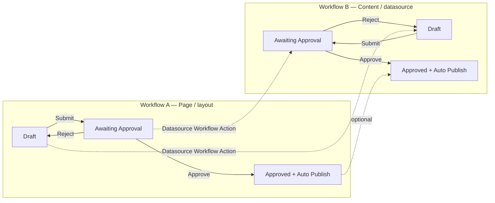
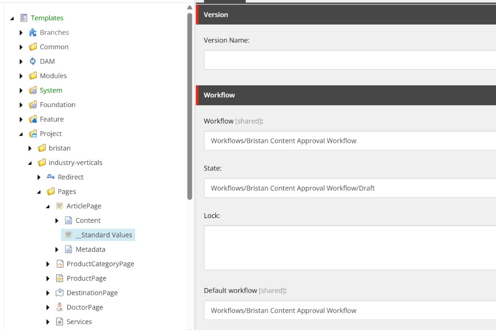
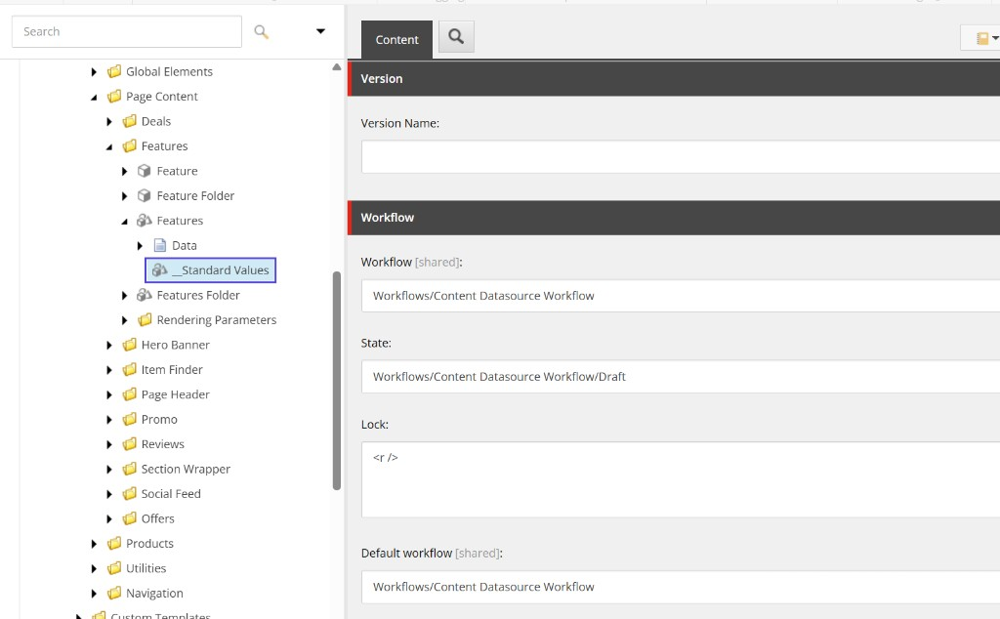
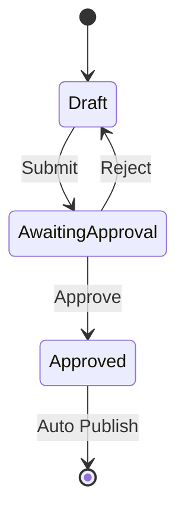
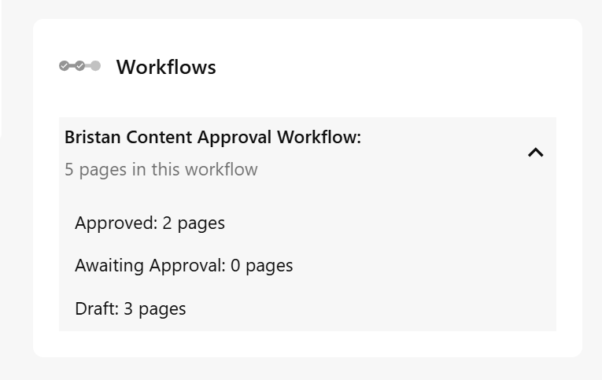

# SitecoreAI — Page layout vs content datasource workflows

How to run **two linked workflows** for SitecoreAI / XM Cloud — following Sitecore’s recommended pattern: one workflow for **page items (layout / structure)** and one for **component datasources (content)**.

Used by **Bristan** (`bristan`, `heritage`), **Lyvera Group**, and any site that assigns these workflows on template standard values.

**Official Sitecore documentation**

| Topic | Link |
| --- | --- |
| Accelerate — Workflows (page + datasource) | [Workflows recipe](https://developers.sitecore.com/learn/accelerate/xm-cloud/implementation/information-architecture/workflow) |
| Assign a data source workflow action | [Assign a data source workflow action](https://doc.sitecore.com/xmc/en/developers/xm-cloud/assign-a-data-source-workflow-action.html) |
| Defining workflows (states, commands, actions) | [Defining workflows](https://doc.sitecore.com/xmc/en/developers/xm-cloud/defining-workflows.html) |
| Workflow cookbook | [Workflow cookbook](https://doc.sitecore.com/xmc/en/developers/xm-cloud/workflow-cookbook.html) |
| Standard values for templates | [Standard values for data template fields](https://doc.sitecore.com/xmc/en/developers/xm-cloud/standard-values-for-data-template-fields.html) |
| Per-site standard values (datasources) | [Walkthrough: Defining standard values for your sites](https://doc.sitecore.com/xmc/en/developers/xm-cloud/walkthrough--defining-standard-values-for-your-sites.html) |
| Publishing optimization (Edge + datasources) | [Publishing optimization](https://developers.sitecore.com/learn/accelerate/xm-cloud/optimization/publishing-optimization) |
| Webhook submit action | [Webhook submit action](https://doc.sitecore.com/xmc/en/developers/xm-cloud/walkthrough--adding-and-configuring-a-webhook-submit-action.html) |

---

## Why two workflows? (Sitecore guidance)

Sitecore’s [Accelerate Workflows recipe](https://developers.sitecore.com/learn/accelerate/xm-cloud/implementation/information-architecture/workflow) states:

> **Two separate workflows are recommended, one for page items and the other for datasources.** By default, Sitecore provides you with the Basic Workflow for page items and the Basic Datasource Workflow for datasources.

| Concern | What changes in CM / Pages | Workflow in this repo |
| --- | --- | --- |
| **A — Page layout / structure** | Add / remove / reorder components, change page design, edit presentation (`__Renderings`), page-level fields | **Content Approval Workflow** (maps to Sitecore “Basic / page” workflow) |
| **B — Page content (datasources)** | Edit Promo / Hero / Rich Text / Link List field values on datasource items under `Data/` or local page data | **Content Datasource Workflow** (maps to Sitecore “Basic Datasource” workflow) |

### How this maps to authoring

| Author action | Item(s) that enter workflow | Workflow |
| --- | --- | --- |
| Change layout (add Promo, move Hero, partial design) | **Page item** (new version when leaving Final) | **A — Content Approval Workflow** |
| Edit component copy / images / links | **Datasource item** (Promo, Hero Banner, etc.) | **B — Content Datasource Workflow** |
| Submit / Approve page in Pages | Page moves in **A**; linked datasources move in **B** via **Datasource Workflow Action** | A drives B |

Sitecore documents this link in [Assign a data source workflow action](https://doc.sitecore.com/xmc/en/developers/xm-cloud/assign-a-data-source-workflow-action.html):

> When a page moves through the workflow, your data sources follow in their own workflow.

Without workflow on datasources, publishing a page (or a previous page version that still references the same datasource) can publish unapproved component content, because Experience Edge stores layout + datasource dependencies together. See [Publishing optimization](https://developers.sitecore.com/learn/accelerate/xm-cloud/optimization/publishing-optimization).

**Administrators bypass workflow.** Do not give content authors the Administrator role — see the Accelerate recipe.

---

## FAQ — detection, content types, and what authors see

These are the usual stakeholder questions. Answers follow [Sitecore’s Accelerate Workflows recipe](https://developers.sitecore.com/learn/accelerate/xm-cloud/implementation/information-architecture/workflow), [Assign a data source workflow action](https://doc.sitecore.com/xmc/en/developers/xm-cloud/assign-a-data-source-workflow-action.html), and [Assign a workflow to a template](https://doc.sitecore.com/xmc/en/developers/xm-cloud/workflow-cookbook.html) (Default workflow on `__Standard Values`).

### So depending on what is changed we can detect that and trigger a different workflow?

**Not as a “change detector.”** Sitecore does **not** inspect a save and pick workflow A vs B from “layout vs content.”

Workflows attach to **items** (via their **content type / data template** → **Default workflow**). What the author changes decides **which item** is versioned and therefore **which workflow** that item is already in:

| What the author changes | Which Sitecore item gets a new version / draft | Which workflow runs |
| --- | --- | --- |
| Layout: add, remove, reorder components; presentation | The **page** item | **A** (page template) |
| Content: text, image, link fields on a component | The **datasource** item | **B** (datasource template) |
| Both in one Pages session | Page **and** one or more datasources | **A** and **B** in parallel; Submit on the page can advance datasources via [Datasource Workflow Action](https://doc.sitecore.com/xmc/en/developers/xm-cloud/assign-a-data-source-workflow-action.html) |

So the “detection” is structural: layout lives on the **page**, component copy lives on **datasource** items. That is why Sitecore recommends **two workflows** rather than one smart trigger.

### I thought workflows were assigned at a content type level — does this need a lot of extra configuration?

**Yes — workflows are assigned at the template (content type) level.** Default workflow is set on template `__Standard Values` ([workflow cookbook](https://doc.sitecore.com/xmc/en/developers/xm-cloud/workflow-cookbook.html)).

For this model you configure **two assignments**, not a special change-routing engine:

| Assignment | Content type | Effort |
| --- | --- | --- |
| **Workflow A** | Page templates (`Page`, optionally `ProductPage`, `ArticlePage`, …) | One (or a few) standard-values fields — already done for Bristan / Lyvera `Page` |
| **Workflow B** | Datasource / component templates (Promo, Hero Banner, Rich Text, Link List, …) | Sitecore’s recommended path: [per-site Standard Values](https://doc.sitecore.com/xmc/en/developers/xm-cloud/walkthrough--defining-standard-values-for-your-sites.html) for those datasource templates (bulk in Content Editor) |
| **Link A → B** | Under page Submit / Approve / Reject | A few [Datasource Workflow Actions](https://doc.sitecore.com/xmc/en/developers/xm-cloud/assign-a-data-source-workflow-action.html) (CM insert → pull) |

That is the same pattern as Sitecore’s **Basic Workflow** (pages) + **Basic Datasource Workflow** (components) in the [Accelerate recipe](https://developers.sitecore.com/learn/accelerate/xm-cloud/implementation/information-architecture/workflow) — intentional, but usually a one-time setup, not per page.

### If I change the content on that page it triggers workflow 1, and if I change the layout it triggers a different workflow?

**Yes — from the author’s point of view that is the outcome**, with precise wording:

| Change | What enters approval |
| --- | --- |
| **Layout only** | Page item → **Workflow A** (Content Approval Workflow) |
| **Content only** (component fields) | Datasource item(s) → **Workflow B** (Content Datasource Workflow). The page item often also gets a new version in Pages when you edit on the canvas; Submit then uses Datasource Workflow Actions so datasources move with the page |
| **Layout + content** | Page in **A** and datasources in **B**; approve/submit together from Pages |

You are **not** putting two Default workflows on the same template. You put **A** on the **page** template and **B** on **datasource** templates. Different item types → different workflows. See [Defining workflows](https://doc.sitecore.com/xmc/en/developers/xm-cloud/defining-workflows.html) for how Final + Edit creates a new version on the item you edit.

```text
Page item  (Page template)           → Default workflow A  (layout / presentation)
  └─ Promo datasource (Promo template) → Default workflow B  (content fields)
  └─ Hero datasource (Hero template) → Default workflow B
```

---

## Architecture



**Matching state names** between A and B (Draft → Awaiting Approval → Approved) keep Datasource Workflow Actions easy to map 1:1 — the same pattern Sitecore uses with Basic Workflow ↔ Basic Datasource Workflow.

---

## Concepts

| Piece | Location | Purpose |
| --- | --- | --- |
| **Workflow** | `/sitecore/System/Workflows` | Process definition; **Initial state** |
| **State** | Child of workflow | Draft, Awaiting Approval, Approved; **Final** = publishable |
| **Command** | Child of state | Moves item to **Next state** (Review tab / Pages / Workbox) |
| **Action** | Child of state or command | Runs on transition (e.g. Auto Publish) |
| **Datasource Workflow Action** | Child of a **page** workflow command | Runs the matching command on the page’s datasources ([docs](https://doc.sitecore.com/xmc/en/developers/xm-cloud/assign-a-data-source-workflow-action.html)) |
| **Default workflow** | Template / **site** `__Standard Values` | New items inherit this workflow |

When an item is in a **Final** state and an author clicks **Edit**, Sitecore creates a **new version**, places it in the **Initial** state, and the previous publishable version remains live until the new version is approved. See [Defining workflows](https://doc.sitecore.com/xmc/en/developers/xm-cloud/defining-workflows.html).

SitecoreAI also ships **Sample Workflow** under `/sitecore/System/Workflows` — use it as a structural reference only; do not use it as production.

---

## Serialized in this repo

### Workflow A — Content Approval Workflow (pages / layout)

| Item | Path | ID |
| --- | --- | --- |
| Workflow | `…/Content Approval Workflow` | `{CB8D521C-CE56-495A-A513-CE2D7118EFF9}` |
| Draft | `…/Draft` | `{D539BA4A-E3BA-4DB1-B548-39C45F15A214}` |
| Awaiting Approval | `…/Awaiting Approval` | `{8D23FEF7-DBA5-4543-977F-26B848A51327}` |
| Approved (Final) | `…/Approved` | `{F0F55E47-C646-4E10-8839-93B8E0DBC53A}` |
| Submit / Approve / Reject | under Draft / Awaiting Approval | → matching next states |
| Auto Publish | `…/Approved/Auto Publish` | `{76C93E5F-F59C-42BC-B2A5-2321070FFFE6}` |

**Assign to:** page templates (`Project/bristan/Page`, `Project/lyveragroup/Page`, optionally `ProductPage`, `ArticlePage`, …).

### Workflow B — Content Datasource Workflow (component content)

| Item | Path | ID |
| --- | --- | --- |
| Workflow | `…/Content Datasource Workflow` | `{CB8D521C-CE56-495A-A513-CE2D7118EFFA}` |
| Draft | `…/Draft` | `{A1B80302-0001-4000-8000-000000000001}` |
| Submit | `…/Draft/Submit` | `{A1B80302-0001-4000-8000-000000000002}` → Awaiting Approval |
| Awaiting Approval | `…/Awaiting Approval` | `{A1B80302-0001-4000-8000-000000000003}` |
| Approve | `…/Awaiting Approval/Approve` | `{A1B80302-0001-4000-8000-000000000004}` → Approved |
| Reject | `…/Awaiting Approval/Reject` | `{A1B80302-0001-4000-8000-000000000005}` → Draft |
| Approved (Final) | `…/Approved` | `{A1B80302-0001-4000-8000-000000000006}` |
| Auto Publish | `…/Approved/Auto Publish` | `{A1B80302-0001-4000-8000-000000000007}` |

**Assign to:** datasource / component templates via **per-site Standard Values** (see below). Do **not** set Default workflow only on global `/sitecore/templates/...` datasource `__Standard Values` if you follow Sitecore’s code-component guidance — use site Standard Values ([docs note](https://doc.sitecore.com/xmc/en/developers/xm-cloud/assign-a-data-source-workflow-action.html)).

**Serialization folder:**  
- `authoring/items/industry-verticals/common/items/workflows-content-approval/Content Approval Workflow.yml` (+ nested states)  
- `authoring/items/industry-verticals/common/items/workflows-content-datasource/Content Datasource Workflow.yml` (+ nested states)  

**Module:** `Project.IndustryVerticals` — includes `workflows-content-approval` and `workflows-content-datasource` (each path is the **workflow item root**, not `/sitecore/system/Workflows`). SCS stores files as `{include-name}/{item-name}.yml` under that include folder.

---

## Link A → B with Datasource Workflow Actions (required)

Serialized workflows alone do **not** move datasources when a page is submitted. You must add **Datasource Workflow Action** items under the **page** workflow commands in Content Editor, then pull them into the repo.

This matches Sitecore’s guidance: Basic Workflow includes Datasource Workflow Actions that point at commands on Basic Datasource Workflow ([Accelerate](https://developers.sitecore.com/learn/accelerate/xm-cloud/implementation/information-architecture/workflow)).

### Steps (CM UI)

1. Push both workflows to CM (see [Push](#push-workflows-to-cm)).
2. Open `/sitecore/system/Workflows/Content Approval Workflow`.
3. Under **Draft → Submit**: **Insert → Datasource Workflow Action** (name e.g. `Sync datasources Submit`).
4. Set fields ([field reference](https://doc.sitecore.com/xmc/en/developers/xm-cloud/assign-a-data-source-workflow-action.html)):

| Field | Recommended value |
| --- | --- |
| **Command item** | `/sitecore/system/Workflows/Content Datasource Workflow/Draft/Submit` |
| **Scope** | **Descendants** (covers Link List children and nested data; use **Self** for leaf-only datasources) |
| Item / datasource rules | Leave empty unless you need template filters |

5. Under **Awaiting Approval → Approve**: insert Datasource Workflow Action → **Command item** = `…/Content Datasource Workflow/Awaiting Approval/Approve`, **Scope** = Descendants.
6. Under **Awaiting Approval → Reject**: insert Datasource Workflow Action → **Command item** = `…/Content Datasource Workflow/Awaiting Approval/Reject`, **Scope** = Descendants.
7. Save, then pull into serialization:

```powershell
dotnet sitecore serialization pull -n {YourEnv} -i Project.IndustryVerticals --include workflows-content-approval
dotnet sitecore serialization pull -n {YourEnv} -i Project.IndustryVerticals --include workflows-content-datasource
```

### Scope values (Sitecore)

| Scope | Behaviour |
| --- | --- |
| **Self** | Only direct datasources used on the page |
| **Direct Children** | Datasource + its direct children (even if not on the page) |
| **Descendants** | Datasource + all descendants (e.g. Link List + links; GraphQL child lists) |

Children/descendants are skipped if their workflow state does not match the parent.

### Partial designs / shared data

Datasource workflow actions only move datasources that are:

- Referenced on the page’s presentation, and for page/partial designs often need **`page:/…` relative** datasources under the page ([docs](https://doc.sitecore.com/xmc/en/developers/xm-cloud/assign-a-data-source-workflow-action.html#using-data-source-workflows-with-page-and-partial-designs)).

Shared site-level items under `Data/Promos/…` still need **Workflow B** assigned so they cannot publish while Draft; authors may approve them from Explorer/Workbox independently when not moved with a page.

---

## Assign workflows to templates

Workflows are assigned on template **`__Standard Values`** via **Default workflow** (field `ca9b9f52-4fb0-4f87-a79f-24dea62cda65`). Turn on **View → Standard fields** if the Workflow section is hidden.

### Workflow A — page / layout templates

Assign **Content Approval Workflow** (`{CB8D521C-CE56-495A-A513-CE2D7118EFF9}`) on page-template `__Standard Values`.



_Example: Content Editor → Templates → Project → industry-verticals → Pages → (page template) → `__Standard Values` → Workflow section. Prefer **Default workflow** only; leave **Workflow** / **State** empty on standard values so Sitecore sets state when items are created ([workflow cookbook](https://doc.sitecore.com/xmc/en/developers/xm-cloud/workflow-cookbook.html))._

| Site / collection | Page template | Value | Standard values path |
| --- | --- | --- | --- |
| Lyvera Group | `Project/lyveragroup/Page` | `{CB8D521C-CE56-495A-A513-CE2D7118EFF9}` | `authoring/items/lyveragroup/.../Page/__Standard Values.yml` |
| Bristan + Heritage | `Project/bristan/Page` | `{CB8D521C-CE56-495A-A513-CE2D7118EFF9}` | `authoring/items/bristan/.../Page/__Standard Values.yml` |

Optional (tenant-wide if set on shared templates):

| Template | Used for (Bristan) | Workflow A value |
| --- | --- | --- |
| `ProductCategoryPage` | `/products/bathroom-taps`, … | `{CB8D521C-…EFF9}` |
| `ProductPage` | PDPs | `{CB8D521C-…EFF9}` |
| `ArticlePage` | Blog articles | `{CB8D521C-…EFF9}` |

### Workflow B — datasource / content templates

Assign **Content Datasource Workflow** (`{CB8D521C-CE56-495A-A513-CE2D7118EFFA}`) on component/datasource `__Standard Values` (Promo, Hero Banner, Features, Rich Text, Link List, …).



_Example: Content Editor → Templates → Project → industry-verticals → Components → Page Content → Features → Features → `__Standard Values` → **Default workflow** = Content Datasource Workflow._

Sitecore’s recommended approach for SXA / code components:

1. Content Editor → site **Settings → Standard Values** (insert Standard Values if missing).
2. Add **Datasource Templates** (Promo, Hero Banner, Rich Text / Text, Features, Link List, etc.).
3. On each site Standard Values item, set **Default workflow** = `{CB8D521C-CE56-495A-A513-CE2D7118EFFA}` (**Content Datasource Workflow**).

Templates must inherit **`_PerSiteStandardValues`** (`/sitecore/Templates/Foundation/Experience Accelerator/StandardValues/`) to appear in that dialog ([Accelerate](https://developers.sitecore.com/learn/accelerate/xm-cloud/implementation/information-architecture/workflow)).

For grouped datasources (e.g. Link List + children) in Page Builder, parent templates may also need **`_HorizonDatasourceGrouping`**.

Until site Standard Values are configured in CM, you can set Default workflow on project datasource `__Standard Values` under `Project/industry-verticals/Components/...` (as in the screenshot) — prefer per-site values for Bristan isolation when available.

See [BRISTAN.md](./BRISTAN.md) for Bristan routes and page map.

---

## Approval flow (both workflows)



Same state machine for **A** and **B**. On pages, Datasource Workflow Actions keep datasources in sync when authors Submit / Approve / Reject from Pages.

### Pages dashboard — pages in workflow

Sitecore Pages surfaces a **Workflows** panel that lists how many pages are in each state of the page workflow (**A**). Authors use this for a quick status view without opening the Workbox.



_Example: **Workflows** card counting pages in Draft / Awaiting Approval / Approved. The label in the UI may still show a prior display name (e.g. “Bristan Content Approval Workflow”); the shared serialized workflow is **Content Approval Workflow** (`{CB8D521C-…EFF9}`)._

Datasource items on **Workflow B** appear when those items are selected or when Datasource Workflow Actions have moved them; this dashboard card is typically the **page** workflow summary.

---

## System template and field IDs

When authoring workflow YAML by hand, **copy structure from Sample Workflow** (or pull it). Legacy blog GUID lists are often wrong for SitecoreAI.

| Item type | Template ID |
| --- | --- |
| Workflow | `1C0ACC50-37BE-4742-B43C-96A07A7410A5` |
| State | `4B7E2DA9-DE43-4C83-88C3-02F042031D04` |
| Command | `CB01F9FC-C187-46B3-AB0B-97A8468D8303` |
| Action (Auto Publish) | `66882E97-C8AA-4E37-8901-7A8AA35ED2ED` |
| Datasource Workflow Action | Insert from CM only (`Insert → Datasource Workflow Action`), then pull — do not invent field GUIDs |

| Field | ID | Used on |
| --- | --- | --- |
| Initial state | `B5166B38-E4BF-4410-953C-2037F2BF6A56` | Workflow item |
| Next state | `DCBEBC58-6124-4100-A248-FC717D6C78D5` | Command items |
| Final | `FB8ABC73-7ACF-45A0-898C-D3CCB889C3EE` | Approved state |
| Type | `A291A22B-99E2-46BB-A27B-8EC744275396` | Auto Publish action |
| Parameters | `1507131D-CEE3-49E9-AF32-DE5403A37B49` | Auto Publish action |
| Default workflow | `CA9B9F52-4FB0-4F87-A79F-24DEA62CDA65` | Template `__Standard Values` |

**Auto Publish**

- **Type:** `Sitecore.Workflows.Simple.PublishAction, Sitecore.Kernel`
- **Parameters:** `deep=1&smart=1`

**Parent folder:** `/sitecore/system/Workflows` = `05592656-56D7-4D85-AACF-30919EE494F9`

---

## Push workflows to CM

```powershell
cd authoring
dotnet sitecore cloud login
dotnet sitecore serialization validate --fix -i Project.IndustryVerticals

# Both workflows (or --include workflows-content-approval / workflows-content-datasource)
dotnet sitecore serialization push -n {YourEnv} -i Project.IndustryVerticals

# Page standard values that reference Workflow A
dotnet sitecore serialization push -n {YourEnv} -i bristan --include templates
dotnet sitecore serialization push -n {YourEnv} -i lyveragroup --include lyveragrouptemplatesProject
```

After push:

1. Confirm `/sitecore/system/Workflows/Content Approval Workflow`
2. Confirm `/sitecore/system/Workflows/Content Datasource Workflow`
3. Add Datasource Workflow Actions (CM) if not yet pulled
4. Assign Workflow B on Bristan site **Standard Values** for datasource templates
5. Publish workflow definition items if required by your tenant process

---

## Create / extend a workflow (CM UI)

1. Content Editor → `/sitecore/System/Workflows`
2. **Insert → Workflow**
3. Insert **States**: Draft, Awaiting Approval, Approved
4. Workflow item → **Initial state** = Draft
5. Commands: Submit / Approve / Reject with **Next state**
6. Copy **Auto Publish** from Sample Workflow onto Approved; check **Final**
7. For **page** workflows only: insert **Datasource Workflow Action** under each command that should sync content datasources

---

## Webhook Submit Action (optional)

Trigger HTTP POST on a command (e.g. Submit → ticketing). Attach under Draft → Submit on **either** workflow.

```powershell
dotnet sitecore serialization pull -n {YourEnv} -i Project.IndustryVerticals --include workflows-content-approval
dotnet sitecore serialization pull -n {YourEnv} -i Project.IndustryVerticals --include workflows-content-datasource
```

---

## Troubleshooting

| Error / symptom | Cause | Fix |
| --- | --- | --- |
| `Configured source item path /sitecore/system/Workflows did not exist` | Include pointed at parent folder that is not serialized | Point includes at each workflow root (`…/Content Approval Workflow`, `…/Content Datasource Workflow`) |
| `ORPHAN ITEM` / `parent … not serialized` under workflows | Wrong disk layout, or unquoted `Path` with spaces so YAML Path truncates | Layout must be `items/{include}/{Item Name}.yml`; quote Paths that contain spaces |
| `Template ID … did not exist` | Wrong workflow/state/command GUID | Use IDs from [System template and field IDs](#system-template-and-field-ids) |
| Datasources stay Draft when page Approves | Missing Datasource Workflow Action or wrong Command item | Add actions under page Submit/Approve/Reject; point at Workflow B commands |
| Unapproved content still live on Edge | Datasource not in Workflow B / Final | Assign Default workflow on site Standard Values; Approve datasource |
| Layout change live, content not | Page Approved but datasource still Draft | Expected until B Final; sync via Datasource Workflow Action |
| Link List children not moved | Scope = Self | Set Scope to **Descendants** |
| Partial design datasources ignored | Not `page:/` relative under page | See [partial design conditions](https://doc.sitecore.com/xmc/en/developers/xm-cloud/assign-a-data-source-workflow-action.html) |
| Datasource template missing from Standard Values dialog | Missing `_PerSiteStandardValues` base | Add base template per Sitecore docs |

---

## Test checklist (Bristan)

### Workflow A — layout

- [ ] Push both workflows (`Project.IndustryVerticals` or `--include workflows-content-approval` / `workflows-content-datasource`)
- [ ] Push Bristan Page standard values (`bristan --include templates`)
- [ ] On an approved page, **Edit** → add/remove a component → page version enters Draft (A)
- [ ] **Submit** → **Approve** → page publishes (Auto Publish)

### Workflow B — content + link

- [ ] Datasource Workflow Actions on page Submit / Approve / Reject (pulled into repo)
- [ ] Workflow B on Promo / Hero / etc. via site Standard Values
- [ ] Edit Promo text on `/bathroom-taps` → datasource enters Draft (B)
- [ ] Submit page → datasource also Awaiting Approval (B)
- [ ] Approve page → datasource Approved (B) and content appears after publish
- [ ] Reject returns page **and** datasources to Draft

### Heritage / Lyvera

- [ ] Repeat Page standard values / site Standard Values as needed for heritage and Lyvera Page templates

---

## Checklist

- [x] Workflow A — Content Approval Workflow (pages / layout)
- [x] Workflow B — Content Datasource Workflow (content / datasources)
- [x] Module include for both under `Project.IndustryVerticals`
- [x] Default workflow A on Bristan + Lyvera Page `__Standard Values`
- [ ] Datasource Workflow Actions under A’s commands (CM insert + pull)
- [ ] Workflow B on Bristan site Standard Values for datasource templates
- [ ] Push + Pages Submit/Approve/Reject tested end-to-end
- [ ] (Optional) Workflow A on ProductPage / ArticlePage
- [ ] (Optional) Webhooks
