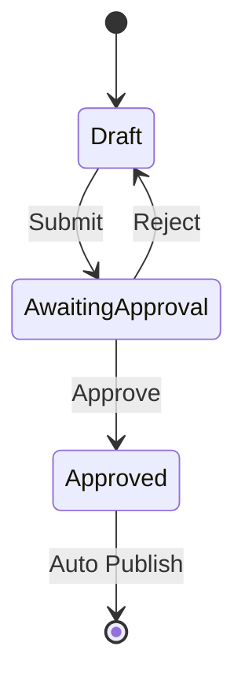

# SitecoreAI — Content approval workflow

How to create, assign, and extend a content approval workflow in SitecoreAI for the **Lyvera Group** sites (corporate `lyvera`, `keithprowse`, `gulliverstravel`, etc.).

**Official docs**

- [Workflow cookbook](https://doc.sitecore.com/xmc/en/developers/xm-cloud/workflow-cookbook.html)
- [Defining workflows](https://doc.sitecore.com/xmc/en/developers/xm-cloud/defining-workflows.html)
- [Standard values for data templates](https://doc.sitecore.com/xmc/en/developers/xm-cloud/standard-values-for-data-template-fields.html)
- [Webhook submit action](https://doc.sitecore.com/xmc/en/developers/xm-cloud/walkthrough--adding-and-configuring-a-webhook-submit-action.html)
- [Webhook event handler](https://doc.sitecore.com/xmc/en/developers/xm-cloud/walkthrough--creating-and-configuring-a-webhook-event-handler.html)

---

## Concepts

| Piece | Location | Purpose |
| --- | --- | --- |
| **Workflow** | `/sitecore/System/Workflows` | Defines the process; has an **Initial state** |
| **State** | Child of workflow | e.g. Draft, Awaiting Approval, Approved; **Final** = publishable |
| **Command** | Child of state | Moves item to **Next state** (shown on Review tab) |
| **Action** | Child of state or command | Runs on transition (e.g. Auto Publish) |
| **Default workflow** | Template `__Standard Values` | New items inherit this workflow |

SitecoreAI ships **Sample Workflow** under `/sitecore/System/Workflows` — use it as a reference; do not use it as your production workflow.

---

## Approval workflow pattern



---

## Serialized in this repo

The **Content Approval Workflow** is serialized under:

| Item | Path | ID |
| --- | --- | --- |
| Workflows folder (parent) | `/sitecore/system/Workflows` | `05592656-56D7-4D85-AACF-30919EE494F9` |
| Workflow | `…/Content Approval Workflow` | `CB8D521C-CE56-495A-A513-CE2D7118EFF9` |
| Draft | `…/Draft` | `D539BA4A-E3BA-4DB1-B548-39C45F15A214` |
| Awaiting Approval | `…/Awaiting Approval` | `8D23FEF7-DBA5-4543-977F-26B848A51327` |
| Approved (Final) | `…/Approved` | `F0F55E47-C646-4E10-8839-93B8E0DBC53A` |
| Submit | `…/Draft/Submit` | → Awaiting Approval |
| Approve / Reject | `…/Awaiting Approval/*` | → Approved / Draft |
| Auto Publish | `…/Approved/Auto Publish` | `76C93E5F-F59C-42BC-B2A5-2321070FFFE6` |

**Serialization folder:** `authoring/items/lyveragroup/lyveragroupworkflows/`  
**Module include:** `lyveragroupworkflows` in `authoring/items/lyveragroup.module.json`  
**Deploy:** `lyveragroup` module in `xmcloud.build.json` → `deployItems.modules`

**Template assignment:** `Page` template `__Standard Values` sets **Default workflow** to Content Approval Workflow (`authoring/items/lyveragroup/lyveragrouptemplatesProject/lyveragroup/Page/__Standard Values.yml`). New pages under Keith Prowse, Lyvera corporate, Gullivers Travel, etc. inherit this when created from the `Page` template.

---

## System template and field IDs

When authoring workflow YAML by hand, **copy structure from Sample Workflow** in CM (or pull it temporarily). Legacy blog GUID lists are often wrong for SitecoreAI.

| Item type | Template ID |
| --- | --- |
| Workflow | `1C0ACC50-37BE-4742-B43C-96A07A7410A5` |
| State | `4B7E2DA9-DE43-4C83-88C3-02F042031D04` |
| Command | `CB01F9FC-C187-46B3-AB0B-97A8468D8303` |
| Action (Auto Publish) | `66882E97-C8AA-4E37-8901-7A8AA35ED2ED` |

| Field | ID | Used on |
| --- | --- | --- |
| Initial state | `B5166B38-E4BF-4410-953C-2037F2BF6A56` | Workflow item |
| Next state | `DCBEBC58-6124-4100-A248-FC717D6C78D5` | Command items |
| Final | `FB8ABC73-7ACF-45A0-898C-D3CCB889C3EE` | Approved state |
| Type | `A291A22B-99E2-46BB-A27B-8EC744275396` | Auto Publish action |
| Parameters | `1507131D-CEE3-49E9-AF32-DE5403A37B49` | Auto Publish action |

**Auto Publish action values** (match Sample Workflow):

- **Type:** `Sitecore.Workflows.Simple.PublishAction, Sitecore.Kernel`
- **Parameters:** `deep=1&smart=1`

**Do not** use outdated IDs such as `AD24B93D-…` (workflow template) or `3BD6704F-…` (auto publish template) — CM will reject them with *Template ID did not exist*.

---

## Push workflow to CM

```powershell
cd authoring
dotnet sitecore cloud login
dotnet sitecore serialization validate --fix -i lyveragroup
dotnet sitecore serialization push -n {YourEnv} -i lyveragroup
```

Push only the workflow subtree:

```powershell
dotnet sitecore serialization push -n {YourEnv} -i lyveragroup --include lyveragroupworkflows
```

After a successful push, verify in Content Editor: `/sitecore/system/Workflows/Content Approval Workflow`.

---

## Create and configure a workflow (CM UI)

Use this when extending the workflow in Content Editor before re-pulling into the repo.

1. Content Editor → `/sitecore/System/Workflows`
2. **Insert → Workflow** — name it (e.g. **Content Approval Workflow**)
3. Under the workflow, **Insert → State** for each state:
   - **Draft**
   - **Awaiting Approval**
   - **Approved**
4. Select the **workflow** item (parent) → **Data** → **Initial state** = **Draft** → Save
5. Create **commands** (right-click a state → **Insert → Command**):

| State | Command | Next state |
| --- | --- | --- |
| Draft | Submit | Awaiting Approval |
| Awaiting Approval | Approve | Approved |
| Awaiting Approval | Reject | Draft |

6. **Auto Publish** on the final state:
   - Right-click **Auto Publish** under `/sitecore/System/Workflows/Sample Workflow/Approved`
   - **Copying → Copy To** → your workflow’s **Approved** state
7. Select **Approved** → check **Final** → Save

---

## Assign workflow to a template

Assign on **`__Standard Values`**, not on the template definition item.

1. Select your **data template** (page or datasource) → **__Standard Values**
2. **Review** tab → **Initial** → choose your workflow → **Open**
3. **Workflow** section → **Default workflow** = same workflow  
   (Turn on **Standard fields** on the View tab if workflow fields are hidden.)
4. **Test**: create an item from that template → **Submit** → **Approve** → **Reject** → delete the test item

**Note:** Leave **Workflow** and **Workflow state** blank on standard values. Only set **Default workflow**. Sitecore sets state when the item is created and when commands run.

To add workflow to other lyveragroup templates (e.g. datasource templates), set **Default workflow** on their `__Standard Values` YAML the same way as `Page` (field `ca9b9f52-4fb0-4f87-a79f-24dea62cda65`).

---

## Webhook Submit Action

Trigger an HTTP POST when a command runs (e.g. notify JIRA or a ticketing system on Submit).

**Prerequisite:** endpoint URL — [webhook.site](https://webhook.site) is fine for testing.

1. Select the **Submit** command (under **Draft**)
2. **Insert → Webhook Submit Action** — name it (e.g. **Notify external system**)
3. Set **Url** and enable **Enabled** → Save
4. **Test**: edit an item in workflow → Save → run **Submit** → confirm payload (`ActionName`, `DataItem`, `WorkflowName`, `UserName`, …)

After configuring in CM, pull webhook actions into serialization:

```powershell
dotnet sitecore serialization pull -n {YourEnv} -i lyveragroup --include lyveragroupworkflows
```

---

## Webhook Event Handler (optional)

Reacts to **system events** (create, delete, save) globally — not tied to a single workflow command.

Use when you need audit logging, integrations on delete, etc.

- Compare `item_deleted` vs `item_deleting`
- Filter by template or path in handler config
- Walkthrough: [Creating and configuring a webhook event handler](https://doc.sitecore.com/xmc/en/developers/xm-cloud/walkthrough--creating-and-configuring-a-webhook-event-handler.html)

---

## Serialize workflow after CM changes

```powershell
cd authoring
dotnet sitecore cloud login
dotnet sitecore serialization pull -n {YourEnv} -i lyveragroup --include lyveragroupworkflows
```

To bootstrap from Sample Workflow (read-only reference):

```powershell
# Temporary module — pull Sample Workflow, copy field structure, then delete temp files
dotnet sitecore serialization pull -n {YourEnv} -i temp-workflow-pull
```

---

## Troubleshooting

| Error | Cause | Fix |
| --- | --- | --- |
| `Template ID … did not exist` | Wrong workflow/state/command/action template GUID in YAML | Use IDs from [System template and field IDs](#system-template-and-field-ids) or pull Sample Workflow |
| `Parent ID … did not exist` | Wrong `/sitecore/system/Workflows` folder GUID | Parent must be `05592656-56D7-4D85-AACF-30919EE494F9` |
| Workflow created but commands do nothing | Wrong **Next state** / **Initial state** field IDs | Use `DCBEBC58-…` and `B5166B38-…` |
| Items stay in Sample Workflow Draft state | Copied workflow still points at Sample state IDs | Update every command **Next state** and workflow **Initial state** to your new state GUIDs |

---

## Test checklist (Keith Prowse / Lyvera)

- [x] Push workflow + Page standard values to CM (`sitecoreSilverProd`)
- [ ] Create a test page under `/sitecore/content/lyveragroup/keithprowse/Home` from **Page** template
- [ ] Confirm **Review** tab shows Draft → **Submit** → Awaiting Approval → **Approve** / **Reject**
- [ ] Approve publishes item (Auto Publish on Approved state)
- [ ] Delete test page after validation

---

## Checklist

- [x] Workflow with Draft → Awaiting Approval → Approved (serialized)
- [x] Initial state = Draft; Approved = Final + Auto Publish
- [x] Default workflow on `Page` template `__Standard Values`
- [x] Pushed to CM with correct system template IDs
- [ ] Submit / Approve / Reject tested in Content Editor or Pages
- [ ] Webhook Submit Action tested (if used)
- [ ] (Optional) Webhook event handler for audit/delete
