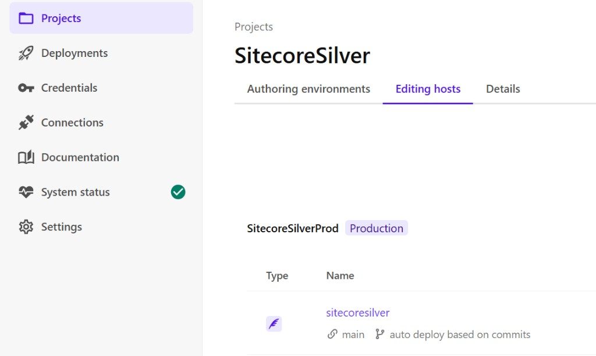
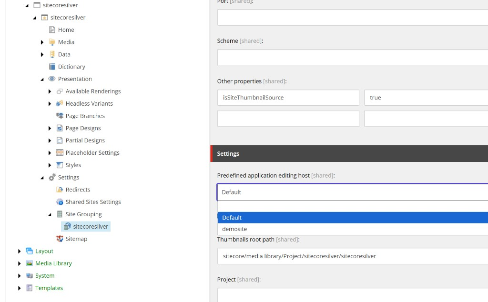
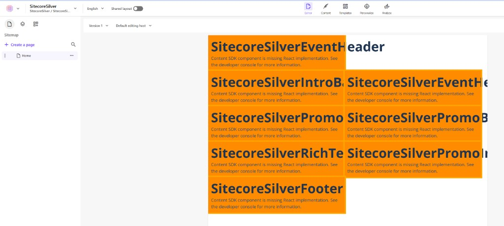

# SitecoreSilver — setup and TODO

**SitecoreSilver** is the **Copenhagen Silver Celebration** event microsite — a single-language marketing site for Sitecore’s 25th anniversary event (Copenhagen · Tivoli · 11 June 2026). It promotes the in-person celebration, explains **SitecoreAI** platform capabilities, showcases attendee profiles, and doubles as a **Sitecore AI Pages** demo (partial designs, headless variants, presentation styles, kit **Promo** component).

**Site purpose, sitemap, and live demo scripts:** [COPENHAGEN-SILVER-SITE.md](./COPENHAGEN-SILVER-SITE.md) (Capabilities walkthrough + Promo styling/variant demo).

**SitecoreSilver** is a fork-style vertical in **this repo** (`spd_Sitecore.Demo.SitecoreAI.IndustryVerticals.SiteTemplates`), modeled on the **Versele** pattern in [SE9](C:\code\sitecore\SE9). It is a **single site** with **multiple languages** — not a multi-brand portal.

> Migrated from `spd-Sitecore.Demo.XMCloud.IndustryVerticals` (June 2026). All app code, authoring YAML, and docs now live here.

| | Value |
|---|--------|
| **Rendering host** | `industry-verticals/sitecoresilver` |
| **Git repo (canonical)** | `https://github.com/sumithpdd/spd_Sitecore.Demo.SitecoreAI.IndustryVerticals.SiteTemplates` |
| **Module** | `authoring/items/sitecoresilver.module.json` |
| **Build key** | `sitecoresilver` in `xmcloud.build.json` |
| **Editing host** (Deploy portal) | `sitecoresilver` (must match build key) |
| **Content root** | `/sitecore/content/sitecoresilver/sitecoresilver` |

**Agent guidance:** [industry-verticals/sitecoresilver/AGENTS.md](../industry-verticals/sitecoresilver/AGENTS.md)  
**General new-site concepts:** [JUNIOR-DEVELOPER-GUIDE.md](./JUNIOR-DEVELOPER-GUIDE.md) · [SITECORE-SERIALIZATION.md](./SITECORE-SERIALIZATION.md)  
**Reference implementation (SE9):** [SE9/docs/VERSELE.md](C:\code\sitecore\SE9\docs\VERSELE.md)

---

## How this maps to Versele (SE9)

| SE9 (Versele) | This repo (SitecoreSilver) |
|---------------|----------------------------|
| `examples/versele/` | `industry-verticals/sitecoresilver/` |
| `authoring/items/versele.module.json` | `authoring/items/sitecoresilver.module.json` |
| `authoring/items/versele/` (YAML) | `authoring/items/sitecoresilver/` (YAML — after pull) |
| `xmcloud.build.json` → `"versele"` | `xmcloud.build.json` → `"sitecoresilver"` |
| `/sitecore/content/versele/versele` | `/sitecore/content/sitecoresilver/sitecoresilver` |
| `VerseleHeader`, `Versele*` components | `SitecoreSilverHeader`, `SitecoreSilver*` components |

Unlike Brother (cloned under `industry-verticals/sites/brother` inside the shared **Industry Verticals** module), SitecoreSilver uses a **standalone module** at the repo root of `authoring/items/` — same pattern as Versele in SE9.

---

## XM Cloud context

| Concept | Value | Notes |
|---------|--------|--------|
| **Deploy environment** (`-n` on CLI) | `SitecoreSilverProd` | Named when you `environment connect` (not the generic `production` label) |
| **Environment ID** | `5Cph5EjHd57eURM3odbI7c` | XM Cloud Deploy → Environment → copy ID |
| **Site / Site Grouping name** | `sitecoresilver` | `NEXT_PUBLIC_DEFAULT_SITE_NAME` |
| **Content root** | `/sitecore/content/sitecoresilver/sitecoresilver` | Main marketing site |
| **Rendering host** | `sitecoresilver` | Must match `xmcloud.build.json` |

**Push workflow** (from repo root; run after `cloud login`):

```powershell
dotnet sitecore cloud login
dotnet sitecore cloud environment connect --environment-id 5Cph5EjHd57eURM3odbI7c --allow-write
dotnet sitecore serialization validate --fix
dotnet sitecore serialization push -n SitecoreSilverProd
```

The `-n SitecoreSilverProd` name must match the environment nickname you used when connecting (check `.sitecore/user.json` if push says the environment is unknown).

**Pull** (refresh YAML from CM):

```powershell
dotnet sitecore cloud login
dotnet sitecore cloud environment connect --environment-id 5Cph5EjHd57eURM3odbI7c --allow-write
dotnet sitecore serialization pull -n SitecoreSilverProd
dotnet sitecore serialization validate --fix
```

**GUIDs in generated YAML:** Item IDs must be valid hex GUIDs (e.g. `b574dcc5-...`, `b5010001-...`). Do not use `ss` prefixes — Sitecore CLI rejects them on push.

The module is auto-discovered via root `sitecore.json` → `"authoring/items/**/*.module.json"` (no separate local `authoring/sitecore.json` entry required).

---

## New site setup (with screenshots)

Use this checklist when creating **any** new XM Cloud site from this repo pattern (SitecoreSilver is the reference). Screenshots live in [`docs/images/sitecoresilver/`](./images/sitecoresilver/).

### Step 1 — Register the rendering host in `xmcloud.build.json`

Add a key that matches your Next.js app folder name exactly:

```json
"sitecoresilver": {
  "path": "./industry-verticals/sitecoresilver",
  "nodeVersion": "22.11.0",
  "enabled": true,
  "type": "sxa",
  "buildCommand": "build",
  "runCommand": "next:start"
}
```

`xmcloud.build.json` alone does **not** create the editing host in the portal.

### Step 2 — Add the editing host in XM Cloud Deploy

1. Open [Sitecore Cloud Portal](https://portal.sitecorecloud.io) → **Projects** → your project (e.g. **SitecoreSilver**).
2. Open the **Editing hosts** tab.
3. Click **Add editing host** (or confirm one already exists).
4. Set the name to **`sitecoresilver`** — must match the `xmcloud.build.json` key **exactly** (case-sensitive).
5. Link it to the authoring environment (e.g. **SitecoreSilverProd**).
6. Connect the correct **GitHub account** to this XM Cloud project.
7. Set **repository** to `sumithpdd/spd_Sitecore.Demo.SitecoreAI.IndustryVerticals.SiteTemplates`, branch **`main`**, and enable **auto deploy based on commits**.
8. Run **Build and deploy** and wait until the status is **successful**.



### Step 3 — Map the site to the editing host (Site Grouping)

Content Editor → `/sitecore/content/sitecoresilver/sitecoresilver/Settings/Site Grouping/sitecoresilver`:

| Field | Value |
|-------|--------|
| **Predefined application editing host** (Rendering host) | **`sitecoresilver`** — not `Default` or `demosite` |
| **SiteName** | `sitecoresilver` |



**Important:** The dropdown only lists hosts that exist in CM **after** step 2 deploys successfully. If you only see `Default` and `demosite`, the `sitecoresilver` editing host is not registered yet — finish step 2 first, then refresh Content Editor.

Serialized value (for push):

```yaml
# authoring/items/sitecoresilver/.../Site Grouping/sitecoresilver.yml
- Hint: RenderingHost
  Value: sitecoresilver
```

### Step 4 — Verify in Pages

Open **Pages** → select **sitecoresilver** → **Home**. The page should render components (not orange error blocks). In the editor toolbar, the editing-host dropdown should show **`sitecoresilver`**, not **Default editing host**.



---

## Troubleshooting: editing host not found in `xmcloud.build.json`

XM Cloud builds from the **Git repository configured on the editing host** — not from your local disk. If the build log says:

```text
Editing host 'sitecoresilver' not found in 'xmcloud.build.json' or it is disabled
Available editing hosts: luxury-retail, demosite
```

then the portal is building an **old commit** or the **wrong repository**.

### Fix

1. Confirm you are working in **`spd_Sitecore.Demo.SitecoreAI.IndustryVerticals.SiteTemplates`** (this repo).
2. Confirm `xmcloud.build.json` contains `"sitecoresilver": { "enabled": true, ... }` on **`main`** and changes are **pushed to GitHub**.
3. **XM Cloud Deploy** → **SitecoreSilver** → **Editing hosts** → **`sitecoresilver`**:
   - Repository: `sumithpdd/spd_Sitecore.Demo.SitecoreAI.IndustryVerticals.SiteTemplates`
   - Branch: `main`
4. **Build and deploy** — log should list `sitecoresilver` among available hosts.

> **Note:** SitecoreSilver was previously developed in `spd-Sitecore.Demo.XMCloud.IndustryVerticals`; it has been **moved here** (June 2026). Do not point the editing host at the old repo.

---

## Troubleshooting: “editing host is not set properly”

This error means Pages cannot reach a valid Next.js editing host for the site. Work through these in order:

| # | Symptom | Fix |
|---|---------|-----|
| 1 | Site Grouping shows **Default** or **demosite** only | Wait for editing host deploy (step 2); trigger **Build and deploy** manually if needed |
| 2 | Dropdown never shows **`sitecoresilver`** | Confirm editing host **name** in portal matches `xmcloud.build.json` key; confirm deploy **succeeded** (check Deploy logs) |
| 3 | Site Grouping still on **Default** | Set **Predefined application editing host** to **`sitecoresilver`** and save |
| 4 | Pages toolbar shows **Default editing host** | Switch to **`sitecoresilver`** in the Pages editing-host dropdown |
| 5 | Orange blocks: “Content SDK component is missing React implementation” | Wrong host is serving the page (usually **Default** → old `demosite` app without `SitecoreSilver*` components). Fix steps 3–4, then redeploy editing host after TSX changes |
| 6 | Components still missing after host fix | Run `npm run sitecore-tools:generate-map && npm run build` locally; push; wait for editing host redeploy |
| 7 | `.env.local` / editing secret | Set `SITECORE_EDITING_SECRET` on the editing host (Deploy portal → host → secrets) and in `industry-verticals/sitecoresilver/.env.local` |

**Root cause (SitecoreSilver):** Site Grouping had `RenderingHost: Default`, which points at the starter **`demosite`** rendering host — not the `sitecoresilver` Next.js app that contains `SitecoreSilverIntroBanner`, `SitecoreSilverEventHero`, etc.

---

## Setup gaps (from Versele working session — do not skip)

These steps are easy to miss after copying a starter and adding `xmcloud.build.json`. See [New site setup (with screenshots)](#new-site-setup-with-screenshots) above for the full visual walkthrough.

### 1. Editing host in XM Cloud Deploy (required)

See **Step 2** above.

### 2. Site Grouping → Rendering host

See **Step 3** above. Value must be **`sitecoresilver`**, not `Default`.

### 3. Environment and SDK config

```bash
cd industry-verticals/sitecoresilver
cp .env.remote.example .env.local
```

| Variable | Value |
|----------|--------|
| `SITECORE_EDGE_CONTEXT_ID` | From Deploy / portal |
| `NEXT_PUBLIC_SITECORE_EDGE_CONTEXT_ID` | Same context |
| `NEXT_PUBLIC_DEFAULT_SITE_NAME` | `sitecoresilver` |
| `SITECORE_EDITING_SECRET` | Editing host secret |

### 4. Regenerate maps before build

```bash
cd industry-verticals/sitecoresilver
npm run sitecore-tools:generate-map
npm run sitecore-tools:build
npm run build
```

---

## Sitecore paths (module includes)

| Include name | Sitecore path |
|--------------|----------------|
| `sitecoresilvertenantRoot` | `/sitecore/content/sitecoresilver` |
| `sitecoresilver-site-root` | `/sitecore/content/sitecoresilver/sitecoresilver` |
| `sitecoresilvertemplatesProject` | `/sitecore/templates/Project/sitecoresilver` |
| `sitecoresilverprojectRenderings` | `/sitecore/layout/Renderings/Project/sitecoresilver` |
| `sitecoresilverprojectPlaceholderSettings` | `/sitecore/layout/Placeholder Settings/Project/sitecoresilver` |
| `sitecoresilverprojectMediaFolders` | `/sitecore/Media Library/Project/sitecoresilver` |

See [sitecoresilver.module.json](../authoring/items/sitecoresilver.module.json).

---

## Presentation architecture (partial designs + page designs)

Same best practice as Versele — put **reusable site chrome** in partial designs; page items hold **`headless-main`** content only.

```text
Layout.tsx
  headless-header  ← Partial Design "header" (SitecoreSilverHeader)
  headless-main    ← Page __Renderings (hero, grids, promos)
  headless-footer  ← Partial Design "footer" (SitecoreSilverFooter)

Page Design "DefaultPage"
  PartialDesigns = {header GUID}|{footer GUID}
```

**Serialized items (after pull):**

| Item | YAML path (under `sitecoresilver-site-root/`) |
|------|-----------------------------------------------|
| Partial design header | `sitecoresilver/Presentation/Partial Designs/header.yml` |
| Partial design footer | `.../Partial Designs/footer.yml` |
| Page design | `.../Page Designs/DefaultPage.yml` |
| Header datasource | `sitecoresilver/Data/Headers/Default Header.yml` |
| Footer datasource | `sitecoresilver/Data/Footers/Default Footer.yml` |

Full Versele walkthrough (same pattern): [SE9/docs/VERSELE.md § Presentation architecture](C:\code\sitecore\SE9\docs\VERSELE.md#presentation-architecture-partial-designs--page-designs).

---

## Scaffolding checklist

- [x] `industry-verticals/sitecoresilver/` Next.js app scaffold (from Versele/SE9 clone)
- [x] `authoring/items/sitecoresilver.module.json`
- [x] `xmcloud.build.json` → `"sitecoresilver": { "enabled": true }`
- [ ] XM Cloud: site collection + site **sitecoresilver** at `/sitecore/content/sitecoresilver/sitecoresilver`
- [ ] **Editing host** `sitecoresilver` in Deploy portal
- [ ] `dotnet sitecore serialization pull -n production` → YAML under `authoring/items/sitecoresilver/`
- [ ] Site Grouping → **Predefined application editing host** = `sitecoresilver` (not `Default`)
- [ ] `.env.local` with Edge context + `NEXT_PUBLIC_DEFAULT_SITE_NAME=sitecoresilver`
- [ ] Copy `src/` from SE9 `examples/versele` (or rebuild components) — app currently has config only

---

## Component inventory (Copenhagen Silver site)

**Full listing** (fields, placeholders, variants, layout, fallbacks, CM notes): **[COPENHAGEN-SILVER-SITE.md](./COPENHAGEN-SILVER-SITE.md)**

| Map key | Role on Home |
|---------|----------------|
| `SitecoreSilverIntroBanner` | Intro band — logo, title, event meta |
| `SitecoreSilverEventHeader` | Sticky header + `sitecoresilver-header-nav-{*}` for LinkList |
| `SitecoreSilverEventHero` | Hero pills, CTAs |
| `SitecoreSilverPromoFullWidth` | “Three engines” platform band |
| `SitecoreSilverPromoBadgeGrid` | Parent grid for badge cards |
| `SitecoreSilverPromoBadge` | Numbered promo card (×3 children) |
| `SitecoreSilverRichText` | **`GlassPanel`** variant — quote panel |
| `SitecoreSilverPromoImageCta` | Tivoli / event-details CTA block |
| `SitecoreSilverFooter` | Footer title, meta, legal |
| `SitecoreSilverCapabilitiesSection` | Capabilities page — section + `sitecoresilver-capability-cards-{*}` |
| `SitecoreSilverCapabilityCard` | Capability card (nested) |
| `SitecoreSilverAttendeeProfile` | Attendee profile — **page item fields** (page-as-datasource) |

TSX: `industry-verticals/sitecoresilver/src/components/sitecoresilver/`  
Serialization generator: `authoring/items/sitecoresilver/scripts/generate-copenhagen-silver-home.mjs`

**Inline editing:** All `SitecoreSilver*` components bind fields via Content SDK (`Text`, `RichText`, `NextImage`, `Link`). Preview fallbacks: `sitecoresilver-copenhagen-defaults.ts`. See [COPENHAGEN-SILVER-SITE.md § Inline editing](./COPENHAGEN-SILVER-SITE.md#inline-editing-in-pages--experience-editor).

**Theme:** Page backdrop `public/branding/page-backdrop-official.jpg` on `.sitecoresilver-page` (`sitecoresilver-copenhagen.css`).

The app also registers **industry-vertical starter** components (`Promo`, `Container`, `ProductListing`, …) for other pages; they are documented under “Shared starter components” in [COPENHAGEN-SILVER-SITE.md](./COPENHAGEN-SILVER-SITE.md). For OOTB XM Cloud Pages components (Image, LinkList, Navigation, RichText, etc.), see [COMPONENTS.md § Out-of-the-box Components](./COMPONENTS.md#out-of-the-box-components-in-sitecore-ai-pages).

## Component naming (Versele → SitecoreSilver)

When porting from SE9, rename consistently:

| Versele (SE9) | SitecoreSilver (Copenhagen) |
|---------------|------------------------------|
| `VerseleHeader` | `SitecoreSilverEventHeader` |
| `VerseleFooter` | `SitecoreSilverFooter` |
| `versele-header-nav-{*}` | `sitecoresilver-header-nav-{*}` |
| `src/components/versele/` | `src/components/sitecoresilver/` |
| `src/lib/versele-*.ts` | `src/lib/sitecoresilver-*.ts` |

SE9 pet-nutrition components (`SitecoreSilverHomeHero`, WHB, product search, etc.) are **not** in this repo’s Copenhagen app; use [SE9/docs/VERSELE.md](C:\code\sitecore\SE9\docs\VERSELE.md) only as a process reference.

---

## Workflow summary

| Do | Don't |
|----|--------|
| One component per task + screenshots | Whole homepage in one prompt |
| Partial designs for header/footer | Put header/footer on every page |
| `validate --fix` before push | Push without validation |
| Add editing host in Deploy portal | Assume `xmcloud.build.json` is enough |
| Regenerate component map after TSX changes | Hand-edit stale map entries |
| SitecoreSilver paths in prompts | Brother / Forma Lux paths in this repo |

---

## Updating this doc

After working sessions, update **`docs/SITECORESILVER.md`**, **`industry-verticals/sitecoresilver/AGENTS.md`**, and **`.cursor/rules/sitecoresilver-*.mdc`** so the next session has the full checklist.
