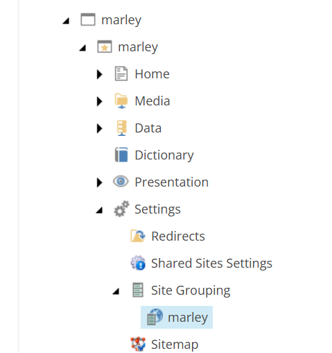
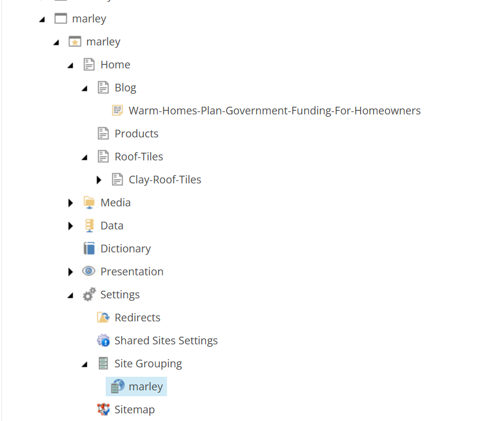
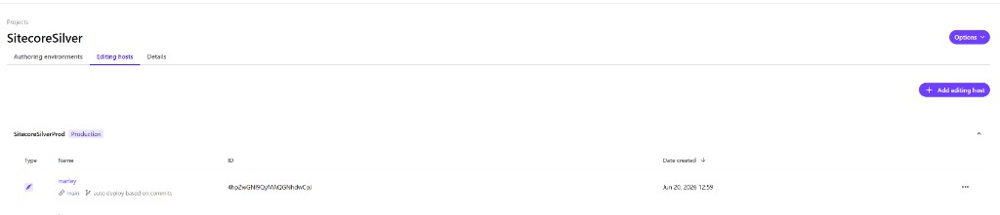

# Marley

## Overview

Dedicated rendering host for **[Marley](https://www.marley.co.uk/)** — pitched roof systems, roof tiles, solar, accessories, blog, and technical content. Built with the **website-to-sitecore** workflow (capture → component review → YAML + Next.js).

| | Value |
|---|--------|
| **Rendering host key** | `marley` (`xmcloud.build.json`) |
| **Site name** | `marley` (`NEXT_PUBLIC_DEFAULT_SITE_NAME`) |
| **Serialization module** | `authoring/items/marley` |
| **Content root** | `/sitecore/content/marley/marley` |
| **Full setup guide** | [docs/MARLEY.md](../../docs/MARLEY.md) |
| **XM Cloud project** | SitecoreSilver → **SitecoreSilverProd** |
| **Editing host** | `marley` (registered; ID `4hpZwGNI9QyMAQGNhdwCoi`) |

**Evidence and component map:** `design-screenshots/marley-co-uk/component-review.json`

## Pages (mirrors marley.co.uk)

| URL path | Sitecore item |
|----------|----------------|
| `/` | Home |
| `/products` | Home/Products |
| `/roof-tiles` | Home/Roof-Tiles |
| `/roof-tiles/clay-roof-tiles/acme-single-camber-plain-tile` | Home/Roof-Tiles/Clay-Roof-Tiles/Acme-Single-Camber-Plain-Tile |
| `/blog` | Home/Blog |
| `/blog/warm-homes-plan-government-funding-for-homeowners` | Home/Blog/Warm-Homes-Plan-Government-Funding-For-Homeowners |

## Local development

```powershell
cd industry-verticals/marley
cp .env.remote.example .env.local
# SITECORE_EDGE_CONTEXT_ID, NEXT_PUBLIC_DEFAULT_SITE_NAME=marley, SITECORE_EDITING_SECRET
npm install
npm run dev
```

After component changes:

```powershell
npm run sitecore-tools:generate-map
npx tsc --noEmit
```

## Components

Cloned from **luxury-retail** plus article components from **retail**:

Header, Navigation, NavigationIcons, Footer, HeroBanner, Promo, Features, PageHeader, ProductListing, ProductDetails, RichText, PageContent, LinkList, **ArticleListing**, **ArticleDetails**, Pagination, SocialShare.

Theme: `src/assets/base/variables.css`, `src/assets/marley/marley.css` (Marley red `#c83232`, charcoal `#4d4d4c`).

## Serialization

Regenerate page layout and datasources:

```powershell
node authoring/items/marley/scripts/generate-marley-site.mjs
dotnet sitecore serialization validate --fix -i marley
dotnet sitecore serialization push -n <env> -i marley
```

## Content tree (after push)

After a successful push, Content Editor shows the **marley** collection and site at `/sitecore/content/marley/marley`:



Expand **Home** to verify all demo pages:



| Path | Description |
|------|-------------|
| `/sitecore/content/marley` | Site collection (tenant folder) |
| `/sitecore/content/marley/marley` | Site root — Home, Media, Data, Dictionary, Presentation, Settings |
| `.../Settings/Site Grouping/marley` | Site definition — **RenderingHost** must be `marley` |

Expand **Home** for the six demo pages (Products, Roof-Tiles, Blog, etc.). See [docs/MARLEY.md](../../docs/MARLEY.md) for the full page map.

| Sitecore item | URL |
|---------------|-----|
| `Home/Products` | `/products` |
| `Home/Roof-Tiles/Clay-Roof-Tiles/Acme-Single-Camber-Plain-Tile` | `/roof-tiles/clay-roof-tiles/acme-single-camber-plain-tile` |
| `Home/Blog` | `/blog` |
| `Home/Blog/Warm-Homes-Plan-Government-Funding-For-Homeowners` | `/blog/warm-homes-plan-government-funding-for-homeowners` |

## Editing host

The **`marley`** editing host is registered in XM Cloud Deploy on the **SitecoreSilver** project, linked to **SitecoreSilverProd** (Production), branch **`main`**, with **auto deploy based on commits**.

| Setting | Value |
|---------|--------|
| **Editing host name** | `marley` (must match `xmcloud.build.json`) |
| **XM Cloud project** | SitecoreSilver |
| **Authoring environment** | SitecoreSilverProd |
| **Host ID** | `4hpZwGNI9QyMAQGNhdwCoi` |
| **Site Grouping RenderingHost** | `marley` |



After the host is added, run **Build and deploy** from the host **Options** menu and confirm deploy succeeds. Then set Site Grouping **RenderingHost** = `marley` in Content Editor.

Full checklist: [docs/MARLEY.md](../../docs/MARLEY.md).
